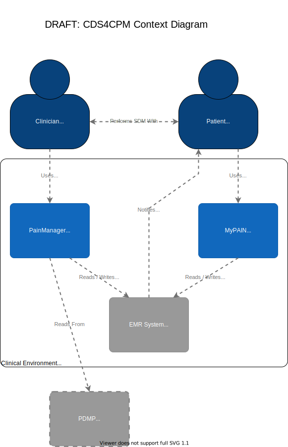

# CDS4CPM Project Implementation Guide

## Repository and Build Information

This repository contains the source for Clinical Decision Support for Chronic Pain Management Implementation Guide, and uses the [FHIR Implementation Guide publisher](http://wiki.hl7.org/index.php?title=IG_Publisher_Documentation) to produce a FHIR Implementation Guide.

FHIR Implementation Guides contain
content forming a platform specification that can be published as a website. More information on IGs can be found on the [Hl7 wiki](https://wiki.hl7.org/FHIR_Implementation_Guides). Examples of IGs can be found at the [FHIR IG Registry](https://registry.fhir.org/guides)

## Change Management and Roadmap

Feedback and issues can be submitted via the [issues](issues) page.

The current developmental focus is the [System Design Document](https://github.com/DBCG/cds4cpm/blob/master/input/pagecontent/sdd.md). This is a markdown file containing a description and diagrams of the system architecture of the cds4cpm system. This design document is a work in progress.

Open design questions:

* PDMP integration
* EHR writeback / site-specific FHIR adapters
  * Shape of SDM record
* MyPain Architecture and SoF / MyChart Integration
* PMD STU3/R4 support
* Cds-hooks deployment and integration
* NDC codes/dispense data support
  * Depends on MME calculation
* Consider how dynamic the questionnaire may be

## Editing Markdown in Github

When browsing Markdown documents such as the [SDD](https://github.com/DBCG/cds4cpm/blob/master/input/pagecontent/sdd.md) in Github a preview of the document is automatically rendered, showing headers, tables, links, images, etc.

A user with write permissions on the repository may see the original source Markdown and edit it directly in Github by pressing the pencil icon at the upper right of the preview.This will activate a Markdown editor where changes can be made and previewed.

Once the desired changes have been made a user can provide a description of the changes and link "Commit Changes" at the bottom of the page.

Github provides several resources for editing Markdown:

[Guide to Writing on Github](https://help.github.com/en/github/writing-on-github)

[Markdown Quick Reference](https://help.github.com/en/github/writing-on-github/basic-writing-and-formatting-syntax)

To get started quickly, here's are direct links to see and edit the SDD:

[View System Design Document](https://github.com/DBCG/cds4cpm/blob/master/input/pagecontent/sdd.md)

[Edit System Design Document](https://github.com/DBCG/cds4cpm/edit/master/input/pagecontent/sdd.md)

## Editing Diagrams

The diagrams in this repository were created using draw.io, a browser-based diagramming tool. No installation is required for editors of this repository. Additionally, draw.io supports a github integration so that the diagrams in the project can be edited online and committed directly back the the repository, in a fashion similar to editing the Markdown.

[Open draw.io in Github mode](https://www.draw.io/?mode=github) - You'll be asked to link your Github account. That will allow you to browse repositories you have access to, and the files within them.

There are a number of online resources for how to use draw.io:

[draw.io Beginner's Guide](https://drawio-app.com/tutorials/beginners-guide/)

For ease of use the diagrams are currently set up so that the editing process can be started by simply clicking on them in a preview. This will be removed prior to publication. As an example, click the diagram below:

## Adding New Images and Diagrams

The [input/pagecontent/assets](input/pagecontent/assets) directory is where images and diagrams for the Implementation Guide are stored.

New content can be added by browsing to the appropriate directory and selecting "Upload Files" from the upper right.

Diagrams intended to be editable should be in the draw.io svg format. The easiest way to create one is to open an existing diagram by clicking it and then selecting "Save As..." from the File menu. Give the diagram a new name, select Github and the save location, add a new Commit message, and then browse to the input/pagecontent/assets/diagrams directory in this repository. Click Save and a copy of the existing diagram will be created.

Images and Diagrams can be included in the Markdown using the appropriate syntax. There are several examples in the SDD and and additional information in the Markdown resources linked above.
