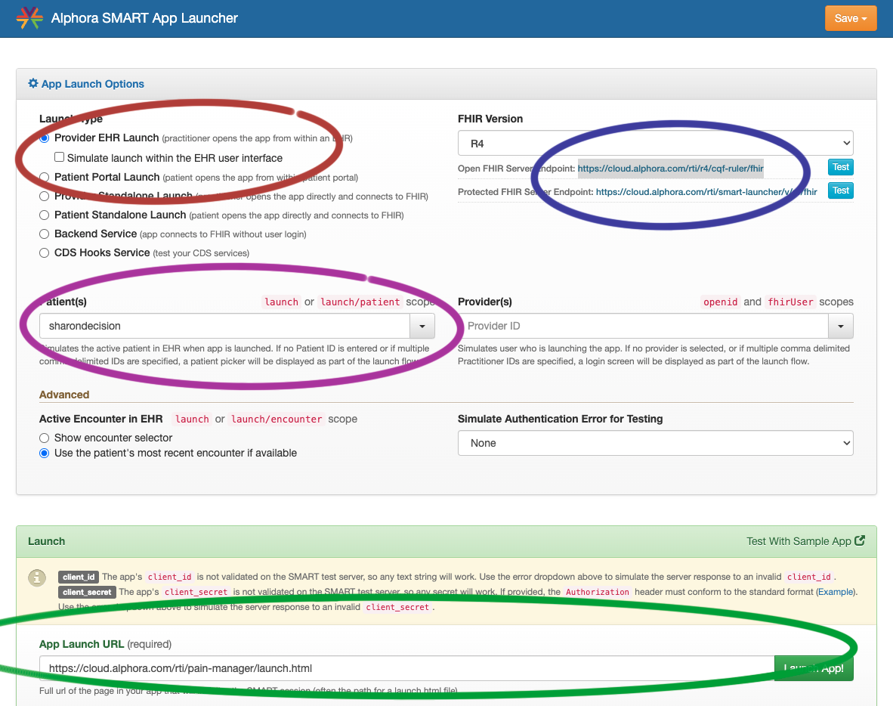

## CDS4CPM Reference Implementation Applications Guide

There are three applications that have been developed to support the pilot of the CDS artifact, [Factors to Consider in Managing Chronic Pain: A Pain Management Summary](https://cds.ahrq.gov/cdsconnect/artifact/factors-consider-managing-chronic-pain-pain-management-summary). 
 These are representative of the [CDS4CPM IG](https://github.com/cqframework/cds4cpm.git).

A [Smart Launcher](https://cloud.alphora.com/rti/smart-launcher) that is a fork of the [Smart Health IT launcher](http://launch.smarthealthit.org/) that links to a FHIR server that contains data related to this example.
The repository is at [https://github.com/cqframework/smart-launcher.git](https://github.com/cqframework/smart-launcher.git)

An application [MyPain](https://cloud.alphora.com/rti/my-pain/launch.html) that uses a questionnaire to record patient entered data and stores it on the FHIR server referenced.
The repository is at [https://github.com/cqframework/cds4cpm-mypain.git](https://github.com/cqframework/cds4cpm-mypain.git)

And an application [PainManager](https://cloud.alphora.com/rti/pain-manager/launch.html) that allows the clinician and patient to review the answers and make decisions based on those answers.
The repository is at [https://github.com/cqframework/AHRQ-CDS-Connect-PAIN-MANAGEMENT-SUMMARY.git](https://github.com/cqframework/AHRQ-CDS-Connect-PAIN-MANAGEMENT-SUMMARY.git)

### SMART App Launcher
This is the starting point to access all the applications and data. It is launched by using a browser to navigate to 
https://cloud.alphora.com/rti/smart-launcher. This application launches the other applications with a pre-selected 
patient. The red circle highlights a box that may be selected by default: "Simulate launch within the EHR user interface". 
This should be unselected. The blue highlight circle indicates the URL of the FHIR Server that is being used. The purple 
highlight is a dropdown that allows the selection of a patient. This example shows "sharondecision". This is a patient 
whose data contains example prescriptions, conditions, urine drug screenings, and answers to the questionnaire that 
display in the PainManager application. The green highlight indicates URL of the application you want to launch with the selected patient.

### MyPain Application
By entering https://cloud.alphora.com/rti/pain-manager/launch.html in the "App Launch URL (required)" text box at the 
bottom of the Smart Launcher and clicking the "Launch App!" button, the MyPain application is launched with the 
patient selected in the "Patient(s)" drop down. The screens that follow the initial welcome screen contain the questions 
used in the pilot. The answers are collected at the end and submitted to the FHIR server as a QuestionnaireResponse 
Resource. The 
[$extract operation](https://github.com/DBCG/cqf-ruler/blob/master/plugin/sdc/src/main/java/org/opencds/cqf/ruler/sdc/r4/ExtractProvider.java) 
of the FHIR server may be used to convert the QuestionnaireResponse to a series of Observations that will be viewed in 
the PainManager application. At this time, the operation is not automatic.

### PainManager Application
By entering https://cloud.alphora.com/rti/pain-manager/launch.html in the "App Launch URL (required)" text box at the
bottom of the Smart Launcher and clicking the "Launch App!" button, the PainManager application is launched with the
patient selected in the "Patient(s)" drop down with their pertinent data. This application launches with the 
"Shared Decision Making" section pre-expanded. There you will see answers to questions asked in the MyPain application. 
Each of the blue bars may be clicked on to expand those sections and show data collected pertaining to that patient and 
includes answers to other questions responded to in the MyPain application. This application is view only and does not 
allow changes and records no information. 

