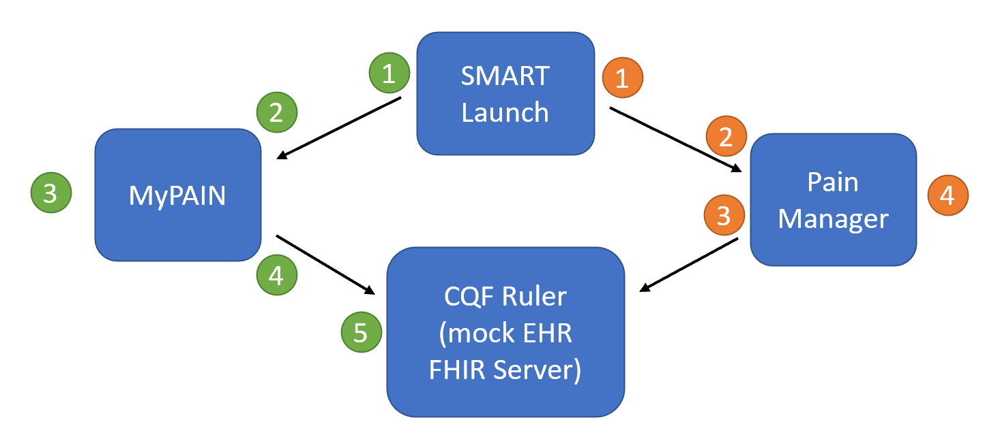

### System Deployment Instructions

This page describes the overall implementation of the CDS4CPM system, beginning with
a description of the sandbox environment that is used to support development and
testing of the system and following up with a description of the implementation
activities required at implementing sites.

#### System Components

##### MyPAIN

Source repository: [https://github.com/cqframework/cds4cpm-mypain](https://github.com/cqframework/cds4cpm-mypain)

The MyPAIN application is a SMART-on-FHIR application designed to be launched from
a patient portal. The application is a REACT-based web app and communicates only with
the FHIR Server provided by the SMART-on-FHIR launch.

MyPAIN will support all major modern web browsers (Chrome, Firefox, Safari, Edge) as well as mobile browsers.

##### PainManager

Source repository: [https://github.com/cqframework/AHRQ-CDS-Connect-PAIN-MANAGEMENT-SUMMARY](https://github.com/cqframework/AHRQ-CDS-Connect-PAIN-MANAGEMENT-SUMMARY)

The PainManager application is a SMART-on-FHIR application designed to be launched from
an electronic health record (EHR). The application is a REACT-based web app and communicates with the FHIR Server provided by the SMART-on-FHIR launch.

TBD: The PainManager application may be configured to support integration with a PDMP
site through the ONC Medications implementation guide, as described in the system
design document.

PainManager will support all major modern web browsers (Chrome, Firefox, Safari, Edge) as well as Internet Explorer 11 (IE11). It will also support mobile browsers.

PainManager requires questionnaire responses from MyPain to be extracted from the QuestionnaireResponse and stored on the FHIR server as Observations. An example of the extraction method can be seen in [CQF-Ruler](https://github.com/cqframework/cqf-ruler/blob/1bf9c414a68b43f067ee09bf98af8096ba9c7ddc/plugin/sdc/src/main/java/org/opencds/cqf/ruler/sdc/r4/ExtractProvider.java).
Use the method extractObservationFromQuestionnaireResponse with the call being similar to 

`POST http://localhost:8080/cqf-ruler-r4/fhir/QuestionnaireResponse/$extract`

with the QuestionnaireResponse as the body of the POST.

##### SMART App Launch

This component is a fork of the SMART-on-FHIR smart-dev-sandbox repository to provide
SMART App launch capability within the testing environments.

Source repository: [https://github.com/cqframework/smart-dev-sandbox.git](https://github.com/cqframework/smart-dev-sandbox.git)

##### FHIR Server

The FHIR Server component of the CDS4CPM system architecture is a FHIR API surfaced by the
clinical system. For systems that support all the required functionality, this may be the
FHIR Server exposed by a vendor EHR. At the time of development, CDS4CPM requires
several features that are not yet widely available, so any gaps in required functionality
will need to be implemented as a FHIR Facade (or adapter interface pattern) that sits
in front of the clinical system and exposes the required capabilities according to the
FHIR standards described in this and the dependent implementation guides.

For the purposes of development and site-independent testing, this component is implemented as a
CQF Ruler, which is a variant of the open-source Java-based HAPI FHIR Server with extensions to
support features defined in the Clinical Reasoning module of FHIR, as well as CDS Hooks.

This component is built as a docker container that has the following:

1. A develop instance of the [CQF Ruler](https://github.com/dbcg/cqf-ruler) (built from the develop branch of the CQF Ruler repository)
2. The RTI-authored content (Questionnaire + any required profiles)
3. The RTI test content (test data constructed as part of development [see Testing for more information])

An update of the CQF Ruler branch or this implementation guide triggers a refresh of the FHIR Server component.

#### Sandbox Environment

The sandbox environment is a continuous delivery development environment to support
testing and development of the CDS4CPM system.

All the repositories are configured with master and develop branches.
Commits to the develop branches trigger an update of the development sandbox, while
commits from develop to master trigger an update of the staging sandbox.

Sites can choose to integrate with either the development sandbox or the staging sandbox directly, or
sites can choose to host the MyPAIN and PainManager applications directly. Due to the
site-specific nature of some of the adapter capabilities required in the FHIR Server component,
implementing sites will need to host a FHIR Facade implementation directly in their environments.

##### Docker Usage
Each of the sandbox components is constructed as a docker container and included in a docker compose for easily creating a complete instance of the sandbox. Source and detailed instructions for using and configuring this docker are included in the following repository:

* [Sandbox](https://github.com/DBCG/cds4cpm-sandbox)

There are 2 files, [docker-compose.yml](https://github.com/DBCG/cds4cpm-sandbox/blob/4266233728eb692ac0dd3ea7bbd817f445077b16/docker/docker-compose.yml) and [docker-compose-ufl.yml](https://github.com/DBCG/cds4cpm-sandbox/blob/4266233728eb692ac0dd3ea7bbd817f445077b16/docker/docker-compose-ufl.yml). Each for their respective project.
#### Docker-Hub
The images for the applications reside in Docker Hub: [https://hub.docker.com/u/alphora](https://hub.docker.com/u/alphora)
  * My-Pain
    * RTI My-Pain: uses tag v0.1.* . It can be pulled by using

        `docker pull alphora/my-pain:v0.1.<substitute latest version number>`
    * UFL My-Pain: uses tag v0.5.* . It can be pulled by using

        `docker pull alphora/my-pain:v0.5.<substitute latest version number>`
  * Pain-Manager
    * RTI Pain-Manager: uses tag latest . It can be pulled by using

      `docker pull alphora/pain-manager:latest`
    * UFL Pain-Manager: uses tag v0.10.* . It can be pulled by using
    
      `docker pull alphora/pain-manager:v0.10.<substitute latest version number>`
  * CQF-Ruler
    * cqf-ruler: Both sites use the same version, latest. It can be pulled by using
    
      `docker pull alphora/cqf-ruler:latest`
  
      and launched using

      `docker run -p 8080:8080 alphora/cqf-ruler`
    
      This will enable the cqf-ruler to be available at http://localhost:8080'
  * Smart-Launcher
    * smart-launcher: Both sites use the same version, latest. It can be pulled by using
    
      `docker pull alphora/smart-launcher:latest`

##### Sandbox

The sandbox components are built off the master branch of each
of the relevant repositories. Features will be pushed from develop to master as they are completed.

* SMART App Launch URL 
  * Public: [http://launch.smarthealthit.org](http://launch.smarthealthit.org) (NOTE: This will launch against the SMART Health IT server, not the FHIR Server in the sandbox environment.)
  * RTI Sandbox: [https://cloud.alphora.com/rti/smart-launcher](https://cloud.alphora.com/rti/smart-launcher)
  * UFL Sandbox: [https://cloud.alphora.com/ufl/smart-launcher](https://cloud.alphora.com/ufl/smart-launcher)
* MyPAIN
  * Standalone application: [https://cloud.alphora.com/rti/my-pain](https://cloud.alphora.com/rti/my-pain)
  * RTI SMART launch URL: [https://cloud.alphora.com/rti/my-pain/launch.html](https://cloud.alphora.com/rti/my-pain/launch.html)
  * UFL SMART launch URL: [https://cloud.alphora.com/ufl/my-pain/launch.html](https://cloud.alphora.com/ufl/my-pain/launch.html)
* PainManager
  * Standalone application: [https://cloud.alphora.com/rti/pain-manager](https://cloud.alphora.com/rti/pain-manager)
  * RTI SMART launch URL: [https://cloud.alphora.com/rti/pain-manager/launch.html](https://cloud.alphora.com/rti/pain-manager/launch.html)
  * UFL SMART launch URL: [https://cloud.alphora.com/ufl/pain-manager/launch.html](https://cloud.alphora.com/ufl/pain-manager/launch.html)
* FHIR Server Endpoint
  * RTI FHIR Server: [https://cloud.alphora.com/rti/r4/cqf-ruler/fhir](https://cloud.alphora.com/rti/r4/cqf-ruler/fhir)
  * UFL FHIR Server: [https://cloud.alphora.com/ufl/r4/cqf-ruler/fhir](https://cloud.alphora.com/ufl/r4/cqf-ruler/fhir)

#### "Hello World" Scenarios

The following diagram depicts two "Hello World" scenarios in the sandbox environment. These
scenarios represent the basic "smoke screen" testing that verifies end-to-end functionality
of the environment:

##### Patient "Hello World" Scenario

1. The user launches the MyPAIN application.
2. The MyPAIN application authorizes and receives launch context.
3. The user enters questionnaire responses.
4. The MyPAIN application posts a QuestionnaireResponse to the FHIR Server.
5. The FHIR Server extracts Observations from the patient’s QuestionnaireResponse into an Observation for each response

##### Practitioner "Hello World" Scenario

1. The practitioner launches PainManager (possibly from a CDS Hooks SMART App card).
2. PainManager application authorizes and receives launch context.
3. PainManager application requests information from the FHIR Server.
4. The practitioner views patient responses and relevant information in the PainManager application.

#### Site-Specific Environment

In a site-specific implementation environment, these components will be implemented
using technologies and capabilities available within the clinical system.

##### MyPAIN

Because MyPAIN is a single-page REACT-based application with no server-side logic layer,
all communication with the FHIR Server (and therefore any protected health information) happens client-side in the browser. This makes it possible for the MyPAIN application to be cloud-hosted off-premise without significant
security or privacy concerns. However, implementation sites may wish to host their own instances of the MyPAIN application.

##### PainManager

Analagous comments apply to PainManager.

##### SMART App Launch

SMART App launch capabilities within the clinical site environment will typically be provided
by the EMR/EHR or associated patient portal technologies.

##### FHIR Server

Given the nature of the capabilities required by the CDS4CPM system, many of the
FHIR features will have to be provided by a site-specific adapter, or FHIR Facade. The
CQF Ruler reference implementation used in the sandbox environment can provide a
starting point for this facade and provides (or will provide) the following
minimum capabilities:

* GET metadata (to support OAuth handshake)
* GET Questionnaire/&lt;questionnaire-id&gt;
* POST QuestionnaireResponse
    * QuestionnaireResponse processing to produce Observation resources
    * Observation transformation/annotation using a ConceptMap to define site-specific codes
* GET Observation?patient&code
* GET MedicationRequest?patient&status
* GET Condition?patient&category
* GET Encounter?patient&status

### Pilot Differences

#### Questionnaire
##### Original questionnaire 
The original questionnaire [MyPain Questionnaire](https://github.com/cqframework/cds4cpm/blob/04579f913fac49d35f3ba2a9f1ecdba61f47ee41/input/resources/questionnaire/mypain-questionnaire.json) was used with RTI at Vanderbilt and Chicago.
A new questionnaire [MyPain Questionnaire UFL](https://github.com/cqframework/cds4cpm/blob/04579f913fac49d35f3ba2a9f1ecdba61f47ee41/input/resources/questionnaire/mypain-questionnaire-ufl.json) was used with UFL. This required changes to questions, answers, code sets, and value sets. The code sets and value sets from the original pilot were modified to include the new changes.

#### MyPain
The changes for the MyPain application from the [RTI pilot](https://github.com/cqframework/AHRQ-CDS-Connect-PAIN-MANAGEMENT-SUMMARY/tree/master) to the [UF pilot](https://github.com/cqframework/cds4cpm-mypain/tree/v0.5.0) included branding changes, questionnaire questions, and answers. It added multiple selection choices for how pain feels to the patient. 

#### PainManager 
The UI from the [RTI pilot](https://github.com/cqframework/cds4cpm-mypain/tree/master) to the [UF pilot](https://github.com/cqframework/AHRQ-CDS-Connect-PAIN-MANAGEMENT-SUMMARY/tree/v0.10.0)  was changed significantly, including a change from a mostly horizontal layout to a vertical one. Warning displays were also changed. A significant change was to use 2022 CDC recommendations instead of the 2016 recommendations. This was reflected in the logic used in PainManagerAll.cql. Additionally, flags were added to turn on or off certain criteria and how items were displayed. 

* "Only Active Medications"
* "Use MMECalculator"
* "Add Benzodiazepine to NonOpioid Medications"
* "Add Naloxone to Opioid Medications"
* "Use 2022 CDC Guidelines"
* "Use Inclusion Criteria"`