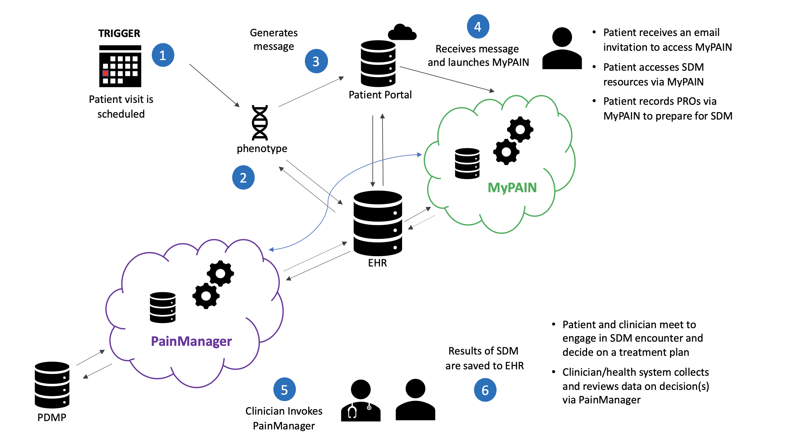

This documentation provides information about the development and implementation of a patient-facing application, **MyPAIN**, and a clinician-facing application, **PainManager**. MyPAIN and PainManager are intended to work together to provide end-to-end support for shared decision making ([SDM](https://www.ahrq.gov/health-literacy/professional-training/shared-decision/index.html)) management for patients with [chronic pain](https://uspainfoundation.org/pain) using clinical decision support ([CDS](https://www.healthit.gov/topic/safety/clinical-decision-support)).

Both applications are implemented as Substitutable Medical Applications, Reusable Technologies on Fast Healthcare Interoperability Resources ([SMART on FHIR](https://smarthealthit.org/)) applications. These SMART on FHIR applications are expected to be integrated with an electronic health record ([EHR](https://www.healthit.gov/faq/what-electronic-health-record-ehr)). Integrated with or interfaced to an electronic health record ([EHR](https://www.healthit.gov/faq/what-electronic-health-record-ehr)) and into clinical workflows.

### Background

The Clinical Decision Support for Chronic Pain Management (CDS4CPM) system and services described in this Implementation Guide (IG) seek to connect patients and clinicians, clinical best practices, novel delivery models, and evidence generators to demonstrate how to provide CDS in a standardized, publicly shareable form at scale for improving chronic pain management. This IG is a product of [a contract with the Agency for Healthcare Research and Quality (AHRQ)](https://digital.ahrq.gov/ahrq-funded-projects/clinical-decision-support-chronic-pain-management-rti#h=pain cds), which is driving innovation in the development of shareable and interoperable CDS. The two applications that comprise the CDS4CPM system are extensions of prior patient-centered and shareable CDS work, such as the [Patient-Centered Clinical Decision Support Learning Network (PCCDS-LN)](https://digital.ahrq.gov/ahrq-funded-projects/patient-centered-outcomes-research-clinical-decision-support-learning-network/) and [CDS Connect](https://cds.ahrq.gov/cdsconnect). The first application is a patient-facing CDS artifact termed My Pain Assessment and Information Needs (MyPAIN). MyPAIN handles the collection and transmission of chronic pain assessment information, provides relevant educational content, and supports an SDM workflow for patients and their clinicians.

The second application is a clinician-facing artifact termed PainManager, which is based on the MITRE-developed [Pain Management Summary/Dashboard](https://cds.ahrq.gov/cdsconnect/artifact/factors-consider-managing-chronic-pain-pain-management-summary), a CDS Connect artifact, and handles the presentation of information collected via MyPAIN along with some demographic, social determinants of health, and prescription drug monitoring program ([PDMP](https://www.cdc.gov/drugoverdose/pdmp/index.html)) data, and other clinically relevant information retrieved from an EHR. Together, these products form a system for the delivery of patient and clinician-facing CDS to support SDM for patients living with chronic pain.

### Implementation Details

**Engineering Details**

> The code is expressed using Clinical Quality Language ([CQL](https://cql.hl7.org/)) and the FHIR Release 4 ([R4](http://hl7.org/fhir/R4/)) data model. All value sets referenced in the logic are published on the Value Set Authority Center ([VSAC](https://vsac.nlm.nih.gov/)). Additional details about these resources can be accessed via the following URLs:

-   **CQL:** <https://ecqi.healthit.gov/cql-clinical-quality-language>

-   **FHIR R4: **<https://hl7.org/fhir/R4/resourcelist.html>

-   **VSAC: **<https://vsac.nlm.nih.gov/>

> MyPAIN and PainManager are intended to work together to provide end-to-end support for SDM around chronic pain management. Key functions of this system include allowing patients to complete self-report measures and review educational materials, providing contextual information from the patient’s medical record accessed via that medical record’s patient portal, notifying a clinician when this information is completed, and presenting results of this information along with PDMP information wherever available in a dashboard to support an SDM encounter for chronic pain at the time of the patient visit. MyPAIN and PainManager are intended to be implemented together rather than as standalone applications. MyPAIN is expected to be invoked via a patient portal (e.g., MyChart for Epic systems), and PainManager is expected to be accessed via an ambulatory EHR (e.g., Epic Ambulatory). 

Open-source code for the SMART on FHIR app is located on GitHub: <https://github.com/cqframework/smart-launcher>

### Purpose and Usage

**Purpose**

> The Clinical Decision Support for Chronic Pain Management (CDS4CPM) applications will interact with the EHR environment at implementing sites through standards-based FHIR application programming interfaces conforming to specific implementation guidance available as part of the CDS4CPM IG.

**Intended Population**

> CDS4CPM is intended for use by clinicians delivering care (for pain management) in an outpatient setting. Some relevant use cases include clinicians specializing in primary care, family medicine, internal medicine, geriatrics, or pain management within ambulatory care settings.

**Cautions**

> **Clinical needs:** Each site using CDS4CPM will have unique clinical needs; therefore, ensuring that CDS4CPM is providing the appropriate clinical guidance is up to the clinical judgment of the clinicians at each site.
>
> **Technical integration:** The primary risks have been related to decision making and weighing the trade-offs between standards-based solutions and what is practicable in real-world institutional settings. Each clinical site comes with independent dependencies related to approval processes for integration into the site-specific EHR environments for MyPAIN and ambulatory environments for PainManager. The clinical site is also responsible for determining whether the clinical guidance is appropriate for their patient population. Similarly, each site has different challenges and dependencies regarding PDMP data access and integration.

### Scope

The diagram below illustrates the overall scope of the project:

As this overview illustrates, the basic capabilities of the system are:

1.  [Phenotype identification and triggering](https://ig-develop.rti.alphora.com/qualifying-query.html)

2.  Patient portal notification/invitation

3.  MyPAIN application

4.  PainManager application

5.  PDMP integration

6.  Decision-making results

### Supporting Evidence

-   Agency for Healthcare Research and Quality. (2018, August). The SHARE approach. Retrieved from <https://www.ahrq.gov/health-literacy/curriculum-tools/shareddecisionmaking/index.html>

-   Agency for Healthcare Research and Quality. (2020). Pain management summary 0.3.2. Retrieved from <https://github.com/AHRQ-CDS/AHRQ-CDS-Connect-PAIN-MANAGEMENT-SUMMARY/releases/tag/v0.3.2>

-   Agency for Healthcare Research and Quality. (n.d.-a). Explore CDS connect artifacts. Retrieved from <https://cds.ahrq.gov/cdsconnect/artifact_discovery>

-   Agency for Healthcare Research and Quality. (n.d.-b). Factors to consider in managing chronic pain: A pain management summary. Retrieved from <https://cds.ahrq.gov/cdsconnect/artifact/factors-consider-managing-chronic-pain-pain-management-summary>

-   American Chronic Pain Association. (n.d.). Four flat tires video. Retrieved from <https://www.acpanow.com/>

-   Brown, S. (n.d.). The C4 model for visualising software architecture. Creative Commons Attribution. Retrieved from <https://c4model.com/>

-   CDSHooks. (2018). Homepage. Boston Children's Hospital. Retrieved from [https://cds-hooks.org](https://cds-hooks.org/)

-   Centers for Disease Control and Prevention. (n.d.). Guideline for prescribing opioids for chronic pain. Retrieved from <https://www.cdc.gov/drugoverdose/pdf/prescribing/Guidelines_Factsheet-a.pdf>

### Pilot Experience

This system has been implemented in primary care clinics via 2 pilot projects.
After discussing with subject-matter experts and pain experts at each of the sites, the pilot implementation focused on certain patients.
The collaboration with UChicago Medicine, Vanderbilt University Medical Center, and RTI International focused on patients with four common conditions: 

- Chronic low back pain
- Osteoarthritis of the hip
- Osteoarthritis of the knee
- Fibromyalgia

The second pilot project in collaboration with the University of Florida focused on patients with the same four common conditions.

Focusing on these four conditions helped to create automated query and triggering mechanisms at each site that sent MyPAIN invitations to patients eligible to receive the intervention while also allowing the project to accumulate a reasonable number of patients and clinicians for evaluation.

The objective of testing the MyPAIN and PainManager applications was to ensure functionality of the system and all essential system requirements, including the following:

1.  Logic testing to ensure that units within the applications behaved as expected

2.  Batch or unit testing to assess the functionality of the system components and anticipate potential failures

3.  Smoke testing to ensure that the overall system behaved as expected when connected

4.  Patient population testing to assess the behavior of system components in a test population

5.  Integration and performance testing to determine whether the system would run in an automated way in the implementation context

6.  User acceptance testing to run through specific test cases to ensure proper functionality

Test stories, cases, patients, and their corresponding data were built based on the expected behavior of the application in a set of base conditions. These included conditions where the patient did or did not meet the inclusion criteria, where MyPAIN data were present or not, and where each of the conditions set for the CDS (logic handling) were met or not.

<!-- download link for the CDS4CPM Final Report [download link to come] and [link to Testing Summary in the CDS4CPM IG will be added] to be added when provided -->
To perform some testing steps, test stories, cases, patients, and their corresponding data were built based on the expected behavior of the application (see integration and performance) in a set of base conditions (see unit). For the logic being tested in the CDS4CPM system, these included conditions where the patient did or did not meet the inclusion criteria, where MyPAIN data were present or not, and where each of the conditions set for the CDS (logic handling) were met or not. Extended details on testing are included in both the [CDS4CPM IG](http://build.fhir.org/ig/cqframework/cds4cpm/) and the Testing Summary in the CDS4CPM IG, and summarized in the full evaluation of the CDS4CPM pilot project at UChicago Medicine and Vanderbilt University Medical Center is described in the CDS4CPM Final Report.

### Resource Guide

Implementation Guide Glossary

This IG serves as a resource for **system integrators** launching these applications in a clinical system, **clinicians** reviewing the clinical decisions produced by these artifacts, and **CDS/FHIR developers** looking to iterate on and leverage these artifacts for future development.

-   **Are you a systems integrator? System Integrators Guide**

1. Launch the applications in a sandbox
2. Review system requirements
3. Materials for supporting your clinical system users

-   **Are you a clinician? Clinicians Guide**

1. Materials for supporting your clinical system users
2. Operational scenarios

-   **Are you a developer? CDS/FHIR Developers Guide**

1. System design document
2. Data elements
3. Logic
