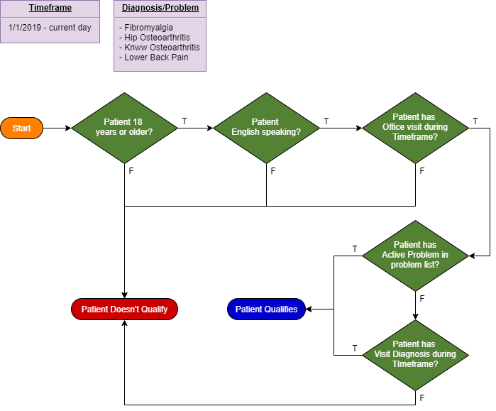

### Initial Qualifying Query

The initial qualifying query defines a set of patients that qualify for chronic pain management for the following 
**diagnoses/problems** during a specified **timeframe**:
- Fibromyalgia
- Hip osteoarthritis
- Knee osteoarthritis
- Lower back pain

### Functional Description

The **timeframe** is specified as an interval from 1/1/2019 to the current day.

The patient must be 18 years or older at the beginning of the **timeframe**.

The patient must be English speaking.

The patient must have an Office Visit during the **timeframe**.

The patient must have an active **Problem** in the problem list **OR** a visit **Diagnosis** during the **timeframe**.

### Functional Diagram

  

### CQL Logic



