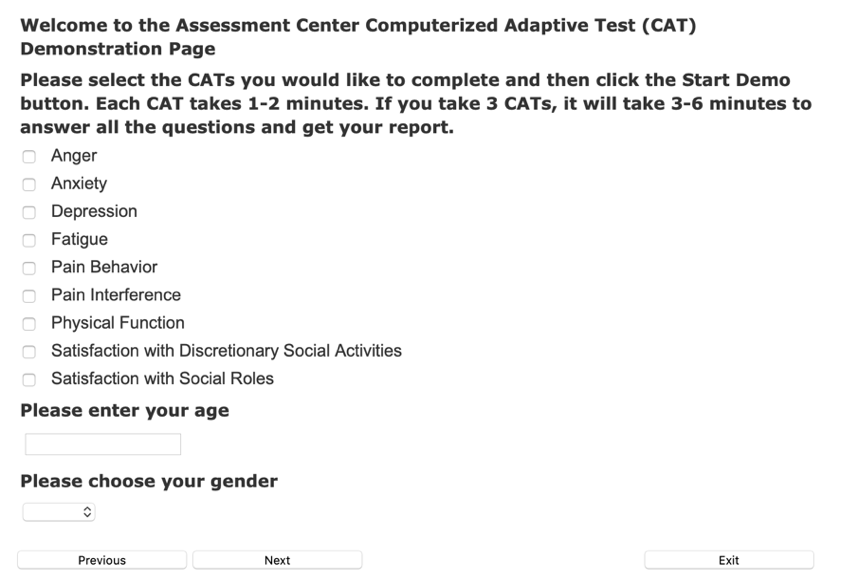

title: System Design Document

---

# System Design Document

**CDS4CPM**  
Version: 1.0  
02/20/2020  
Document Number:  
Contract Number:

## Table of Contents

- [1. Introduction](#1-introduction)
  - [1.1 Purpose of the SDD](#11-purpose-of-the-sdd)
- [2. General Overview and Design Guidelines/Approach](#2-general-overview-and-design-guidelines-approach)
  - [2.1 General Overview](#21-general-overview)
  - [2.2 Assumptions/Constraints/Risks](#22-assumptions-constraints-risks)
    - [2.2.1 Assumptions](#221-assumptions)
    - [2.2.2 Constraints](#222-constraints)
    - [2.2.3 Risks](#223-risks)
  - [2.3 Alignment with Enterprise Architecture](#23-alignment-with-enterprise-architecture)
- [3. Design Considerations](#3-design-considerations)
  - [3.1 Goals and Guidelines](#31-goals-and-guidelines)
  - [3.2 Development Methods & Contingencies](#32-development-methods---contingencies)
  - [3.3 Architectural Strategies](#33-architectural-strategies)
  - [3.4 Performance Engineering](#34-performance-engineering)
- [4. System Architecture and Architecture Design](#4-system-architecture-and-architecture-design)
  - [4.1 Logical View](#41-logical-view)
  - [4.2 Hardware Architecture](#42-hardware-architecture)
    - [4.2.1 Security Hardware Architecture](#421-security-hardware-architecture)
    - [4.2.2 Performance Hardware Architecture](#422-performance-hardware-architecture)
  - [4.3 Software Architecture](#43-software-architecture)
    - [4.3.1 Security Software Architecture](#431-security-software-architecture)
    - [4.3.2 Performance Software Architecture](#432-performance-software-architecture)
  - [4.4 Information Architecture](#44-information-architecture)
    - [4.4.1 Records Management](#441-records-management)
      - [4.4.1.1 Data](#4411-data)
      - [4.4.1.2 Manual/Electronic Inputs](#4412-manual-electronic-inputs)
      - [4.4.1.3 Master Files](#4413-master-files)
  - [4.5 Internal Communications Architecture](#45-internal-communications-architecture)
  - [4.6 Security Architecture](#46-security-architecture)
  - [4.7 Performance](#47-performance)
  - [4.8 System Architecture Diagram](#48-system-architecture-diagram)
- [5. System Design](#5-system-design)
  - [5.1 Business Requirements](#51-business-requirements)
  - [5.2 Database Design](#52-database-design)
    - [5.2.1 Data Objects and Resultant Data Structures](#521-data-objects-and-resultant-data-structures)
    - [5.2.2 File and Database Structures](#522-file-and-database-structures)
      - [5.2.2.1 Database Management System Files](#5221-database-management-system-files)
      - [5.2.2.2 Non-Database Management System Files](#5222-non-database-management-system-files)
  - [5.3 Data Conversion](#53-data-conversion)
  - [5.4 User Machine-Readable Interface](#54-user-machine-readable-interface)
    - [5.4.1 Inputs](#541-inputs)
    - [5.4.2 Outputs](#542-outputs)
  - [5.5 User Interface Design](#55-user-interface-design)
    - [5.5.1 Section 508 Compliance](#551-section-508-compliance)
- [6. Operational Scenarios](#6-operational-scenarios)
- [7. Detailed Design](#7-detailed-design)
  - [7.1 Hardware Detailed Design](#71-hardware-detailed-design)
  - [7.2 Software Detailed Design](#72-software-detailed-design)
  - [7.3 Security Detailed Design](#73-security-detailed-design)
  - [7.4 Performance Detailed Design](#74-performance-detailed-design)
  - [7.5 Internal Communications Detailed Design](#75-internal-communications-detailed-design)
- [8. System Integrity Controls](#8-system-integrity-controls)
- [9. External Interfaces](#9-external-interfaces)
  - [9.1 Interface Architecture](#91-interface-architecture)
  - [9.2 Interface Detailed Design](#92-interface-detailed-design)
- [Appendix A: Record of Changes](#appendix-a--record-of-changes)
- [Appendix B: Acronyms](#appendix-b--acronyms)
- [Appendix C: Glossary](#appendix-c--glossary)
- [Appendix D: Referenced Documents](#appendix-d--referenced-documents)
- [Appendix E: Approvals](#appendix-e--approvals)
- [Appendix F: Additional Appendices](#appendix-f--additional-appendices)

## 1. Introduction

<!-- Instructions: Provide identifying information for the existing and/or proposed automated system or situation for which the System Design Document (SDD) applies (e.g., the full names and acronyms for the development project, the existing system or situation, and the proposed system or situation, as applicable), and expected evolution of the document. Also describe any security or privacy considerations associated with use of this document. -->

Through its Accelerating Change and Transformation in Organizations and Networks III (ACTION III) initiative, the Agency for Healthcare Research & Quality (AHRQ) has elected to sponsor a project called Clinical Decision Support for Chronic Pain Management (CDS4CPM) which investigates how knowledge from narrative clinical practice guidelines or best practices—or patient-centered outcomes research—can be made actionable for patients and clinicians at scale. Embodied to some degree in prior work such as that of the PCCDS Learning Network (PCCDS-LN) and CDS Connect, AHRQ has invested in the concepts of patient-centered and shareable clinical decision support (CDS) but these efforts face development and implementation challenges to wider adoption and use.

The PCCDS-LN is an Agency for Healthcare Research and Quality (AHRQ)-supported effort that brings together diverse stakeholders to promote a sustainable community around developing, disseminating, and applying evidence-enabled, patient-centered clinical decision support. Three working groups convened by the PCCDS-LN, the opioid action plan working group (OAPWG), the technical framework working group (TechFWG), and the patient-facing CDS application development working group (PFWG) developed key findings that have contributed to the concepts to be developed and tested in this system.

Related to this, the purpose of the CDS Connect Repository is to store and provide access to CDS artifacts, ranging from text to computable versions of decision logic that trigger events and include text recommendations and suggested actions; pilot and implementation details; lessons learned during development, integration, and clinical use; and metadata, including original evidence links, decisions made in creating the artifact, sponsoring clinical organizations, and keywords. The CDS Connect repository contains several CDS artifacts that could be useful in addressing CNCP management. Inspired by the Centers for Disease Control and Prevention (CDC) Guideline for Prescribing Opioids for Chronic Pain, the PMD is not directly derived from a single CDC recommendation statement. It is intended to complement several recommendation statements within the CDC guideline and provide a consolidated view of a patient’s pain experience in the context of supporting management of their condition. The goal is to promote and support discussion, also referred to as shared decision making (SDM) between the patient and the provider on the effectiveness of existing treatments, the benefits and risks of specific intervention options, and to describe and promote the use of non-opioid and/or non-pharmacologic treatment whenever possible.

The PMD as it currently exists lacks a specific interface or related service to support the collection of key information from the patient. To this end, the system described herein contains an additional component, MyPAIN, which would be patient-facing and used to collect data via pain-related assessments (e.g., PEG scale for pain, PROMIS 6a short form for pain interference, etc.), provide access to authoritative educational materials (e.g., ACPA’s four flat tires video, Harvard’s Non-opioid options for managing chronic pain, etc.), and effectively present content.

Other extensions of the PMD will include the ability to incorporate demographic data, social determinants of health data, PDMP data, and related contextual (patient-specific) information to be requested of the EHR.

By building upon the PMD and incorporating the MyPAIN component, the CDS4CPM project seeks to connect clinical sites and patient participants, clinical best practices, novel delivery models, and evidence generators to demonstrate how to provide high-quality patient care CDS in a standardized, publicly-shareable form at scale.

The requirements for the systems and services in this project are documented in the System Requirements Document (SRD). Following upon that, this System Design Document (SDD) describes design goals and considerations, provides a high-level overview of the system architecture, and maps the requirements described in the SRD to the implementation of the system and services.

### 1.1 Purpose of the SDD

<!-- Instructions: Provide the purpose of the SDD. This document should be tailored to fit a particular project’s needs.  -->

This SDD documents and tracks the necessary information required to define the architecture and system design of these components and their interactions with other systems to give the development team guidance on the implementation of these components. This document is intended for all key stakeholders of this system including developers, project managers, users, testers, and documentation writers.

## 2. General Overview and Design Guidelines/Approach

### 2.1 General Overview

<!-- Instructions: Briefly introduce the system context and the basic design approach or organization. Provide a brief overview of the system and software architectures and the design goals. Include the high-level context diagram(s) for the system and subsystems previously provided in the High-Level Technical Design Concept/Alternatives and/or Requirements Document, updated as necessary to reflect any changes that have been made based on more current information or understanding. If the high-level context diagram has been updated, identify the changes that were made and why.  -->

The system outlined in this document includes two central services, MyPAIN, which will handle the collection and transmission of chronic non-cancer pain (CNCP) assessment information, provide relevant educational content, and martial a workflow designed to handle the collection and delivery of this information to support a shared decision making (SDM) encounter for a patient and their provider. Partnering with MyPAIN is PainManager. PainManager is based on the MITRE-developed Pain Management Dashboard (PMD), a registered CDS Connect artifact, and handles the presentation of information collected via MyPAIN along with some demographic, social determinants of health data, prescription drug monitoring program (PDMP) data (optional), and other clinically relevant information retrieved from an electronic health record (EHR). Together, these products form a system for the delivery of both patient and provider facing CDS to support SDM in CNCP patients at two sites, Vanderbilt University Medical Center (VUMC) and the University of Chicago Medicine (UCM). PainManager is intended to collect additional information regarding treatment decisions and both transmit and store the results of the SDM encounter.

Both components are planned to be implemented as Substitutable Medical Applications, Reusable Technologies (SMART) on Fast Healthcare Interoperability Resources (FHIR) services. These SMART on FHIR services are expected to be integrated with or interfaced to an EHR.

As of the time of this writing there are several open questions that need to be addressed in order ot fully define the system architecture, including potential shared components for MyPain and PainManager or site-specific services for the integration of these components into an EHR environment. As noted above the PainManager will be based on the PMD. There is a pre-existing system called PatientWisdom that is being considered for use as the basis of MyPain.

The diagrams in this document follow the C4 model for visualizing software architecture, which represents four levels granularity (Context, Containers, Components, Code). The following diagram is at the coarsest level of granularity.

Diagram 1 - Context Diagram for CDS4CPM

### 2.2 Assumptions/Constraints/Risks

#### 2.2.1 Assumptions

<!-- Instructions: Describe any assumptions or dependencies regarding the system, software and its use. These may concern such issues as: related software or hardware, operating systems, end-user characteristics, and possible and/or probable changes in functionality. -->

- Leverage and build upon the existing CDS Connect PMD artifact to the fullest extent possible
- Leverage the CPGonFHIR checklists and implementation guide as appropriate, in the hopes of leveraging other opioid related work in this arena
- We are considering a central assumption, which is to first build for an Epic implementation at the two sites (VUMC and UCM), and then refine and post the shareable artifact(s) after roll-out
- We are considering a central assumption to build for an Epic EHR implementation in the two sites (VUMC and UCM) first and refine and post the shareable artifact(s) after roll-out.
- Availability of and patient access and use of the EHR and associated patient portal
- Affiliated sites with primary care providers interested in using CDS for chronic pain management support
- Associated training for providers related to CDS for chronic pain management support and SDM using the SHARE framework

#### 2.2.2 Constraints

<!-- Instructions: Describe any global limitations or constraints that have a significant impact on the design of the system’s hardware, software and/or communications, and describe the associated impact. Such constraints may be imposed by any of the following (the list is not exhaustive):
    • Hardware or software environment
    • End-user environment
    • Availability or volatility of resources
    • Standards compliance
    • Interoperability requirements
    • Interface/protocol requirements
    • Licensing requirements
    • Data repository and distribution requirements
    • Security requirements (or other such regulations)
    • Memory or other capacity limitations
    • Performance requirements
    • Network communications
    • Verification and validation requirements (testing)
    • Other means of addressing quality goals
    • Other requirements described in the Requirements Document  -->

- Every step in the development of this solution will depend upon a tight budget and timeline with the desire to implement in the first year and collect data in the second
- This system is being designed  in primary care clinics identified by our two site partners: VUMC and UCM. The target for this intervention include:
  - Chronic low back pain
  - Osteoarthritis of the hip
  - Osteoarthritis of the knee
  - Fibromyalgia
- Constraints related to the phenotype and trigger behavior in addition to the overall workflow will be forthcoming in future design documents. This will include related constraints around FHIR resources, use of CDS-HOOKS, other technical constraints, financial issues, licensing issues, and regulatory concerns all of which are currently under investigation by the project team.

#### 2.2.3 Risks

<!-- Instructions: Describe any risks associated with the system design and proposed mitigation strategies.  -->

- Each site comes with independent dependencies related to approval processes for integration into the Epic MyChart environments for MyPAIN and into the Epic ambulatory environments for PainManager.
- Similarly, each site has different challenges and dependencies regarding PDMP data access and integration.

### 2.3 Alignment with Enterprise Architecture

<!-- Instructions: Describe alignment with EA.  -->

## 3. Design Considerations

<!-- Instructions: Describe issues which need to be addressed or resolved before attempting to devise a complete design solution. -->

### 3.1 Goals and Guidelines

<!-- Instructions: Describe any goals, guidelines, principles, or priorities which dominate or embody the design of the system and its software. Examples of such goals might be: an emphasis on speed versus memory use; or working, looking, or “feeling” like an existing product. Guidelines include coding guidelines and conventions. For each such goal or guideline, describe the reason for its desirability unless it is implicitly obvious. Describe any design policies and/or tactics that do not have sweeping architectural implications (meaning they would not significantly affect the overall organization of the system and its high-level structures), but which nonetheless affect the details of the interface and/or implementation of various aspects of the system (e.g., choice of which specific product to use).  -->

### 3.2 Development Methods & Contingencies

<!-- Instructions: Briefly describe the method or approach used for the system and software design (e.g., structured, object-oriented, prototyping, J2EE, UML, XML, etc.). If one or more formal/ published methods were adopted or adapted, then include a reference to a more detailed description of these methods. If several methods were seriously considered, then each such method should be mentioned, along with a brief explanation of why all or part of it was used or not used. Describe any contingencies that might arise in the design of the system and software that may change the development direction. Possibilities include lack of interface agreements with outside agencies or unstable architectures at the time the SDD is prepared. Address any possible workarounds or alternative plans.  -->

### 3.3 Architectural Strategies

<!-- Instructions: Describe any design decisions and/or strategies that affect the overall organization of the system and its higher-level structures. These strategies should provide insight into the key abstractions and mechanisms used in the system architecture. Describe the reasoning employed for each decision and/or strategy (possibly referring to previously stated design goals and principles) and how any design goals or priorities were balanced or traded-off. 
Describe compliance with standards. Specifically identify any deviations that were made from the standards, and provide rationale to support the deviation(s). When describing a design decision, discuss any other significant alternatives that were considered, and the reasons for rejecting them (as well as the reasons for accepting the alternative finally chosen). Sometimes it may be most effective to employ the “pattern format” for describing a strategy. 
Examples of design decisions might concern (but are not limited to) things like the following:
    • Use of a particular type of product (programming language, database, library, commercial off-the-shelf (COTS) product, etc.)
    • Reuse of existing software components to implement various parts/features of the system
    • Future plans for extending or enhancing the software
    • User interface paradigms (or system input and output models)
    • Hardware and/or software interface paradigms
    • Error detection and recovery
    • Memory management policies
    • External databases and/or data storage management and persistence
    • Distributed data or control over a network
    • Generalized approaches to control
    • Concurrency and synchronization
    • Communication mechanisms
    • Management of other resources  -->

### 3.4 Performance Engineering

<!-- Instructions:
Using the Performance Requirements defined in the Requirements Document, provide a detailed explanation that describes how the Performance Requirements were incorporated into the system’s design. Please refer to any contractual reference to defining Performance Requirements.
Start preparing Production Load Model(s) in preparation for Performance testing. Please refer to any contractual reference to performance testing standards.  -->

Performance requirements are a contributing factor to system design.
Performance requirements are the defined scalability or responsiveness expectations of specific workloads that process on a system.

## 4. System Architecture and Architecture Design

<!-- Instructions: Describe the system architecture, how the application interacts with other applications. Not necessarily how the application itself works but, how the appropriate data is correctly passed between applications. Provide an overview of how the functionality and responsibilities of the system were partitioned and then assigned to subsystems or components. Don’t go into too much detail about the individual components themselves in this section. A subsequent section of the SDD will provide the detailed component descriptions. The main purpose here is to gain a general understanding of how and why the system was decomposed, and how the individual parts work together to provide the desired functionality.
At the top-most level, describe the major responsibilities that the software must undertake and the various roles that the system (or portion of the system) must play. Describe how the system was broken down into its components/subsystems (identifying each top-level component/subsystem and the roles/responsibilities assigned to it). Describe how the higher-level components collaborate with each other in order to achieve the required results. Provide some sort of rationale for choosing this particular decomposition of the system (perhaps discussing other proposed decompositions and why they were rejected).
Make use of design patterns whenever possible, either in describing parts of the architecture (in pattern format), or for referring to elements of the architecture that employ them. Provide rationale for choosing a particular algorithm or programming idiom (or design pattern) to implement portions of the system’s functionality.  -->

This section outlines the system and hardware architecture design of the system.

### 4.1 Logical View

<!-- Instructions: Insert any related logical views or provide a reference to where they are stored.  -->

### 4.2 Hardware Architecture

<!-- Instructions: Describe the overall system hardware and organization, indicating whether the processing system is distributed or centralized. Identify the type, number, and location of all hardware components including the presentation, application, and data servers and any peripheral devices (e.g., load balancers, SSL accelerator, switches, firewalls, with a brief description of each item and diagrams showing the connectivity between the components along with required firewalls, ports, and network bands utilized (e.g., management band). Include resource estimates for processor capacity, memory, on-line storage, and auxiliary storage.   -->

We currently expect the hardware architecture to be site-specific. More on the overall site architecture is under development now.

#### 4.2.1 Security Hardware Architecture

<!-- Instructions: Describe the hardware components and configuration supporting the security and privacy of the system. Specify the architecture for (1) authentication to validate user identity before allowing access to the system, including the use of IACS/EUA or other type of Identity Vetting & Authentication system;(2) authorization of users to perform functional activity once logged into the system, (3) encryption protocol to support the business risks and the nature of information, and (4) logging and auditing design, if required. The design should be based on the designated system security level and provide adequate protection against threats and vulnerabilities.  -->

#### 4.2.2 Performance Hardware Architecture

<!-- Instructions: Describe the hardware components and configuration supporting the performance and reliability of the system. Identify single points of failure and, if relevant, describe high availability design (e.g., clustering).  -->

### 4.3 Software Architecture

<!-- Instructions: Describe all software that is needed to support the system, the hardware component for which each software component is targeted, and specify the physical location of all software systems. List such things as logical components (e.g., JSP in presentation layer, JNDI in application layer, EJB and JDBC in data layer), database platforms, computer languages, compilers, utilities, operating systems, communications software, programming computer-aided software engineering tools, commercial off-the-shelf (COTS) software, open source frameworks, etc., with a brief description of the function of each item and any identifying information such as manufacturer, version number, number and types of licenses needed, etc., as appropriate. Identify all Computer Software Configuration Items (CSCIs), Computer Software Components (CSCs) and Application Programming Interfaces (APIs) to include name, type, purpose and function for each; the interfaces, messaging, and protocols for those elements; and rationale for the software architectural design. Include software modules that are functions, subroutines, or classes. Use functional hierarchy diagrams, structured organization diagrams (e.g., structure charts), or object-oriented diagrams that show the various segmentation levels down to the lowest level. All features on the diagrams should have reference numbers and names.
Include a narrative that expands on and enhances the understanding of the functional breakdown. If necessary, describe how a component was further divided into subcomponents, and the relationships and interactions between the subcomponents. Proceed into as many levels/subsections of discussion as needed in order to provide a high-level understanding of the entire system or subsystem, leaving the details for inclusion in a later section of the SDD. Include data flow diagrams that conform to appropriate standards (e.g., Yourdon-Demarco conventions) and provide the physical process and data flow related to the logical process and data flow decomposed to the primitive process level (describing how each input is processed/transformed into the resulting output). If there are parts of the system that already existed before this development effort began, then only describe the relationships and interactions between the old parts and the new parts. Pre-existing parts that are modified or enhanced need to be described only to the extent that is necessary to provide a sufficient understanding of the nature of the changes that are being made.  -->

#### 4.3.1 Security Software Architecture

<!-- Instructions: Describe the software components and configuration supporting the security and privacy of the system. Specify the architecture for (1) authentication to validate user identity before allowing access to the system, including the use of IACS/EUA or other type of Identity Vetting & Authentication system;(2) authorization of users to perform functional activity once logged into the system, (3) encryption protocol to support the business risks and the nature of information, and (4) logging and auditing design, if required. The design should be based on the designated system security level and provide adequate protection against threats and vulnerabilities.  -->

#### 4.3.2 Performance Software Architecture

<!-- Instructions: Describe the software components and configuration supporting the performance and reliability of the system. Identify single points of failure and, if relevant, describe high availability design (e.g., clustering).  -->

### 4.4 Information Architecture

<!-- Instructions: Describe the information that will be stored in the system (e.g. beneficiary information, claim data, etc.) Identify if any of the information is personally identifiable information (PII), individually identifiable information (IIF), or personal health information (PHI).  -->

#### 4.4.1 Records Management

Federal regulations issued by the National Archives and Records Administration (NARA) are outlined in 36 Code of Federal Regulations (CFR) - Subchapter B - Records Management. Business owners must contact the Office of Strategic Operations and Regulatory Affairs (OSORA) to initiate the record management process.

##### 4.4.1.1 Data

<!--  Identify all data (as well as the format of the data — paper, manual input, electronic data) supplied to the system as well as who/what is supplying the data.  -->

##### 4.4.1.2 Manual/Electronic Inputs

 <!-- Provide instructions on what happens to the manual/electronic inputs after they are entered into the master file/database and are verified.  -->

##### 4.4.1.3 Master Files

<!-- Provide a detailed description of the data maintained in the system/database.  -->

### 4.5 Internal Communications Architecture

<!-- Instructions: Provide a detailed description of the system’s communications network, denoting the communications architecture(s) being implemented (e.g., Token Ring, Ethernet, etc.) and how system components are linked. Describe any Local or Wide Area Networks and buses. Include descriptions of necessary equipment (e.g., hubs, routers, cabling, transmitters, firewalls, ports, etc.). Provide a diagram depicting the communications flow between the system and subsystem components. Include resource estimates for communications network capacity (LAN and WAN) needed to install and execute each application on each platform.  -->

### 4.6 Security Architecture

<!-- Instructions: Insert any related security architecture documents, including integrity controls, or provide a reference to where they are stored.  -->

### 4.7 Performance

<!-- Instructions: Insert any performance documents or provide a reference to where they are stored.  -->

Preliminary considerations of system performance include total time to complete a session with MyPAIN (for patients) with an upper limit of 15 minutes, and total time to review material in PainManager (for clinicians) at an average of 5 minutes. Considerations for the population and presentation of PainManager dashboard are expected to reflect standards for this service (likely ~3 seconds maximum). Details on the total time to complete an SDM encounter are under development.

### 4.8 System Architecture Diagram

<!-- Instructions: Using the hardware, software, communications, and information designs described above, depict the overall, integrated structure of the system in terms of presentation, application, and data regions.
Diagram(s) should show the architecture of the “to-be-production-system,” i.e., the architectural design must map to the targeted production environment.
Diagram(s) must reflect the accuracy and clarity of the system architecture.
Diagram(s) must reflect the complete system’s context, i.e., more detailed software components, internal/external interfaces, and their underlying infrastructure, etc., not just pertain to the design under review.  -->

## 5. System Design

### 5.1 Business Requirements

<!-- Instructions: Insert any related project business requirements or provide a reference to where they are stored.  -->

### 5.2 Database Design

<!-- Instructions: Describe the design of all database management system (DBMS) files and non-DBMS files associated with the system. Provide a comprehensive data dictionary showing data element name, type, length, source, validation rules, maintenance (create, read, update, delete (CRUD) capability), data stores, outputs, aliases, and description. The Data Design information can be included as an appendix or recorded in a separate Database Design Document (DDD), as appropriate, which would be referenced here.  -->

#### 5.2.1 Data Objects and Resultant Data Structures

<!-- Instructions: For each functional data object, specify the data structure(s) which will be used to store and process the data. Describe any data structures that are a major part of the system, including major data structures that are passed between components. List all functions and function parameters. For functions, give function input and output names in the description. Refer as appropriate to the decomposition diagrams.  -->

#### 5.2.2 File and Database Structures

<!-- Instructions: Using the Logical Data Model (LDM), create a physical data model that describes data storage and manipulation in the systems architectural setting. Describe file structures and their locations. Explain how data may be structured in the selected DBMS, if applicable. Refer to a separate DDD, as appropriate. For networks, detail the specific distribution of data. Note any changes to the LDM that occur because of software or hardware requirements.  -->

##### 5.2.2.1 Database Management System Files

<!-- Instructions: Provide the detailed design of the DBMS files. Generally, this information should be documented in a separate DDD that should be referenced within this section.  -->

##### 5.2.2.2 Non-Database Management System Files

<!-- Instructions: Provide the detailed description of all non-DBMS files and include a narrative description of the usage of each file that identifies if the file is used for input, output, or both, and if the file is a temporary file. Also provide an indication of which modules read and write the file and include file structures (refer to the data dictionary). As appropriate, the file structure information should include the following:
    • Record structures, record keys or indexes, and data elements referenced within the records
    • Record length (fixed or maximum variable length) and blocking factors
    • Access method (e.g., index sequential, virtual sequential, random access, etc.)
    • Estimate of the file size or volume of data within the file, including overhead resulting from file access methods
    • Definition of the update frequency of the file (If the file is part of an online transaction-based system, provide the estimated number of transactions per unit of time, and the statistical mean, mode, and distribution of those transactions.)
    • Backup and recovery specifications  -->

### 5.3 Data Conversion

<!-- Instructions: Insert any documents describing any necessary data conversions or provide a reference to where they are stored.  -->

### 5.4 User Machine-Readable Interface

<!-- Instructions: Provide a description of each user class or role associated with the system. A user class is distinguished by the ways in which users interact with the proposed system or situation. Factors that distinguish a user class include common responsibilities, skill levels, work activities, and modes of interaction with the system. In this context, a user is anyone who interacts with the proposed system, including operational users, data entry personnel, system operators, operational support personnel, system maintainers, and trainers. For each user class, provide estimates of the total number of users anticipated, a maximum number of concurrent users, and the number of external users.  -->

#### 5.4.1 Inputs

<!-- Instructions: Provide a description of the input media used by the user/operator for providing information to the system. Show a mapping to the high-level data flows (e.g., data entry screens, optical character readers, bar scanners, etc.). If appropriate, the input record types, file structures, and database structures provided in the section for Data Design, may be referenced. Include data element definitions, or refer to the data dictionary. Provide the layout of all input data screens or graphical user interfaces (GUIs) (e.g., windows). Define all data elements associated with each screen or GUI, or reference the data dictionary. Provide edit criteria for the data elements, including specific values, range of values, mandatory/optional, alphanumeric values, and length. Also address data entry controls to prevent edit bypassing. Discuss the miscellaneous messages associated with user/operator inputs, including (but not limited to) the following:
    • Copies of form(s) if the input data are keyed or scanned for data entry from printed forms
    • Description of any access restrictions or security considerations
    • Each transaction name, code, and definition, if the system is a transaction-based processing system
    • Incorporation of the Privacy Act statement into the screen flow, if the system is covered by the Privacy Act
    • Description of accessibility provisions to comply with Section 508 of the Rehabilitation Act  -->

#### 5.4.2 Outputs

<!-- Instructions: Describe the system output design relative to the user/operator. Show a mapping to the high-level data flows. System outputs include reports, data display screens and GUIs, query results, etc. The output files described in the section for Data Design may be referenced. The following should be provided, if appropriate:
    • Identification of codes and names for reports and data display screens
    • Description of report and screen contents (provide a graphical representation of each layout and define all data elements associated with the layout or reference the data dictionary)
    • Description of the purpose of the output, including identification of the primary users
    • Report distribution requirements, if any (include frequency for periodic reports)
    • Description of any access restrictions or security considerations  -->

### 5.5 User Interface Design

<!-- Instructions: Insert any user interface design documents or provide a reference to where they are stored.  -->

For MyPAIN, the UI will be new. The UI for PainManager will reuse and extend the CDS Connect PMD.

**MyPain**

The UI for MyPAIN will center around the delivery of educational materials and the collection of assessment data. While the final materials are still yet to be determined, strong candidates are under review now. To illustrate the kinds of components that will populate MyPAIN and subsequently drive the UI, below are some screen shots of candidate components:

Educational materials: MyPAIN will prompt patients who use it to review a combination of educational materials to cover issues around chronic pain management, treatment options and shared decision making processes. For anyone with a recent prior history of opioid use, an additional item on alternatives to opioids for treatment will be provided.

An example of one of these materials is the ACPA’s video titled “APCA Car With Four Flat Tires”. More detail on the UI will be developed in the next phase of the work and updated accordingly.

Assessments: Several assessments are under consideration for inclusion in MyPAIN. Many stem from the work already undertaken in the development of the PMD including the PEG Scale Assessing Pain Intensity and Interference (Pain, Enjoyment, General Activity or PEG) scale and the Patient-Reported Outcomes Measurement Information System (PROMIS) measures. Many PROMIS measures are already available in the EHR and also have a computer adapted testing (CAT) format with related application programming interface (API). These are fairly typical survey style interactive forms such as the ones depicted below in Exhibits XX and YY:

Exhibit XX: Sample PROMIS User Interface for CAT

Exhibit YY: Sample PROMIS User Interface for CAT

**PainManager**

The basic UI of the existing PMD artifact will persist in this system. The current plan is to expand the available elements in the dashboard to accommodate the desire to include demographic information, relevant chart or medical information, available SDoH information, and to incorporate the self assessment information and report on educational access and use generated through MyPAIN. In addition, if possible, the PDMP data will also be included. An example of this is shown in Exhibit ZZ:

Exhibit ZZ: Sample User Interface for PainManager Based on the PMD

#### 5.5.1 Section 508 Compliance

<!-- Instructions: Describe accessibility considerations in your user interface design and insert your section 508 compliance related documents or provide a reference to where they are stored.  -->

## 6. Operational Scenarios

<!-- Instructions: Describe the general functionality of the system from the users’ perspectives and provide an execution or operational flow of the system via operational scenarios that provide step-by-step descriptions of how the proposed system should operate and interact with its users and its external interfaces under a given set of circumstances. The scenarios tie together all parts of the system, the users, and other entities by describing how they interact, and may also be used to describe what the system should not do. 
Operational scenarios should be described for all operational modes, transactions, and all classes of users identified for the proposed system. For each transaction, provide an estimate of the size (use maximum, if variable) and frequency (e.g., average number per session). Identify if there any transactional peak periods and include an estimate of frequency during those periods. Each scenario should include events, actions, stimuli, information, and interactions as appropriate to provide a comprehensive understanding of the operational aspects of the proposed system. 
 The scenarios can be presented in several different ways: 1) for each major processing function of the proposed system, or 2) thread-based, where each scenario follows one type of transaction type through the proposed system, or 3) following the information flow through the system for each user capability, following the control flows, or focusing on the objects and events in the system. The number of scenarios and level of detail specified will be proportional to the perceived risk and the criticality of the project.  -->

 This system is intended for use by clinicians delivering care in an outpatient setting. Therefore, relevant use cases would include clinicians specializing in primary care, family medicine, internal medicine, geriatrics, and/or pain management.

The system identifies a patient who is to receive the intervention and then sends an email (or other means of communication) to the patient, which directs him or her to an EHR patient portal. Note that the specific method or phenotype used to identify and send the invitation is dependent on local implementation decisions. This email provides a link for the user to access MyPAIN to receive educational information on CNCP management and SDM along with requesting that the patient complete several assessments regarding their CNCP status and preferences to help them prepare for the SDM encounter. When the patient completes their MyPAIN materials, a notification is sent to the provider that assessment materials were completed and are available for review. At the time of the patient encounter, the physician is then presented with the patient-specific information in PainManager to carry out SDM. The information is to be supplied as a dashboard that displays various information including: clinical concepts that a clinician might consider before making a treatment decision regarding CNCP, demographic and/or SDoH information, patient-specific clinical information, and PDMP data.

Typical use case scenarios include:

        (1) When a chronic lower back pain patient with no history of recent opioid use schedules a pain-related appointment with their primary care provider:

Mr. Delta, a 43-year-old patient with a recent history of chronic lower back pain schedules a visit with Dr. Charlie and cites his back pain as his primary reason for the visit. The system identifies Mr. Delta, who has no history of recent opioid use [1, see p. 24 for definition used for PMD], as a candidate to receive an invitation to MyPAIN. Before his visit, Mr. Delta receives an invitation to MyPAIN via the local EHR patient portal, MyChart. Mr. Delta accesses MyPAIN and spends about 15 minutes or less reviewing educational material and completing assessments, including indicating how ready he is for his upcoming SDM encounter with Dr. Charlie. When Mr. Delta finishes and exits MyPain or the linked materials, the system automatically sends Dr. Charlie a secure message that Mr. Delta’s materials from MyPAIN are ready for review. Just prior to his visit with Mr. Delta, Dr. Charlie spends a few minutes reviewing the information assembled for his SDM encounter in PainManager which includes all of the information Mr. Delta submitted via MyPAIN. Dr. Charlie notes that Mr. Delta’s pain functional status has been unacceptably low, and his pain level has remained elevated over the past 6 months. When Mr. Delta arrives for his visit, Dr. Charlie discusses possible therapeutic approaches with Mr. Delta using the SHARE framework for SDM. Noting that no non-pharmacologic treatments have been ordered for Mr. Delta in the past 6 months, Dr. Charlie recommends physical therapy to Mr. Delta to help improve his functional status as well as acupuncture to reduce his level of pain. Mr. Delta agrees to both options for treatment and this information is documented by Dr. Charlie.

        (2) When a patient with chronic osteoarthritic knee and hip pain has a history of recent opioid use schedules a pain-related appointment with their primary care provider:

Ms. Echo, a 65 year old patient with a 5 year history of chronic osteoarthritic knee and hip pain schedules a visit with Dr. Alpha and references how her knee and hip pain continue to make dressing difficult and sometimes makes it hard to fall asleep at night. The system identifies Ms. Echo, who has a history of recent opioid use [1, see p. 24 for definition used for PMD], as a candidate to receive an invitation to MyPAIN. Before her visit, Ms. Echo receives an invitation to MyPAIN via the local EHR patient portal, MyChart.  Ms. Echo accesses MyPAIN and spends about 15 minutes reviewing educational material including an information sheet on alternative therapies to opioids and completing assessments, including indicating how ready she is for her upcoming SDM encounter with Dr. Alpha. When Ms. Echo finishes, the system automatically sends Dr. Alpha a secure message that Ms. Echo’s materials from MyPAIN are ready for review. Just prior to her visit with Ms. Echo, Dr. Alpha spends a few minutes reviewing the information assembled for her SDM encounter in PainManager which includes all of the information Ms. Echo submitted via MyPAIN and reviews the SHARE-based shared decision making information provided in PainManager to prepare for that aspect of the upcoming visit as well. Dr. Alpha notes that Ms. Echo’s pain functional status has been unacceptably low, and her pain level has remained elevated over the past 6 months. Dr. Alpha checks on the status of any recent radiologic images for Ms. Echo or any surgery consults. Using PDMP information, Dr. Alpha also notes that Ms. Echo’s use of opioids for therapy have remained steady over the last 6 months. When Ms. Echo arrives for her visit, Dr. Alpha discusses possible therapeutic approaches with Ms. Echo using the SHARE framework for SDM. Noting that only pharmacologic treatments have been ordered for Ms. Echo in the past 6 months, Dr. Alpha recommends the addition of physical therapy to Ms. Echo to help improve her functional status and asks Ms. Echo if she would like to consider a custom brace to also help reduce her level of knee pain. Ms. Echo details her concerns about any increase in opioid therapy and supports recommendations that provide alternatives to opioids to help with her pain. They also discuss whether or not Ms. Echo has previously discussed surgical options with a specialist. Ms. Echo agrees to both options for treatment and this information is documented by Dr. Alpha.

## 7. Detailed Design

<!-- Instructions: Provide the information needed for a system development team to actually build and integrate the hardware components, code and integrate the software components, and interconnect the hardware and software segments into a functional product. Additionally, address the detailed procedures for combining separate COTS packages into a single system.  -->

### 7.1 Hardware Detailed Design

<!-- Instructions: Provide enough detailed information about each of the individual hardware components to correctly build and/or procure all the hardware for the system (or integrate COTS items). If there are many components or if the component documentation is extensive, place it in an appendix. Add additional diagrams and information, if necessary, to describe each component and its functions adequately. Industry-standard component specification practices should be followed. For COTS components, identify specific vendor and appropriate item names and model numbers. Include the following information in the detailed component designs, as applicable:
    • Power input requirements for each component
    • Signal impedances and logic states
    • Connector specifications (serial/parallel, 11-pin, male/female, etc.)
    • Memory and/or storage space specifications
    • Processor requirements (speed and functionality)
    • Graphical representation depicting the number of hardware items (e.g., servers, I/O devices, monitors, printers, etc.), and the relative positioning of the components to each other
    • Cable type(s) and length(s)
    • User interfaces (buttons, toggle switches, etc.)
    • Hard drive/floppy drive/CD-ROM specifications
    • Monitor resolution  -->

### 7.2 Software Detailed Design

<!-- Provide a detailed description for each system software service that addresses the following software service attributes. Much of the information that appears in this section should be contained in the headers/prologues and comment sections of the source code for each component, subsystem, module, and subroutine. If so, this section may largely consist of references to or excerpts of annotated diagrams and source code. Any referenced diagrams or source code excerpts should be provided at any design reviews.
    • Service Identifier - The unique identifier and/or name of the software service
    • Classification - The kind of service (e.g., application, data service, etc.)
    • Definition - The specific purpose and semantic meaning of the service
    • Requirements - The specific functional or nonfunctional requirements that the service satisfies
    • Internal Data Structures - The internal data structures for the service
    • Constraints - Any relevant, assumptions, limitations, or constraints for the service (this should include constraints on timing, storage, or service state, and might include rules for interacting with the service (encompassing pre-conditions, post-conditions, invariants, other constraints on input or output values and local or global values, data formats and data access, synchronization, exceptions, etc.))
    • Composition - A description of the use and meaning of the subservices that are a part of the service
    • Users/Interactions - A description of the service’s collaborations with other services (what other services use this this entity? what other services does this entity use (including any side-effects this service might have on other parts of the system)? this includes the method of interaction, as well as the interaction itself. Object-oriented designs should include a description of any known or anticipated sub-classes, super-classes, and meta-classes)
    • Processing - A description of precisely how the service goes about performing the duties necessary to fulfill its responsibilities (this should encompass a description of any algorithms used; changes or state; relevant time or space complexity; concurrency; methods of creation, initialization, and cleanup; and handling of exceptional conditions)
    • Interfaces/Exports - The set of services (resources, data types, constants, subroutines, and exceptions) that the service provides (the precise definition or declaration of each such element should be present, along with comments or annotations describing the meanings of values, parameters, etc.; for each service element described, include or provide a reference in its discussion to a description of its important software service attributes (Component Identifier, Classification, Language, SLOC Estimate, Definition, Responsibilities, Requirements, Internal Data Structures, Constraints, Composition, Uses/Interactions, Resources, Processing, and Interfaces/Exports))
    • Reporting Design and Integration - If built in, provide details on data traffic and volumes  -->

### 7.3 Security Detailed Design

<!-- Instructions: Provide a graphical representation with detailed information for each of the individual security hardware components. Specify the design for the below items as required.
    • Authentication
    • Authorization
    • Logging and Auditing
    • Encryption
    • Network ports usage
    • Intrusion Detection and Prevention
The design should be based on the designated system security level and provide adequate protection against threats and vulnerabilities.  -->

### 7.4 Performance Detailed Design

<!-- Instructions: Provide a graphical representation with detailed information for each of the individual performance and reliability hardware components to include the below items:
    • Capacity and volume requirements/estimates
    • Performance expectations
    • Availability requirements
    • Performance design to meet capacity requirements
    • Reliability design to meet availability requirements
    • Backup, recovery, and archive design
Identify single points of failure and, if relevant, describe high availability design (e.g., clustering).  -->

### 7.5 Internal Communications Detailed Design

<!-- Instructions: If the system includes more than one component, there may be a requirement for internal communications to exchange information, provide commands, or support input/output functions. Provide enough detailed information about the communication design to correctly build and/or procure the communications components for the system. Include the following information in the detailed component designs, as appropriate:
    • Number of servers and clients to be included on each area network
    • Specifications for bus timing requirements and bus control
    • Format(s) for data being exchanged between components
    • Graphical representation of the connectivity between components, showing the direction of data flow (if applicable), and approximate distances between components (information should provide enough detail to support the procurement of hardware to complete the installation at a given location)
    • LAN topology  -->

## 8. System Integrity Controls

<!-- Instructions: Provide design specifications for the following minimum levels of control and any additional controls as appropriate or necessary:
    • Internal security to restrict access of critical data items to only those access types required by users/operators
    • Audit procedures to meet control, reporting, and retention period requirements for operational and management reports
    • Application audit trails to dynamically audit retrieval access to designated critical data
    • Standard tables to be used or requested for validating data fields
    • Verification processes for additions, deletions, or updates of critical data
    • Ability to identify all audit information by user identification, network terminal identification, date, time, and data accessed or changed.  -->

## 9. External Interfaces

<!-- Instructions: Describe any interfaces that exist with external systems that are not within the scope of the system being designed. Describe the electronic interface(s) between the system being designed and each of the other systems and/or subsystem(s), emphasizing the point of view of the system being designed. If there are more than one or two external systems, or if the interfaces are not simplistic, one or more separate Interface Control Documents (ICDs) should be prepared and referenced here. If applicable, identify how many ICDs exist and what they are. -->

Principally, this system will interface with the current EHR environment at each site for VUMC and UCM. It is likely that this will include both the EHR Ambulatory environment and the EHR patient portal environment at a minimum. Other software interfaces have yet to be determined but some preliminary work investigating PDMP integration suggests additional software interfaces might be required to connect and retrieve PDMP data. An assessment of FHIR API and HL7 standards use at each site is underway.

There may be some need to align the delivery of messaging, e.g., to patient from the EHR patient portal or to provider from the portal or similar, to the best method available at each site. For example, messaging patients through the existing appointment reminder system could be beneficial, this would then point the patient to a link to MyPAIN in their patient portal application. Details on this are still emerging and will be provided in a future update.

### 9.1 Interface Architecture

<!-- Instructions: Describe the interface(s) between the system being developed and other systems (e.g., batch transfers, queries, etc.), indicating the location of the interfacing system. Include the interface architecture(s) being implemented (e.g., wide area networks, gateways, etc.) and the interfacing mechanisms (e.g., MQ, Gentran, etc.) If remote connectivity is required, identify the method of access. Provide a diagram depicting the communications path(s) between this system and each of the other systems, which should map to the context diagram(s) provided in the Section for System Overview. The graphical representation should depict the connectivity between systems, showing the direction of data flow. Use subsections or a separate ICD(s) to address each interface independently.  -->

### 9.2 Interface Detailed Design

<!-- Instructions: For each external system with which the system being designed interfaces, describe the information exchange and rules governing the interface. Provide enough detailed information about the interface to correctly format, transmit, and/or receive data across the interface. Generally, this information should be documented in a separate ICD(s) that should be referenced within this section.  -->

## Appendix A: Record of Changes

<!-- Instructions: Provide information on how the development and distribution of the SDD will be controlled and tracked. Use the table below to provide the version number, the date of the version, the author/owner of the version, and a brief description of the reason for creating the revised version.  -->

Table 1 - Record of Changes

| Version Number | Date | Author/Owner | Description of Change |
|---|---|---|---|
| 1.0 | 02/25/2020 | Jonathan Percival | Initial Draft |

## Appendix B: Acronyms

<!-- Instructions: Provide a list of acronyms and associated literal translations used within the document. List the acronyms in alphabetical order using a tabular format as depicted below.  -->
Table 2 - Acronyms
| Acronym | Literal Translation |
|---|---|
| ACPA | American Chronic Pain Association |
| ACTION III | Accelerating Change and Transformation in Organizations and Networks III |
| AHRQ | Agency for Healthcare Research & Quality |
| API | Application Programming Interface |
| CAT | Computer Adaptive Testing |
| CDS | Clinical Decision Support |
| CDS4CPM | Clinical Decision Support for Chronic Pain Management |
| CNCP | Chronic Non-Cancer Pain |
| CPG | Clinical Practice Guidelines |
| CQL | Clinical Quality Language |
| DDR | Detailed Design Review |
| EHR | Electronic Health Record |
| FHIR |  Fast Healthcare Interoperability Resources |
| GUI | Graphical User Interface |
| IT | Information Technology |
| LDM | Logical Data Model |
| MyPAIN | My Pain Assessment and Information Needs |
| PCCDS | Patient Centered Clinical Decision Support |
| PCCDS-LN | PCCDS Learning Network |
| PCORI | Patient-Centered Outcomes Research Institute |
| PDMP | Prescription Drug Monitoring Program |
| PDR | Preliminary Design Review |
| PEG | Pain, Enjoyment, General Activity |
| PMD | Pain Management Dashboard |
| PROMIS | Patient-Reported Outcomes Measurement Information System |
| SDD | System Design Document |
| SDoH | Social Determinants of Health |
| SDM | Shared Decision Making |
| SMART | Substitutable Medical Applications, Reusable Technologies |
| SRD | System Requirements Document |
| UCM | University of Chicago Medicine |
| UI | User Interface |
| VUMC | Vanderbilt University Medical Center |

## Appendix C: Glossary

<!-- Instructions: Provide clear and concise definitions for terms used in this document that may be unfamiliar to readers of the document. Terms are to be listed in alphabetical order.  -->

Table 3 - Glossary
| Term | Acronym | Definition |
|---|---|---|

## Appendix D: Referenced Documents

<!-- Instructions: Summarize the relationship of this document to other relevant documents. Provide identifying information for all documents used to arrive at and/or referenced within this document (e.g., related and/or companion documents, prerequisite documents, relevant technical documentation, etc.).  -->

Table 4 - Referenced Documents
| Document Name | Document Location and/or URL | Issuance Date |
|---|---|---|
| System Requirements Document | <https://cds.ahrq.gov/collaboration/download/attachments/84869138/Deliverable%201_05_SRS_CDS4CPM_V2_toAHRQ.docx> | 12/31/2019 |
| PMD Implementation Guide | <https://cds.ahrq.gov/sites/default/files/cds/artifact/476/ImplementationGuidePainManagementSummary50810012018.pdf> ||
| CDC Guidelines | <https://www.cdc.gov/drugoverdose/pdf/prescribing/Guidelines_Factsheet-a.pdf> ||
| PCCDS-LN Imperative | <https://www.ncbi.nlm.nih.gov/pmc/articles/PMC6078148/> ||
| AHRQ Clinical Decision Support Portfolio | <https://healthit.ahrq.gov/ahrq-funded-projects/current-health-it-priorities/clinical-decision-support-cds> ||
| AHRQ PCOR CDS site |<https://cds.ahrq.gov>||
| Patient-Centered Clinical Decision Support Learning Network |<https://pccds-ln.org>||
| CDS Connect | <https://cds.ahrq.gov/cdsconnect> ||
| CDS Connect Repository | <https://cds.ahrq.gov/cdsconnect/artifact_discovery> ||
| CDS Connect Authoring Tool | <https://cds.ahrq.gov/cdsconnect/authoring> ||
| CDS Connect PMD | <https://cds.ahrq.gov/cdsconnect/artifact/factors-consider-managing-chronic-pain-pain-management-summary> ||
| SMART-on-FHIR | <https://docs.smarthealthit.org> ||
| CDS Hooks | <https://cds-hooks.org> ||
| CPGonFHIR | <https://confluence.hl7.org/display/CDS/CPGonFHIR> ||
| PCORI Shared Decision Making |<https://www.pcori.org/topics/shared-decision-making>|| AHRQ SHARE Framework|<https://www.ahrq.gov/health-literacy/curriculum-tools/shareddecisionmaking/index.html>||
| Noninvasive Nonpharmacological Treatment for Chronic Pain: A Systematic Review |<https://www.ahrq.gov/health-literacy/curriculum-tools/shareddecisionmaking/index.html>||
| ACPA Four flat tires video | <https://www.theacpa.org/acpa-car-with-four-flat-tires/>||
| Clinical Decision Support for Chronic Pain Management | <https://healthit.ahrq.gov/ahrq-funded-projects/clinical-decision-support-chronic-pain-management-rti> ||
| PROMIS Measures |<http://www.healthmeasures.net/explore-measurement-systems/promis>||

## Appendix E: Approvals

<!-- Instructions: List the individuals whose signatures are desired. Examples of such individuals are Business Owner, Project Manager (if identified), and any appropriate stakeholders. Add additional lines for signature as necessary.  -->

The undersigned acknowledge that they have reviewed the SDD and agree with the information presented within this document. Changes to this SDD will be coordinated with, and approved by, the undersigned, or their designated representatives.

Table 5 - Approvals
| Document Approved By | Date Approved |
|---|---|
| Name, Job Title - Company | Date of Approval |

## Appendix F: Additional Appendices

<!-- Instructions: Utilize additional appendices to facilitate ease of use and maintenance of the document. Suggested appendices include (but are not limited to):
    • Software Architecture Diagrams - provide the functional hierarchy diagrams, structured organization diagrams, or object-oriented diagrams that show the various segmentation levels of the software architecture down to the lowest level.
    • Data Dictionary - provide definitions of all processes, data flows, data elements, and data stores.
    • Requirements Traceability Matrix - demonstrate backward traceability of the system and software architectural designs to the functional and nonfunctional requirements documented in the Requirements Document.
    • Section 508 Product Assessment - demonstrate compliance or non-compliance with accessibility standards provided in Section 508 of the Rehabilitation Act of 1973, as amended effective June 20, 2001. <!-- Instructions: List the individuals whose signatures are desired. Examples of such individuals are Business Owner, Project Manager (if identified), and any appropriate stakeholders. Add additional lines for signature as necessary.  -->

<!--Appendix G: Notes to the Author/Template Instructions
This document is a template for creating an SDD for a given investment or project. The final document should be delivered in an electronically searchable format. The SDD should stand on its own with all elements explained and acronyms spelled out for reader/reviewers.
This template includes instructions, boilerplate text, and fields. The developer should note that:
    • Each section provides instructions or describes the intent, assumptions, and context for content included in that section. Instructional text appears in blue italicized font throughout this template.
    • Instructional text in each section should be replaced with information specific to the particular investment.
    • Some text and tables are provided as boilerplate examples of wording and formats that may be used or modified as appropriate.
When using this template, follow these steps:
    1. Table captions and descriptions are to be placed left-aligned, above the table.
    2. Modify any boilerplate text, as appropriate, to your specific investment.
    3. Do not delete any headings. If the heading is not applicable to the investment, enter “Not Applicable” under the heading.
    4. All documents must be compliant with Section 508 requirements.
    5. Figure captions and descriptions are to be placed left-aligned, below the figure. All figures must have an associated tag providing appropriate alternative text for Section 508 compliance.
    6. Delete this “Notes to the Author/Template Instructions” page and all instructions to the author before finalizing the initial draft of the document. -->
