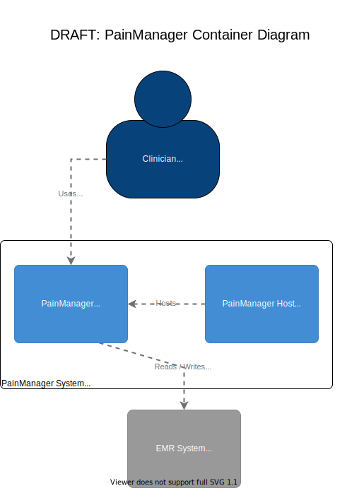
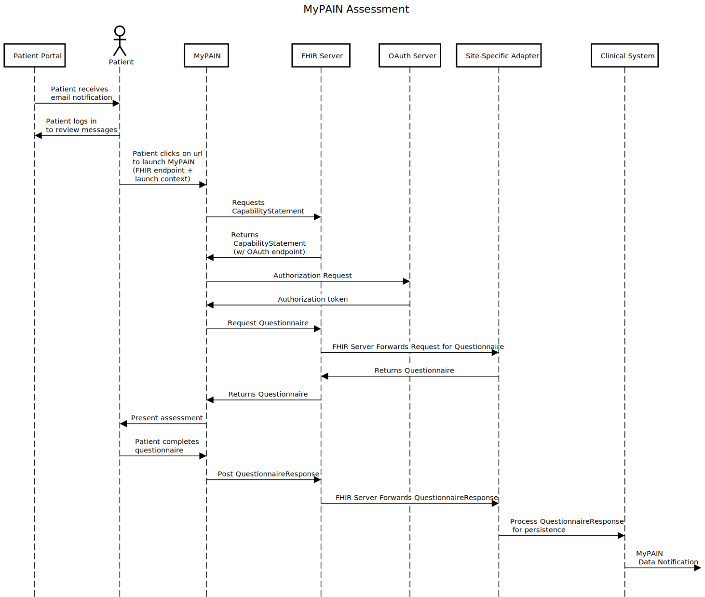

title: System Design Document

---

# System Design Document

**CDS4CPM**  
Version: 1.0  
02/20/2020  
Document Number:  
Contract Number:

## Table of Contents

- [1. Introduction](#1-introduction)
  - [1.1 Purpose of the SDD](#11-purpose-of-the-system-design-document)
- [2. General Overview and Design Guidelines](#2-general-overview-and-design-guidelines)
  - [2.1 General Overview](#21-general-overview)
    - [2.1.1 CDS4CPM Containers](#211-cds4cpm-containers)
    - [2.1.2 Implementation Site Containers](#212-implementation-site-containers)
    - [2.1.3 Interactions](#213-interactions)
    - [2.1.4 Assumptions/Constraints/Risks](#214-assumptions-constraints-risks)
      - [2.1.4.1 Assumptions](#2141-assumptions)
      - [2.1.4.2 Constraints](#2142-constraints)
      - [2.1.4.3 Dependencies](#2143-dependencies)
      - [2.1.4.4 Risks](#2144-risks)
    - [2.1.5 Alignment to the Enterprise Architecture](#215-aligning-to-the-enterprise-architecture)
- [3. Design Considerations](#3-design-considerations)
  - [3.1 Goals and Guidelines](#31-goals-and-guidelines)
    - [3.1.1 Safety Requirements](#311-safety-requirements)
  - [3.2 Development Methods and Contingencies](#32-development-methods-and-contingencies)
  - [3.3 Architectural Strategies](#33-architectural-strategies)
    - [3.3.1 Standards Compliance](#331-standards-compliance)
  - [3.4 Performance Engineering](#34-performance-engineering)
    - [3.4.1 System Architecture and Architecture Design](#341-system-architecture-and-architecture-design)
  - [3.5 Logical View](#35-logical-view)
    - [3.5.1 EMR System View](#351-emr-system-view)
    - [3.5.2 MyPAIN System View](#352-mypain-system-view)
    - [3.5.3 PainManager System View](#353-painmanager-system-view)
  - [3.6 Software Architecture](#36-software-architecture)
    - [3.6.1 Phenotype Trigger](#361-phenotype-trigger)
    - [3.6.2 MyPAIN](#362-mypain)
    - [3.6.3 PainManager](#363-painmanager)
    - [3.6.4 Decision Support](#364-decision-support)
  - [3.7 Information Architecture](#37-information-architecture)
    - [3.7.1 Data](#371-data)
      - [3.7.1.1 Phenotype Trigger](#3711-phenotype-trigger)
      - [3.7.1.2 MyPAIN](#3712-mypain)
      - [3.7.1.3 PainManager](#3713-painmanager)
  - [3.8 Performance](#38-performance)
  - [3.9 Section 508 Compliance](#39-section-508-compliance)
- [4. Operational Scenarios](#4-operational-scenarios)
- [5. System Detailed Design](#5-system-detailed-design)
  - [5.1 User Interfaces](#51-user-interfaces)
    - [5.1.1 User Classes and Characteristics](#511-user-classes-and-characteristics)
  - [5.2 User Interface Design](#52-user-interface-design)
    - [5.2.1 MyPain User Interface](#521-mypain-user-interface)
    - [5.2.2 PainManager User Interface](#522-painmanager-user-interface)
  - [5.3 Detailed Requirements](#53-detailed-requirements)
    - [5.3.1 MyPain Requirements](#531-mypain-requirements)
    - [5.3.2 PainManager Requirements](#532-painmanager-requirements)
- [6. Implementation](#6-implementation)
  - [6.1 Phenotype/Trigger](#61-phenotype-trigger)
    - [6.1.1 Phenotype Requirements](#611-phenotype-requirements)
  - [6.2 MyPAIN](#62-mypain)
  - [6.3 PainManager](#63-painmanager)
  - [6.4 FHIR Facade](#64-fhir-facade)
  - [6.5 Testing](#65-testing)
  - [6.6 Timeline](#66-timeline)
  - [6.7 Evaluation](#67-evaluation)
  - [6.8 Development Progress](#68-development-progress)
- [7. References](#7-references)
- [Appendix A: Record of Changes](#appendix-a-record-of-changes)
- [Appendix F: Additional Appendices](#appendix-f-additional-appendices)

## Glossary
*	Application (App)—is a program or group of programs designed for end users; typically, software that a user downloads, installs, and manages
*	Code—items that comprise a component
*	Context—software system in scope
*	Container—high level building blocks of the software system in scope
*	Component—elements of an individual container
*	Feature—set of related requirements that allows the user to satisfy a business objective or need
*	FHIR façade—an architectural pattern for implementing capability in a standards-compliant way, in the absence of that support from existing/installed vendor systems
*	Function—specification of behavior between outputs and inputs
*	Interface requirement—system requirement that involves an interaction with another system
*	Requirement—a condition or capability needed by a user to solve a problem or achieve an objective
*	Service—centrally managed software that provides some logic or functionality to end users, which a user accesses (via API, website, etc.)
*	Site-specific Adapter—an instance of a FHIR façade at a site, implemented with proprietary mechanisms, but exposed using standard FHIR APIs
*	Software as a service (SaaS)—method of software delivery and licensing in which software is accessed online via a subscription, rather than bought and installed on individual computers
*	[Software] System—a series of components working together to deliver services
*	User interface (UI)—the rules of engagement for a user interacting with a specific page on a website or screen within an application

## Acronyms
| Acronym | Literal Translation |
|---|---|
| ACPA | American Chronic Pain Association |
| AHRQ | Agency for Healthcare Research & Quality |
| API | Application Programming Interface |
| CAT | Computer Adaptive Testing |
| CDC | Centers for Disease Control and Prevention |
| CDS | Clinical Decision Support |
| CNCP | Chronic Non-Cancer Pain |
| CQL | Clinical Quality Language |
| EHR | Electronic Health Record |
| FHIR |  Fast Healthcare Interoperability Resources |
| IRB | Institutional Review Board |
| IT | Information Technology |
| MEDD | Maximum Equivalent Daily Dose (Epic-specific calculation per medication) |
| MME/day | Maximum Morphine Equivalent per day|
| MyPAIN | My Pain Assessment and Information Needs |
| PCCDS-LN | Patient Centered Clinical Decision Support Learning Network |
| PDMP | Prescription Drug Monitoring Program |
| PEG scale | Pain, Enjoyment, General Activity scale for pain |
| PMD | Pain Management Dashboard |
| PRO | Patient-Reported Outcome |
| PROMIS | Patient-Reported Outcomes Measurement Information System |
| SDD | System Design Document |
| SDM | Shared Decision Making |
| SDOH | Social Determinants of Health |
| SHARE | Seek, Help, Assess, Reach, and Evaluate |
| SMART | Substitutable Medical Applications, Reusable Technologies |
| UCM | University of Chicago Medicine |
| UI | User Interface |
| VUMC | Vanderbilt University Medical Center |

## 1. Introduction

<!-- Instructions: Provide identifying information for the existing and/or proposed automated system or situation for which the System Design Document (SDD) applies (e.g., the full names and acronyms for the development project, the existing system or situation, and the proposed system or situation, as applicable), and expected evolution of the document. Also describe any security or privacy considerations associated with use of this document. -->

Through its Accelerating Change and Transformation in Organizations and Networks III (ACTION III) initiative, the Agency for Healthcare Research & Quality (AHRQ) has elected to sponsor a project that investigates how shareable and interoperable clinical decision support (CDS) can be made actionable for patients and clinicians at scale. Embodied in prior work such as that of the Patient-Centered Clinical Decision Support Learning Network (PCCDS-LN) and CDS Connect, AHRQ has invested in patient-centered and shareable CDS, but these efforts face development and implementation challenges to wider adoption and use. The system and services outlined in this document seek to connect patients and providers, clinical best practices, novel delivery models, and evidence generators to demonstrate how to provide CDS in a standardized, publicly shareable form at scale for improving chronic pain management.

The system outlined in this document includes two central services. First, a patient-facing CDS artifact termed My Pain Assessment and Information Needs (MyPAIN), which will handle the collection and transmission of chronic non-cancer pain (CNCP) assessment information, provide relevant educational content, and support a workflow designed to handle the collection and delivery of this information to support a shared decision-making (SDM) encounter for a patient and their provider. Partnering with MyPAIN is a provider-facing artifact termed PainManager. PainManager is based on the MITRE-developed Pain Management Summary/Dashboard (PMD) (AHRQ, n.d.-b), a CDS Connect (AHRQ, n.d.-a) artifact, and handles the presentation of information collected via MyPAIN along with some demographic, social determinants of health (SDOH), and prescription drug monitoring program (PDMP) data, and other clinically relevant information retrieved from an electronic health record (EHR). Together, these products form a system for the delivery of both patient- and provider-facing CDS to support SDM in CNCP patients at two sites, Vanderbilt University Medical Center (VUMC) and the University of Chicago Medicine (UCM). PainManager will collect additional information regarding treatment decisions and transmit and store the results of the SDM encounter. Throughout our planning and development efforts we have explicitly weighed when, where, and how we can leverage existing standards to improve applicability and sustainability of the system beyond this project.

This system is being implemented in primary care clinics as identified by our two site partners: VUMC and UCM. After discussing with subject matter experts at RTI International and pain experts at each of the sites we agreed to target patients with four common conditions in the pilot:

* Chronic low back pain
*	Osteoarthritis of the hip
*	Osteoarthritis of the knee
*	Fibromyalgia

Focusing on the four conditions above will help to create automated query and triggering mechanisms at each site that send MyPAIN invitations to patients who are eligible to receive the intervention while also allowing the project to accumulate a reasonable number of patients and providers for the evaluation of this project.

This document is intended to provide information about the development and implementation of a system that includes a patient-facing application, MyPAIN, and a provider-facing application, PainManager. The information provided by these applications is presented in MyPAIN as a patient-facing application and in PainManager as a dashboard application, both implemented as Substitutable Medical Applications, Reusable Technologies on Fast Healthcare Interoperability Resources (SMART on FHIR) applications. These SMART on FHIR applications are expected to be integrated with or interfaced to an EHR.

### 1.1 Purpose of the System Design Document

<!-- Instructions: Provide the purpose of the SDD. This document should be tailored to fit a particular project’s needs.  -->

This System Design Document (SDD) documents both the high-level system design and the low-level detailed design specifications. In addition, this SDD describes design goals and considerations, specifications, and an overview of the system architecture and describes the information architecture and data structures associated with the system, in addition to human-machine interface and operational scenarios. The high-level system design is further decomposed into low-level detailed design specifications for each system component. This SDD documents and tracks the necessary information required to effectively define architecture and system designs that give the development team guidance on the architecture of the system to be developed. Design documents are incrementally and iteratively produced during the system development life cycle, based on the circumstances of the information technology (IT) project and the system development methodology used for developing the system. This document is intended for all key stakeholders of this system including developers, project managers, users, testers, and documentation writers. Some portions of this document, such as the user interface (UI), may be shared with the client/user and other stakeholders whose input/approval into the UI is needed.

## 2. General Overview and Design Guidelines

This section describes the principles and strategies to be used as guidelines when designing and implementing the system.

### 2.1 General Overview

<!-- Instructions: Briefly introduce the system context and the basic design approach or organization. Provide a brief overview of the system and software architectures and the design goals. Include the high-level context diagram(s) for the system and subsystems previously provided in the High-Level Technical Design Concept/Alternatives and/or Requirements Document, updated as necessary to reflect any changes that have been made based on more current information or understanding. If the high-level context diagram has been updated, identify the changes that were made and why.  -->

This work follows the development of key concepts on patient-centered and patient-facing clinical decision support and related initiatives originating in the PCCDS-LN and extends the work of the CDS Connect PMD . The PCCDS-LN was an AHRQ-supported effort that brought together diverse stakeholders to promote a sustainable community around developing, disseminating, and applying evidence-enabled, patient-centered CDS. Three working groups convened by the PCCDS-LN—the opioid action plan working group, the technical framework working group, and the patient-facing CDS application development working group—developed key findings around addressing the opioid crisis with CDS solutions, on technical barriers and facilitators to achieving this and on patient-facing solutions that both complement and contribute to the CDS solution to be developed, used, and evaluated.

The CDS Connect Repository (AHRQ, n.d.-a) stores and provides access to CDS artifacts, ranging from text to computable versions of decision logic that trigger events and include text recommendations and suggested actions; pilot and implementation details; lessons learned during development, integration, and clinical use; and metadata, including original evidence links, decisions made in creating the artifact, sponsoring clinical organizations, and keywords. The CDS Connect repository contains several CDS artifacts that could be useful in addressing CNCP management. Inspired by the Centers for Disease Control and Prevention (CDC) Guideline for Prescribing Opioids for Chronic Pain , the PMD is not directly derived from a single CDC recommendation statement . It is intended to complement several recommendation statements within the CDC guideline and provide a consolidated view of a patient’s opioid status as represented in an EHR. The goal is to promote and support discussion, also referred to as SDM , between the patient and the provider on the effectiveness of existing treatments and the benefits and risks of specific intervention options and to describe and promote the use of non-opioid or nonpharmacologic treatment whenever possible. The PMD specifically addresses CDC recommendations 3, 8, 10, and 11:

*	Recommendation #3: Before starting, and periodically during opioid therapy, clinicians should discuss with patients known risks and realistic benefits of opioid therapy and patient and clinician responsibilities for managing therapy (recommendation category: A, evidence type: 3).
*	Recommendation #8: Before starting, and periodically during continuation of opioid therapy, clinicians should evaluate risk factors for opioid-related harms. Clinicians should incorporate into the management plan strategies to mitigate risk, including considering offering naloxone when factors that increase risk for opioid overdose, such as history of overdose, history of substance use disorder, higher opioid dosages (greater than or equal to [≥] 50 morphine milligram equivalents per day (MME/day), or concurrent benzodiazepine use, are present.
*	Recommendation #10: When prescribing opioids for chronic pain, clinicians should use urine drug testing before starting opioid therapy and consider urine drug testing at least annually to assess for prescribed medications and other controlled prescription drugs and illicit drugs.
*	Recommendation #11: Clinicians should avoid prescribing opioid pain medication and benzodiazepines concurrently whenever possible.

The PMD as it currently exists lacks a specific interface or related service to support the collection of key information from the patient. To this end, the system described herein contains an additional application, MyPAIN, which will be patient-facing and used to collect data via assessments on pain treatment history and patient goals and preferences and provide access to authoritative educational materials (e.g., the American Chronic Pain Association’s (ACPA) four flat tires video (American Chronic Pain Association, n.d.)and the U.S. Pain Foundation’s Living with Pain resources) (2017), and effectively present content back to the patient and his or her provider.

Other extensions of the PMD will include the ability to incorporate demographics, SDOH, PDMP data wherever possible, and calculate a daily medication-level MEDD and compiled MME/day from existing medication information and related contextual (patient-specific) information from an EHR. If not contained in the EHR, these data must come from a related system or environment (e.g., state-level PDMP interface) to be displayed in PainManager. Alternatively, a site can elect to not display or not include configurable aspects of PainManager.

MyPAIN and PainManager are intended to work together to provide end-to-end support for SDM around CNCP management. Key functions of this system include allowing patients to complete self-report measures and education materials, provide contextual information from the patient’s medical record accessed via that medical record’s patient portal, notify a provider when this information is completed, and present results of this information along with PDMP information wherever available in a dashboard to support an SDM encounter for chronic pain at the time of the patient visit. MyPAIN and PainManager are intended to be implemented together rather than standalone applications.

To summarize, within this system are the following:

1.	a patient-facing application that collects patient-reported data and preferences, delivers patient-specific educational materials about CNCP and opioids, and prepares patients for SDM with providers via a SMART on FHIR integration with a patient portal; and
2.	a clinician-facing CDS application that gives primary care physicians visually satisfying patient-specific data for CNCP and opioids, access to PDMP data (optional), information supporting SDM during primary care visits, and an ability to record the results. The clinician-facing application is an enhanced version of CDS Connect’s SMART on FHIR–based PMD.

The applications above are designed to comprise a standalone system that can be integrated into EHRs and into clinical workflows. MyPAIN is expected to be invoked via a patient portal (e.g., MyChart for Epic systems), and PainManager is expected to be accessed via an ambulatory EHR (e.g., Epic Ambulatory). The system will support interactions between patients and clinicians.

Use of MyPAIN is dependent upon a patient accepting an invitation to access and use the application. This invitation is triggered according to a particular patient profile or “phenotype” within the EHR. This phenotype will include criteria that identify relevant diagnoses. Sites will need to determine their own best practices for configuring and implementing the phenotype and programming a triggering mechanism(s) for sending an invitation to patients. Strategies might include using an existing appointment reminder system infrastructure either within the EHR environment (UCM) or through an external appointment system (VUMC). Whatever the approach, these and future sites will determine how to identify the candidates who will receive a MyPAIN invitation. 

In addition to MyPAIN and PainManager, the high-level system architecture consists of several supporting applications (called containers in the architectural approach taken for this project) that enable the functionality delivered by PainManager and MyPAIN. Exhibit 1 illustrates these main containers and their interactions:

**Exhibit 1 - Architectural Overview for CDS4CPM**

#### 2.1.1 CDS4CPM Containers

* A: **Phenotype/Trigger** - A periodic or triggered process that identifies candidate patients for invitation to the MyPAIN application
* B: **MyPAIN** - A SMART-on-FHIR application that collects information from and provides information to patients
* C: **PainManager** - A SMART on FHIR application that displays patient-reported and EHR-provided data that enables SDM at a clinic visit
* D: **Decision Support** - A feature that provides decision support related to chronic pain

#### 2.1.2 Implementation Site Containers

* X: **Patient Portal** - A patient portal that is an existing feature of the ambulatory medical records system
* Y: **Clinical System** - An ambulatory medical records system that supports standard interfaces for securely accessing patient information
* Z: **PDMP** - Prescription Drug Monitoring Program, accessed through standard interfaces

#### 2.1.3 Interactions

1.	Phenotype/Trigger to Clinical System
2.	Phenotype/Trigger initiates patient invitation in the Patient Portal
3.	Patient securely launches MyPAIN from the invitation in the Patient Portal
4.	MyPAIN delivers patient assessment information to the Clinical System
5.	Clinician securely launches PainManager from the Clinical System
6.	PainManager accesses and displays relevant information from the Clinical System
7.	PainManager invokes appropriate Decision Support
8.	PainManager accesses Prescription Drug Monitoring Program

Each of these containers and their interactions will be discussed in more detail in subsequent sections.

#### 2.1.4 Assumptions Constraints Risks

##### 2.1.4.1 Assumptions

<!-- Instructions: Describe any assumptions or dependencies regarding the system, software and its use. These may concern such issues as: related software or hardware, operating systems, end-user characteristics, and possible and/or probable changes in functionality. -->

*	Leverage and build on the existing CDS Connect PMD artifact to the fullest extent possible
*	Leverage the CPGonFHIR checklists and implementation guide as appropriate, in the hopes of leveraging other opioid related work in this arena (most likely to be used in implementation phase)
*	Leverage CDS standards to the fullest extent possible, and when standards fall short, employ EHR-specific solutions (e.g., Epic services)
*	Plan to first build for an Epic, Inc. implementation at the two sites (VUMC and UCM), and then refine and post the shareable artifact(s) after rollout
*	Patients will have access to, and the means for using, a site’s EHR patient portal
*	Affiliated sites with primary care providers will be invested in using CDS for chronic pain management support
*	System training for providers will contain instructions on SDM methods based on AHRQ’s Seek, Help, Assess, Reach, and Evaluate (SHARE) framework
*	The sites will employ a system architecture in which the system’s hardware, software, and data reside within each site’s own firewall
*	The assessment and educational content that we offer in MyPAIN and PainManager are allowable for use

##### 2.1.4.2 Constraints

<!-- Instructions: Describe any global limitations or constraints that have a significant impact on the design of the system’s hardware, software and/or communications, and describe the associated impact. Such constraints may be imposed by any of the following (the list is not exhaustive):
    • Hardware or software environment
    • End-user environment
    • Availability or volatility of resources
    • Standards compliance
    • Interoperability requirements
    • Interface/protocol requirements
    • Licensing requirements
    • Data repository and distribution requirements
    • Security requirements (or other such regulations)
    • Memory or other capacity limitations
    • Performance requirements
    • Network communications
    • Verification and validation requirements (testing)
    • Other means of addressing quality goals
    • Other requirements described in the Requirements Document  -->

This solution is built using Health Level Seven (HL7) FHIR as the framework for enabling interoperability among the systems, services, and applications involved. From the perspective of the SMART on FHIR applications, all the interactions with the clinical system will be described by and performed through FHIR Application Programming Interfaces (APIs) exposed as industry standard web services. The technical standards on which this project is based are documented in the following references:

*	HL7 FHIR STU3 (HL7FHIR, 2019d)
*	SMART app launch, v1.0.0 (HL7FHIR, 2018a)
*	US Core Profiles, v2.0.0 (HL7FHIR, 2018b)
*	US Meds Home, v1.2.0 (HL7FHIR, 2019)
*	Structured Data Capture (SDC), v2.0.0 (HL7FHIR, 2017b)
*	CDS Hooks, v1.0 (CDSHooks, 2018)
*	Pain Management Dashboard, v0.3.2 (Agency for Healthcare Research and Quality, 2020)
*	CDC Opioid Prescribing Support, v1.1.1 (GitHub, 2020)

Note that although this project is implemented using the 3rd Standard for Trial-Use (STU3) version of FHIR (HL7FHIR, 2019a) (and related standards and content built on it), we have also considered the Release 4 (R4) version of the specification and related standards and content with the goal of ensuring that steps and approaches taken in this project align with standards and implementation trajectories in the industry:

*	HL7 FHIR R4 (HL7FHIR, 2019a)
*	US Core Profiles, v3.1.0 (HL7FHIR, 2019b)
*	Structured Data Capture (SDC) v2.7.0 (HL7FHIR, 2017b)
*	CDC Opioid Prescribing Support, v2.0.0 (in progress) (cqframework, 2020)

The rationale for choosing the STU3 version of FHIR is that this version is most broadly available within production sites today. Although the latest ONC Rule names R4, systems supporting that specification will not be available for some time. Note that SMART on FHIR and CDS Hooks operate with both STU3 and R4 versions, but some content, specifically the Pain Management Dashboard, only has published support for DSTU2 (an earlier version of FHIR) and R4. As such that content will be back-ported to STU3 as part of the implementation phase.

In addition to referencing each of these standards, this project will generate an Implementation Guide (IG) along with supporting documentation that describes the conformance requirements and expectations for system interactions. The IG will be published using the existing open source publication toolchain (HL7FHIR, 2019c) for FHIR-based implementation guides.

##### 2.1.4.3 Dependencies

*	Each site’s governance dictates the approval processes for integrating MyPAIN and PainManager into its EHR environments.
*	VUMC will not be using PDMP data access and integration in PainManager because of issues with IT development and scheduling and external issues with implementing the PDMP at the state level. At the time a decision needed to be made about PDMP integration, VUMC and the state were still finalizing the terms of API use and had not moved beyond a memorandum of understanding for participation in RxCheck, a nationwide PDMP option.
*	This work will leverage existing and ongoing work that MITRE is conducting on the PMD.
*	To the extent possible, this work will leverage existing and ongoing work that OCHIN has conducted on the PMD.

##### 2.1.4.4 Risks

<!-- Instructions: Describe any risks associated with the system design and proposed mitigation strategies.  -->

*	The primary risks have been related to decision-making and weighing the trade-offs between standards-based solutions and what is practicable in the real-world institutional settings at VUMC and UCM.
*	Each site comes with independent dependencies related to approval processes for integration into the Epic MyChart environments for MyPAIN and into the Epic ambulatory environments for PainManager.
*	Similarly, each site has different challenges and dependencies regarding PDMP data access and integration.

#### 2.1.5 Aligning to the Enterprise Architecture

<!-- Instructions: Describe alignment with EA.  -->

CDS4CPM supports standards-based integrations while balancing practical implementation requirements and capabilities of the sites by defining the capabilities in terms of FHIR APIs while also allowing sites to implement those capabilities by exposing FHIR endpoints that may or may not be natively supported by their existing clinical systems. We are employing three categories to delineate and assess FHIR capabilities:

1.	Capabilities that are fully described by existing implementation guides such as US Core, and those capabilities are fully supported by existing clinical systems already deployed at the sites.
2.	Capabilities that are fully described by existing implementation guides such as SDC, but those capabilities are not fully supported by existing clinical systems.
3.	Capabilities that are not yet described by existing implementation guides and are not available in existing clinical systems.

Wherever possible, this project will use capabilities that fall into the first category. For the second category, this project will identify the published implementation guide being used and facilitate site-specific implementation of FHIR services that implement the published capabilities. For the third category, this project will create the required implementation guides to fully describe the capabilities and facilitate site-specific implementation of FHIR services that implement those capabilities. One technical approach to the third category involves the creation of site-specific **FHIR facades**, or FHIR APIs that behave according to the specified standard, but are implemented using site-specific services. These services are adapters on top of existing proprietary customization and integration functionality made available by the existing clinical systems. For example, an Epic system may support a particular functionality in a nonstandard way through an existing Interconnect Web Service, and an implementation site would need to wrap that functionality in a FHIR service to make it available for use. 

To ensure that our technical approach is effective across different sites and clinical systems, functionality throughout this project will be identified using one of the three categories above, and service and application capability declarations will be grouped into these categories to facilitate implementation and configuration along these lines. When and how we arrive at decisions for the given example have been and will continue to be documented and will be incorporated into the project evaluation.

## 3. Design Considerations

<!-- Instructions: Describe issues which need to be addressed or resolved before attempting to devise a complete design solution. -->

### 3.1 Goals and Guidelines

<!-- Instructions: Describe any goals, guidelines, principles, or priorities which dominate or embody the design of the system and its software. Examples of such goals might be: an emphasis on speed versus memory use; or working, looking, or “feeling” like an existing product. Guidelines include coding guidelines and conventions. For each such goal or guideline, describe the reason for its desirability unless it is implicitly obvious. Describe any design policies and/or tactics that do not have sweeping architectural implications (meaning they would not significantly affect the overall organization of the system and its high-level structures), but which nonetheless affect the details of the interface and/or implementation of various aspects of the system (e.g., choice of which specific product to use).  -->

#### 3.1.1 Safety Requirements

This system will conform to the safety requirements of any site in which it is implemented. The system requires site-based implementation for operation and is designed in such a way that implementation will be executed fully within a site firewall. For any safety concerns related to clinical logic, please refer to the details of PainManager and the underlying rules developed and implemented based on CDC guidelines (detailed in Chapter 5).

### 3.2 Development Methods and Contingencies

<!-- Instructions: Briefly describe the method or approach used for the system and software design (e.g., structured, object-oriented, prototyping, J2EE, UML, XML, etc.). If one or more formal/ published methods were adopted or adapted, then include a reference to a more detailed description of these methods. If several methods were seriously considered, then each such method should be mentioned, along with a brief explanation of why all or part of it was used or not used. Describe any contingencies that might arise in the design of the system and software that may change the development direction. Possibilities include lack of interface agreements with outside agencies or unstable architectures at the time the SDD is prepared. Address any possible workarounds or alternative plans.  -->

Scrum is an agile methodology that allows the project team to focus on delivering the highest business value in the shortest time. It allows the project team to rapidly and repeatedly inspect actual working software (every 2 weeks). The business sets the priorities, and teams self-organize to determine the best way to deliver the highest priority features. Every 2 weeks any stakeholder can see real working software and decide to release it as is or continue to enhance it for another sprint. This rapid and iterative approach has been quickly gaining acceptance within the informatics community (Kannan et al., 2019).

This project will also use a “Continuous Delivery” pipeline to support project development as has been commonly employed by industry leaders like Amazon, Netflix, eBay, Comcast, and Uber for over 10 years. This approach consistently reduces:

*	Environment dependency risks through the use of lightweight virtual machines (Containers)
*	Environment hosting risks by using automated and immutable servers
*	Testing risks by using automated testing with Continuous Quality Improvement
*	Deployment risks by using incremental rollout and instantaneous rollback
*	Versioning risks by using microservices and volatility decomposition
*	Overall project-related risks by implementing both a high-level overview (e.g., waterfall) executed in agile development cycles

### 3.3 Architectural Strategies

<!-- Instructions: Describe any design decisions and/or strategies that affect the overall organization of the system and its higher-level structures. These strategies should provide insight into the key abstractions and mechanisms used in the system architecture. Describe the reasoning employed for each decision and/or strategy (possibly referring to previously stated design goals and principles) and how any design goals or priorities were balanced or traded-off.
Describe compliance with standards. Specifically identify any deviations that were made from the standards, and provide rationale to support the deviation(s). When describing a design decision, discuss any other significant alternatives that were considered, and the reasons for rejecting them (as well as the reasons for accepting the alternative finally chosen). Sometimes it may be most effective to employ the “pattern format” for describing a strategy.
Examples of design decisions might concern (but are not limited to) things like the following:
    • Use of a particular type of product (programming language, database, library, commercial off-the-shelf (COTS) product, etc.)
    • Reuse of existing software components to implement various parts/features of the system
    • Future plans for extending or enhancing the software
    • User interface paradigms (or system input and output models)
    • Hardware and/or software interface paradigms
    • Error detection and recovery
    • Memory management policies
    • External databases and/or data storage management and persistence
    • Distributed data or control over a network
    • Generalized approaches to control
    • Concurrency and synchronization
    • Communication mechanisms
    • Management of other resources  -->

This project uses the C4 modeling (Brown, n.d.) as an approach to define and document the system architecture: Context, Container, Component, Code (C4). More information on C4 modeling and its use is publicly available.

This project will also use industry standard, open source, and widely available development tools and technologies, including:

* [JavaScript](https://en.wikipedia.org/wiki/ECMAScript)
* [React](https://reactjs.org/)
* [Java 11 (Adopt Open JDK and OpenJ9)](https://adoptopenjdk.net/?variant=openjdk11&jvmVariant=openj9)
* [Github](http://github.com)

#### 3.3.1 Standards Compliance

As described in the design Constraints section (above), this project’s approach is to choose standards-based approaches, whenever possible, between the MyPAIN and PainManager applications and the clinical systems with which they interact. However, when building functionality for the project, there are two considerations that the project must address:

1. **Standards Gaps** - When an existing specification does not support the functionality required
2. **Adoption Gaps** - When a standard specification exists, but is not widely implemented

Balancing these two considerations has caused our team to select FHIR version STU3 because it is the most widely adopted by the industry. However, STU3 still does not provide full support for the capabilities that are required for the project. For example:

1. **Phenotype/Trigger** - Existing FHIR implementations (CPGonFHIR, n.d.) do not widely support the population-level queries (“Flat FHIR”) that are required to determine candidate patients, nor are the interfaces between the EHR and the patient portal standardized in ways that would support the required triggering or invitation functionality. As such, this capability must be implemented in a largely site-specific way, with support from the project team and technical partners. This project’s implementation guide will document the queries involved with as much specificity as possible (e.g., SNOMED CT codes, ICD-10 codes) but ultimately the sites are responsible for operationalizing the functionality.
2. **MyPAIN** - Because of various technical and policy-related issues, it is not feasible for MyPAIN to directly write patients’ pain assessment data to the clinical system via a typical standards-based FHIR service. However, we are encouraged by a potential architectural strategy described in the SDC implementation guide that describes a “FHIR façade,” which could allow the sites to implement the required functionality in local contexts while also supporting standards-based interactions. As a result, sites can implement site-specific calls using site-specific implementation options between a standard FHIR server and MyPAIN.

Our project will continue using C4 to inform and develop architectural strategies that balance the needs for standards-based solutions with site-specific needs.

### 3.4 Performance Engineering

<!-- Instructions:
Using the Performance Requirements defined in the Requirements Document, provide a detailed explanation that describes how the Performance Requirements were incorporated into the system’s design. Please refer to any contractual reference to defining Performance Requirements.
Start preparing Production Load Model(s) in preparation for Performance testing. Please refer to any contractual reference to performance testing standards.  -->

Performance requirements are a contributing factor to system design, they are the defined scalability or responsiveness expectations of specific workloads that process on a system. Preliminary considerations of system performance include total time to complete a session with MyPAIN (for patients) with an upper limit of 15 minutes and total time to review material in PainManager (for clinicians) at an average of 5 minutes. Considerations for the population and presentation of PainManager dashboard are expected to reflect standards for this service (likely ~3 seconds maximum). During the development process, the team will continue to surface specific response time goals. Details on the total time to complete an SDM encounter are under development.

#### 3.4.1 System Architecture and Architecture Design

Extending the architectural diagram for the CDS4CPM system (see Exhibit 2), below we outline the logical view, EHR system view and component diagram, and system views for MyPAIN and PainManager.

### 3.5 Logical View

Exhibit 2 provides the context of the proposed CDS4CPM system in the site-specific environment(s) in which it is intended to function. The two user types, a clinician and a patient, are shown interacting with the system through PainManager and MyPAIN respectively, and these components or software systems are interfacing with the local clinical systems or EMRs. The PDMP connection is shown here as an external system, and the information could be passed either directly from that system or through the EMR to PainManager.

**Exhibit 2.	Context Diagram for CDS4CPM**

#### 3.5.1 EMR System View

The next diagram shows a closer look at the EHR system, its containers, and their interactions with each other:

**Exhibit 3.	Container Diagram for EMR**

As shown in the diagram, EMR Patient Portal invites the Patient to use the MyPAIN application to provide a pain assessment and view educational materials prior to the encounter with the clinician. The MyPAIN application posts the results of the assessment to the Site-Specific Adapter, a FHIR-server implementing the SDC Questionnaire and QuestionnaireResponse capabilities. The Site-Specific Adapter uses either existing FHIR or proprietary capabilities provided by the EMR to store the assessment results, and retrieve them, making them available for retrieval by the PainManager application during the SDM encounter or as part of encounter preparation or review. All data are ultimately saved the EMR and retrievable from each site’s clinical data repository.

Exhibit 4 drills further into the EMR, showing how the Phenotype component supports automated identification of candidates for MyPAIN and how scheduling provides a trigger for notifying the user through the Patient Portal of the invitation to use MyPAIN at an appropriate period prior to their encounter. The Phenotype component is described conceptually by the CDS4CPM system but a lack of standards-based approaches for enabling this capability means this must be developed by implementing sites.

**Exhibit 4.	Component Diagram for EMR**

#### 3.5.2 MyPAIN System View

Exhibit 5 focuses on the major containers for the MyPAIN application:

**Exhibit 5.	Container Diagram for MyPAIN**

As shown in the diagram, a patient is invited to MyPAIN via the EMR System’s Patient Portal to provide assessment information and view educational materials prior to an encounter with the clinician. The MyPAIN application is implemented as a SMART on FHIR application, launched via the smart-app-launch patient launch protocol from the EMR System’s Patient Portal, resulting in a secure and authorized connection to the EMR System. The MyPAIN application runs within a browser and is hosted either as part of the EMR System’s or the implementing site’s existing application hosting infrastructure. The MyPAIN application supports the collection of assessment data from the patient, provides the patient the opportunity to view web-accessible educational materials then posts the result of the assessment to the EMR System.

#### 3.5.3 PainManager System View

The next diagram (Exhibit 6) illustrates the same level of detail for the PainManager system.

**Exhibit 6.	Container Diagram for PainManager**

As shown in the diagram, a clinician uses the PainManager application to facilitate a shared decision-making session with the patient. The PainManager application is implemented as a SMART on FHIR application, launched via the smart-app-launch provider launch protocol from the EMR system, resulting in a secure, authorized connection to the EMR System. Optionally, sites can configure a CDS Hooks patient-view trigger to support displaying a recommendation to the clinician to launch the PainManager application when a patient is enrolled in the MyPAIN application or has MyPAIN assessment data available for review. The PainManager displays a summary of the patient’s information related to chronic pain management and provides recommendations based on CDC’s Opioid Prescribing Support Guidelines. Any available assessment data provided by the patient through the MyPAIN application are made available for review through the PainManager. In addition, sites can configure the PainManager to support accessing PDMP data and calculation and display of MME values for the set of medications in use by the patient. And finally, the PainManager application provides the clinician the ability to capture the results of the SDM session and post that back to the EMR System in the form of a clinical note. This clinical note can be incorporated into a visit summary as needed.

### 3.6 Software Architecture

<!-- Instructions: Describe the system architecture, how the application interacts with other applications. Not necessarily how the application itself works but, how the appropriate data is correctly passed between applications. Provide an overview of how the functionality and responsibilities of the system were partitioned and then assigned to subsystems or components. Don’t go into too much detail about the individual components themselves in this section. A subsequent section of the SDD will provide the detailed component descriptions. The main purpose here is to gain a general understanding of how and why the system was decomposed, and how the individual parts work together to provide the desired functionality.
At the top-most level, describe the major responsibilities that the software must undertake and the various roles that the system (or portion of the system) must play. Describe how the system was broken down into its components/subsystems (identifying each top-level component/subsystem and the roles/responsibilities assigned to it). Describe how the higher-level components collaborate with each other in order to achieve the required results. Provide some sort of rationale for choosing this particular decomposition of the system (perhaps discussing other proposed decompositions and why they were rejected).
Make use of design patterns whenever possible, either in describing parts of the architecture (in pattern format), or for referring to elements of the architecture that employ them. Provide rationale for choosing a particular algorithm or programming idiom (or design pattern) to implement portions of the system’s functionality.  -->

As previously described in the overall system architecture diagram above, the system consists of the following _containers_ and primary _interactions_:

#### 3.6.1 Phenotype Trigger

Software for this container consists of:

1.	Conceptual, standards-based, site-independent description of the Phenotype characteristics.
2.	Concrete, site-specific implementation of the Phenotype, including queries in relevant languages appropriate to the sites, integration software or scripting to support periodic or triggered application of the resulting population, and invitation of candidate patients to the MyPAIN application through the Patient Portal.

#### 3.6.2 MyPAIN

Software for this container consists of a JavaScript-based web application, developed with the REACT framework as a SMART on FHIR application. The application will be configured such that it can be securely launched from an invitation within the Patient Portal, using the SMART on FHIR patient-portal launch protocol.

The following diagram (Exhibit 7) illustrates the primary UI design elements for the MyPAIN application.

To communicate with the Clinical System, the application will use the FHIR API negotiated as part of the SMART app launch, which will be expected to support the Form Filler (HL7FHIR, 2017a) role of the SDC implementation guide. Specifically, the retrieval, creation, and update of QuestionnaireResponse resources will contain the pain assessment answers that patients provide.

**Exhibit 7.	Primary UI Design Elements**

#### 3.6.3 PainManager

Software for this application consists of a JavaScript-based web application, developed with the REACT framework as a SMART on FHIR application. The application will be configured such that it can be securely launched from within the Clinical System, using the SMART on FHIR provider-facing launch protocol.

The PainManager application will be built starting from the existing Pain Management Dashboard (AHRQ, 2020) with the following modifications and enhancements:

1.	Updates to the look and feel, presentation, and data elements as suggested by project stakeholders including pain specialists
2.	Updates to the decision support content to support FHIR STU3
3.	Updates to support calculation of MME values for both specific drugs and totals across drugs, as contained in the relevant NLM value set(s)
4.	Updates to support the retrieval and display of PDMP information
5.	Addition of a SDM workflow

To communicate with the Clinical System, the application will use the FHIR API negotiated as part of the SMART app launch, which will be expected to support the US Core profiles. Specifically, support for the following resource types and search capabilities:

1.	Condition—Search by patient
2.	Procedure—Search by patient and date or period
3.	MedicationRequest—Search by patient
4.	Observation—Search by patient, category, and date or period

MyPAIN assessment data captured for a patient will be expected to be available as Observation data with terminology as specified for the PROMIS questionnaire data.

To communicate with the Prescription Drug Monitoring Program, the application will use the US Meds implementation guide. Specifically, the PDMP requestor and responder capabilities described in the HL7 documentation.

Note that PDMP capabilities may not be available in any given environment, so the PainManager application will be built such that PDMP functionality can be configured as appropriate.

To communicate with the Decision Support functionality, the application will either evaluate Clinical Quality Language (CQL) content internally using the JavaScript-based CQL engine (the approach currently taken by the Pain Management Dashboard) or will use CDS Hooks to call out to a service configured to run the required decision support content.

#### 3.6.4 Decision Support

This container is described as separate from PainManager to enable more flexible use of available content. Decision support logic in the current Pain Management Dashboard is embedded directly within the application and will remain functionally similar. By considering this capability separately, the implementation has the option to isolate this functionality from the PainManager application.

The software for this Container consists of existing CQL content within the current Pain Management Dashboard and the decision support content available as part of the Opioid Prescribing Support implementation guide. Whether this is run as internally evaluated CQL content or by communicating with a CDS Hooks service is to be determined based on environment and other factors. In addition, specific updates to the embedded CQL are still to be determined but the overall scope will remain as established for the Pain Management Dashboard.

Currently, much of the existing decision support for the pain management dashboard artifact is hard coded into the Javascript of the application. This may limit the ability to update and reuse this content in both this and related work moving forward. To address this, we are planning to develop this content as something like a chronic pain (and opioid) common implementation guide. This will be called by PainManager to supply the needed references to current content. This process will be further detailed moving forward and details on implementation will be provided in the CDS4CPM Implementation Guide. For CQL development purposes, the team is using Atom with the language-CQL package, Open CQF and the FHIR publication toolchain.

### 3.7 Information Architecture

Within the Phenotype/Trigger system, implementation sites will be identifying and enrolling MyPAIN candidates as part of a selection process that involves review of personally identifiable information (PII) and personal health information (PHI) for candidate patients. Enrollment in and subsequent invitation to MyPAIN will involve the use of this same PII and potentially aspects of PHI.

Within the CDS4CPM system, the MyPAIN application will gather assessment data from the patient that constitutes PHI. In particular, the responses to assessment questions gathered by MyPAIN will need to be securely transmitted to the EMR System using an authenticated and authorized connection. The Site-Specific Adapter will be responsible for storing the responses as part of the patient’s record within the EMR.

The PainManager application will display PII and PHI retrieved from the EHR System using an authenticated and authorized connection. The Site-Specific Adapter may be involved in supporting this capability, depending on the native capabilities of the existing EMR.

Both the MyPAIN and PainManager applications are constructed to request the minimum necessary content from the EMR System to support the business requirements.

#### 3.7.1 Data

##### 3.7.1.1 Phenotype Trigger

Within the Phenotype Trigger, the system must be able to capture whether a patient has been selected as a candidate for MyPAIN. In addition, the system will need to be able to determine the current status of the invitation to MyPAIN (either by sending on a preconfigured interval prior to a scheduled encounter or by specifically recording MyPAIN invitation status for selected patients). Although this aspect is managed by the sites, the data about whether a patient is enrolled in MyPAIN, and the assessment data gathered from their MyPAIN session(s), need to be available through the FHIR API used by the MyPAIN and PainManager applications.

##### 3.7.1.2 MyPAIN

Within MyPAIN, data are collected as a QuestionnaireResponse FHIR resource. Specifically, the answers to assessment questions will be recorded in the appropriate elements of a QuestionnaireResponse and posted to each site’s FHIR server. Each site will be responsible for storing the answers provided as part of that QuestionnaireResponse. This storage may be in the form of an additional repository at the site for storing QuestionnaireResponses directly, or it may involve transforming the responses in the questionnaire into observational data that can be stored directly within the EMR through proprietary API calls. Sites have the flexibility to choose the approach they take so long as the interfaces exposed for use by MyPAIN support the required functionality.

##### 3.7.1.3 PainManager

Within PainManager, input data may consist of the results of the SDM encounter, captured as a clinical note and posted to the EMR’s FHIR Server. The sites will be responsible for storing the resulting clinical note, either as a native capability of the EMR’s existing FHIR server or as additional functionality exposed as a FHIR API through the Site-Specific Adapter.

### 3.8 Performance

Preliminary considerations of system performance include total time to complete a session with MyPAIN (for patients) with an upper limit of 15 minutes and total time to review material in PainManager (for clinicians) at an average of 5 minutes. Considerations for the population and presentation of PainManager dashboard are expected to reflect standards for this service (likely ~3 seconds maximum). Details on the total time to complete an SDM encounter are under development.

### 3.9 Section 508 Compliance

System components will be in keeping with the United States Access Board’s Functional Performance Criteria (Section 302) to enable access to those with limited or no sight, hearing, speech, movement, or cognitive abilities. Please see Appendix C for a list of the criteria.

## 4. Operational Scenario(s)

<!-- Instructions: Describe the general functionality of the system from the users’ perspectives and provide an execution or operational flow of the system via operational scenarios that provide step-by-step descriptions of how the proposed system should operate and interact with its users and its external interfaces under a given set of circumstances. The scenarios tie together all parts of the system, the users, and other entities by describing how they interact, and may also be used to describe what the system should not do.
Operational scenarios should be described for all operational modes, transactions, and all classes of users identified for the proposed system. For each transaction, provide an estimate of the size (use maximum, if variable) and frequency (e.g., average number per session). Identify if there any transactional peak periods and include an estimate of frequency during those periods. Each scenario should include events, actions, stimuli, information, and interactions as appropriate to provide a comprehensive understanding of the operational aspects of the proposed system.
 The scenarios can be presented in several different ways: 1) for each major processing function of the proposed system, or 2) thread-based, where each scenario follows one type of transaction type through the proposed system, or 3) following the information flow through the system for each user capability, following the control flows, or focusing on the objects and events in the system. The number of scenarios and level of detail specified will be proportional to the perceived risk and the criticality of the project.  -->

This system is intended for use by clinicians delivering care in an outpatient setting. Therefore, relevant use cases would include clinicians specializing in primary care, family medicine, internal medicine, geriatrics, or pain management within ambulatory care settings.

The system identifies a patient coming in for a pain-related appointment for one of the four specified conditions (chronic low back pain, osteoarthritis in the hip or knee, or fibromyalgia) who is to receive the intervention and then sends an email (or other preferred means of communication) to the patient, which directs him or her to an EHR patient portal. Note that the specific method or phenotype used to identify and send the invitation is dependent on local implementation decisions. This email provides a link for the user to access MyPAIN to receive educational information on CNCP management and SDM and a request that the patient complete several assessments regarding their CNCP status and preferences to help them prepare for the SDM encounter. When the patient completes their MyPAIN materials, a notification is sent to the provider that assessment materials were completed and are available for review. At the time of the patient encounter, the physician is then presented with the patient-specific information in PainManager to carry out SDM. The information is to be supplied as a dashboard that displays various information including clinical concepts that a clinician might consider before making a treatment decision regarding CNCP, demographic or SDOH information, patient-specific clinical information, and PDMP data.

A typical use case scenario is as follows:

  A patient with chronic lower back pain with no history of recent opioid use schedules a pain-related appointment with her primary  care provider:
  Ms. Jackson, a 63-year-old patient with a recent history of chronic lower back pain, schedules a visit with Dr. Smith and cites back pain as her primary reason for the visit. Using an EHR-based phenotype, Ms. Jackson is identified as a candidate to receive an invitation to MyPAIN. Before her visit, Ms. Jackson receives an appointment reminder message encouraging her to log into her patient portal inbox, which contains an invitation to MyPAIN. 

When Ms. Jackson accesses MyPAIN the system imports select demographic data from the EHR and displays that for her. Once in MyPAIN, Ms. Jackson is presented with a welcome message and her identity including her birthdate and details for the upcoming visit scheduled with her provider. Ms. Jackson reviews the information and confirms her identity. She is then presented with assessments that include questions about pain location and intensity level experienced in the past 2 weeks, the extent to which the pain has interfered with Ms. Jackson’s life, and her treatment history (including opioids) for the pain and the efficacy of these treatments. Ms. Jackson also provides her goals for outcomes resulting from pain treatment and management and any known barriers to achieving these goals. Following the assessments, MyPAIN presents Ms. Jackson with a link to two brief (5 minutes or less) resources related to chronic pain management to prepare her for the SDM encounter with Dr. Smith. The first resource is a 3-minute video titled “Four Flat Tires,” and the second is a text resource titled “Living with Chronic Pain.” Ms. Jackson is reminded of her scheduled visit and she reviews all of the material she has entered and submits the information to share it with Dr. Smith. She then exits MyPain. She spent no more than 15 minutes in MyPAIN reviewing her upcoming visit details, completing assessments and reviewing educational materials in preparation for her upcoming SDM encounter with Dr. Smith. 

Ms. Jackson is sent a notification to her patient portal inbox that contains all of the information she submitted via MyPAIN and offers her an opportunity to print and bring the information to her visit with Dr. Smith.

At the health care organization, the system matches Ms. Jackson’s MyPAIN data to the corresponding EHR record. The system automatically displays a flag or reminder in the EHR prior to the upcoming encounter thereby indicating that Ms. Jackson’s MyPAIN data are available and ready for Dr. Smith’s review. Dr. Smith has been trained to know that when a flag or reminder is active in Epic, he can view Ms. Jackson’s data prior to the visit or during the visit via an embedded SMART on FHIR app called PainManager.

In the patient room, Dr. Smith greets the patient and begins the visit with the open encounter in the EHR to review the record while she is talking with Ms. Jackson. Dr. Smith clicks the link to launch PainManager and reviews the information assembled for the encounter, including the information that Ms. Jackson submitted via MyPAIN. Dr. Smith goes through the PainManager left-hand menu to review data compiled from both the medical record and from MyPAIN:

*	Category: Shared Decision Making
   * Activity goals and barriers
   * Pain location and severity
   * Treatments tried and how they worked
*	Category: Pertinent Medical History
   * Chronic pain conditions (e.g., diagnoses)
   * Risk screenings relevant to pain management
   * Risk factors for opioid-related harms (e.g., substance abuse history)
*	Category: Current and Historical Pain Treatments
   * Current opioid medications
   * Opioid medications in the past year
   * Stool softeners and laxatives in the past year
   * Non-opioid analgesic medications in the past year
   * Nonpharmacologic treatments in the past year
   
Dr. Smith notices that Ms. Jackson does not have any opioid-related data in the record based on a review of:

* Category: Current and Historical Pain Treatments
   * Current opioid medications
   * Opioid medications in the past year
   * Stool softeners and laxatives in the past year
*	Category: Opioid Risk Considerations
   * Most recent MME/day
   * Urine drug screens
   * Benzodiazepine medications
   * Naloxone medications
   * Risk factors for opioid-related harms

Given that Ms. Jackson does not have a recent history of opioid use, Dr. Smith elects not to review the PDMP information (which provides access to data from the state’s database where available).

Dr. Smith reviews the pain assessment information with Ms. Jackson and comments that the PROMIS-based assessment results show that her pain intensity and pain interference status appear unacceptably high. Ms. Jackson states that her pain level has remained elevated for almost 2 months. Ms. Jackson comments that she found the educational materials in MyPAIN helpful because they pointed to information she hadn’t come across during her Google searches. 

Dr. Smith is able to see that Ms. Jackson opened all of the educational materials that were presented to her in MyPAIN and asks which of them she found most useful. Ms. Jackson replies that they were all helpful but says that she especially liked the video. Dr. Smith pulls up the video from within PainManager. 

Because it seems a meaningful conversation around pain management is underway, Dr. Smith pulls up the PainManager feature that displays what Ms. Jackson wrote in MyPAIN as her stated goals and preferences. PainManager displays that Ms. Jackson wants (needs) to address the pain but strongly prefers not to rely on “pain meds” because of what she has “read in the news.” Dr. Smith appreciates how PainManager helps organize and present information from the patient and the EHR to support reaching a goal with Ms. Jackson around next steps to help manage her pain. 

Noting that no nonpharmacologic treatments have been ordered for Ms. Jackson in the past 2 months, Dr. Smith recommends physical therapy for her to help improve her functional status and acupuncture to reduce her level of pain. Ms. Jackson appreciates the acupuncture option because she values “Eastern medicine” and doesn’t want to use pain medications if she doesn’t absolutely have to. Ms. Jackson agrees to both options for treatment. Using the EHR, Dr. Smith writes a brief note about the visit including the decision they’ve agreed upon for treatment, which includes referring Ms. Jackson to an in-network physical therapist and provides her with some names for local acupuncture clinics.

## 5. System Detailed Design

### 5.1 User Interfaces

#### 5.1.1 User Classes and Characteristics

Our two central classes are (1) patients and their families/caregivers and (2) clinicians. These and other potential user classes and their characteristics are outlined in more detail below.

*	**Patients and their Family Members/Caregivers** who wish to participate in the process of PCCDS data collection and preparation for shared decision making around CNCP management or in general
*	**Clinicians and Quality Leaders** who seek to implement, test, and execute this PCCDS system for CNCP management in their EHRs or other health information tools/systems
*	**CDS Developers, Standards Organizations, and Informaticists** seeking to use this PCCDS system for SDM around CNCP management; contribute PCCDS artifacts of their own making; or want to make use of well-developed structured logic and CQL in their own work 
*	**Organizations or Individuals** interested in developing their own PCCDS artifacts may find this document helpful as a resource for the process by which clinical guidelines are translated into CQL artifacts and SMART on FHIR services

### 5.2 User Interface Design

For MyPAIN, the UI will be new and is detailed further below using wireframes and a sequence diagram. The UI for PainManager will reuse and extend the CDS Connect PMD and is also detailed further below using wireframes.

#### 5.2.1 MyPAIN User Interface

The UI for MyPAIN will center around the delivery of educational materials and pain assessments. Although the materials are not yet finalized, we present near-approved candidates below. The selection criteria for the education and assessment materials revolve around authoritativeness, user engagement, accessibility, and timeliness (all materials can be reviewed and acted upon in 15 minutes or less). Exhibit 8 provides an overview of the basic steps in the block flow of the MyPAIN interface.

**Exhibit 8.	Workflow of MyPAIN User Interface**

**User welcome and confirmation:** The MyPAIN user interface is initiated with an email invitation, within which users are prompted to launch the MyPAIN application by clicking a link to provide input in preparation for their SDM visit. The MyPAIN application launches within the user’s MyChart with some default demographic information.

**Exhibit 9.	MyPAIN Flow Diagram, Steps 1 and 2: Email Invitation and Confirm User**

**Assessments:** Following user confirmation, the next visual prompt is for users to provide information about their recent experience with chronic pain to assess their current situation and needs. An unstructured question about pain location and two PROMIS assessments are then presented in MyPAIN: (1) the Pain Intensity (Short Form 3a); (2) and the Pain Interference (Short Form 4a). 

**Exhibit 10.	MyPAIN Flow Diagram, Step 3: Pain Assessments**

In addition to the PROMIS assessments, MyPAIN prompts users to complete two open-ended questions to collect their comments around patient preferences, values, and goals:

1.	We’d like to know more about you and your goals. What are your most important activity goals? *For example: I’d like to be able to walk without pain.*
2.	What are the biggest barriers to achieving your activity goals? *For example: I have a lot of stress from work which makes my pain worse.*

**Educational materials:** After completing the assessments, MyPAIN will prompt patients to review a combination of educational materials to cover issues around chronic pain management, treatment options, and SDM processes.

At this time the committee of SMEs have agreed on two educational materials. The first item is an ACPA video titled “ACPA Car With Four Flat Tires,” (n.d.) which is a 2-minute animated feature that explains that different interventions are often required to keep one’s “tires” from getting deflated and breaking down. The SMEs chose this material because of its authoritative producer (ACPA), engaging video, and its brief 2-minute duration. The material is also publicly available, and the website on which it resides is routinely monitored and maintained as per the ACPA’s Terms & Conditions.

The second item is the website from the U.S. Pain Foundation, specifically the “About Pain” section which features content in six sections that provide an array of patient-directed materials. The SMEs chose this material because of its authority (U.S. Pain Foundation, 2017), topic areas, and engaging materials. The material is also publicly available.

Following the presentation of educational materials, MyPAIN will prompt users to confirm a summary of the responses provided with the option to change individual items as needed. Following confirmation, they will be thanked for taking the time to complete MyPAIN and presented with options to copy responses to their MyChart or return directly to MyChart.

**Exhibit 11.	MyPAIN Flow Diagram, Step 4: Chronic Pain Education**

#### 5.2.2 PainManager User Interface

The basic UI of the existing PMD artifact will be preserved for PainManager. The plan is to expand the available elements in the dashboard to accommodate including some additional demographic or SDOH information, much of the same relevant chart or medical information, an MME/day calculation (see Integrating a Calculator to Provide MME/day), PDMP data (where applicable) and SDM-related self-assessment information and to report on educational access and use generated through MyPAIN. An example of this is shown in Exhibit 12 and the full wireframes for PainManager are provided in Appendix B:

**Exhibit 12.	Sample User Interface for PainManager Based on the PMD**

**Integrating a Calculator to Provide MME/day.** While both sites have some access to a medication-level MEDD (morphine equivalent daily dose, an Epic-specific calculation and concept), there is limited ability to surface and pass this data to PainManager. Moreover, this would not adequately represent a standards-based solution. As a result, CDS4CPM will incorporate the existing CDS Connect artifact based on CDC guideline #5, an MME/day calculator into PainManager. Some details about how this calculator will be finally configured and how it calculates and what it calculates are still to be determined but the wireframes do provide an example of how this information will be integrated into PainManager. One additional consideration is to determine how best to handle the sig which is often only available as free test. There is some sample code available to do that parsing which would need additional testing and validation.

### 5.3 Detailed Requirements

The requirements for MyPAIN and PainManager are outlined below.

#### 5.3.1 MyPain Requirements

|    Component    |    ID       |    Requirement                                                                                           |    Function                                          |    Priority    |    Resource                                                                                                                                                                                                                                                                                                                                                                                                                                         |
|-----------------|-------------|----------------------------------------------------------------------------------------------------------|------------------------------------------------------|----------------|-----------------------------------------------------------------------------------------------------------------------------------------------------------------------------------------------------------------------------------------------------------------------------------------------------------------------------------------------------------------------------------------------------------------------------------------------------|
|    MyPAIN       |    1.1.1    |    OAuth 2.0   specification is used to identify and authenticate the patient when accessing   MyPAIN    |    Authentication   and matching                     |    Core        |    Patient   matching by clinical identifier is conducted to validate the identity of the   patient. NOTE: Assumes a SMART on FHIR solution.                                                                                                                                                                                                                                                                                                        |
|    MyPAIN       |    1.2.1    |    MyPAIN   populated with patient data from EHR                                                         |    Data Population                                   |    Core        |    Demographic   information—Patient name, DOB, condition, visit doctor, date and time                                                                                                                                                                                                                                                                                                                                                              |
|    MyPAIN       |    1.3.1    |    Patient completes   self-report measure(s)                                                            |    Data Collection                                   |    Core        |    Use PROMIS Pain   Intensity SF-3a (75262-6 In the past 7 days - How intense was your pain at   its worst?; 75261-8 In the past 7 days - How intense was your average pain?;   75260-0 What is your level of pain right now?)                                                                                                                                                                                                                     |
|    MyPAIN       |    1.3.2    |    Patient   completes self-report measure(s)                                                            |    Data Collection                                   |    Core        |    Use PROMIS Pain   Interference SF-4a (LOINC: 61758-9 In the past 7 days - How much did pain   interfere with your day to day activities?; 61769-6 In the past 7 days - How much   did pain interfere with work around the home?; 61773-8 In the past 7 days -   How much did pain interfere with your ability to participate in social   activities?; 61775-3 In the past 7 days - How much did pain interfere with   your household chores?)    |
|    MyPAIN       |    1.3.4    |    Patient   completes self-report measure(s)                                                            |    Data Collection                                   |    Core        |    Patient records   treatment hx (see MyPAIN wireframes)                                                                                                                                                                                                                                                                                                                                                                                           |
|    MyPAIN       |    1.3.5    |    Patient   completes self-report measure(s)                                                            |    Data Collection                                   |    Core        |    Patient records   activity goals and barriers                                                                                                                                                                                                                                                                                                                                                                                                    |
|    MyPAIN       |    1.4.1    |    Patient is   presented with chronic pain education materials                                          |    Patient   Education - Living with Chronic pain    |    Core        |    US Pain   Foundation website: https://uspainfoundation.org/living-with-pain/—chronic   pain and treatment options                                                                                                                                                                                                                                                                                                                                |
|    MyPAIN       |    1.6.1    |    Patient is   presented with SDM education materials                                                   |    Patient   Education - Chronic pain                |    Desired     |    American   Chronic Pain Association ‘Car with four flat tires’ video: https://www.theacpa.org/acpa-car-with-four-flat-tires/—chronic   pain management                                                                                                                                                                                                                                                                                           |

#### 5.3.2 PainManager Requirements

|     Component     |     ID       |     Requirement                                                                                                                |     Function                                                                                                                                                                                               |     Priority     |     Resource                                       |
|-------------------|--------------|--------------------------------------------------------------------------------------------------------------------------------|------------------------------------------------------------------------------------------------------------------------------------------------------------------------------------------------------------|------------------|----------------------------------------------------|
|    PainManager    |    2.1.1     |    PainManager   operates under the authentication provided by the EHR’s patient portal                                        |    PainManager is   invoked within the authentication provided by the EHR patient portal                                                                                                                   |    Core          |    NA                                              |
|    PainManager    |    2.1.2     |    Provider can   verify whether PainManager displays the correct patient                                                      |    PainManager   displays patient identifiers within the application                                                                                                                                       |    Core          |    NA                                              |
|    PainManager    |    2.3.1     |    Provider can   access a patient’s responses to the treatment history assessment                                             |    PainManager   displays the results from the treatment history assessment                                                                                                                                |    Core          |    Treatment   history assessment                  |
|    PainManager    |    2.3.2     |    Provider can   access a patient’s responses to the PROMIS Pain Intensity Survey (SF-3a)                                     |    PainManager   displays the results from the PROMIS Pain Intensity Survey (SF-3a)                                                                                                                        |    Core          |    SF-3a                                           |
|    PainManager    |    2.3.3     |    Provider can   access a patient’s responses to the PROMIS Pain Interference Survey (SF-4a)                                  |    PainManager   displays the results from the PROMIS Pain Intensity Survey (SF-4a)                                                                                                                        |    Core          |    SF-4a                                           |
|    PainManager    |    2.3.4     |    Provider can   access a patient’s responses to two open-ended questions about activity goals   and barriers                 |    PainManager   graphically displays the results from the previous three timepoints for each   question in the SF-3a battery                                                                              |    Core          |    SF-3a                                           |
|    PainManager    |    2.3.5     |    Provider can   access a patient’s answers to three previous timepoints for the PROMIS Pain   Interference Survey (SF-4a)    |    PainManager   graphically displays the results from the previous three timepoints for each   question in the SF-4a battery                                                                              |    Core          |    SF-4a                                           |
|    PainManager    |    2.3.6     |    Provider can   access a patient’s answers to three previous timepoints for the PROMIS Pain   Intensity Survey (SF-3a)       |    PainManager   displays the results from the project’s three open-ended questions                                                                                                                        |    Core          |    TBD                                             |
|    PainManager    |    2.3.7     |    Provider can   access a patient’s responses to one open-ended question about the location(s)   of their pain                |    PainManager   displays the results from the pain-location open-ended question                                                                                                                           |    Core          |    TBD                                             |
|    PainManager    |    2.4.1     |    Provider can   view education materials patient viewed (or not)                                                             |    PainManager displays   whether the ACPA “Car with Four Flat Tires” video (or not)                                                                                                                       |    Core          |    Web log                                         |
|    PainManager    |    2.4.2     |    Provider can   view education materials patient viewed (or not)                                                             |    PainManager   displays whether the patient viewed the US Pain Foundation website                                                                                                                        |    Core          |    Web log                                         |
|    PainManager    |    2.4.3     |    Provider can   access the education material a patient viewed (or not)                                                      |    PainManager   displays the ACPA “Four Flat Tires” video                                                                                                                                                 |    Core          |    ACPA’s Four   Flat Tires, US Pain Foundation    |
|    PainManager    |    2.4.4     |    Provider can   access the education materials a patient viewed (or not)                                                     |    PainManager   displays the US Pain Foundation website                                                                                                                                                   |    Core          |    US Pain   Foundation website                    |
|    PainManager    |    2.5.1     |    A provider   receives an EHR notification (passive or semi-active) that a patient provided   data via MyPAIN                |    PainManager (or   the system) delivers a notification of the site’s choosing (e.g., BPA,   SnapShot)                                                                                                    |    Important     |    NA                                              |
|    PainManager    |    2.5.2     |    A provider can   open PainManager from the EHR notification (passive or semi-active)                                        |    The EHR (or the   system) provides a means to open PainManager via the site’s choosing (e.g.,   BPA, SnapShot)                                                                                          |    Important     |    NA                                              |
|    PainManager    |    2.5.3     |    A provider can   access PainManager whether a patient entered data via MyPAIN                                               |    The EHR offers   access to PainManager via a “persistent link” in the EHR (e.g., Links, BPA)                                                                                                            |    Important     |    NA                                              |
|    PainManager    |    2.7.1     |    Provider can   access PDMP data                                                                                             |    PainManager at   UCM (ONLY) displays a link to access PDMP data                                                                                                                                         |    Important     |    Illinois PDMP   via LogiCoy                     |
|    PainManager    |    2.7.2     |    Provider can   view PDMP data                                                                                               |    PainManager at   UCM (only) displays PDMP data                                                                                                                                                          |    Important     |    Illinois PDMP   via LogiCoy                     |
|    PainManager    |    2.12.2    |    Providers can   view flags, counts, tooltips, information icons, and URLs                                                   |    Show “flags” (different   icon), show counts (only if = 0), tooltips (need to be updated), information   icons (information needs updating), and URLs (need updating) from Pain   Management Summary    |    Desired       |    Pain Management   Summary                       |
|    PainManager    |    2.13.1    |    Physician   reviews pertinent medical history - Risk Factors for Opioid-related Harms                                       |    PainManager   displays data from the relevant value set via NLM VSAC                                                                                                                                    |    Core          |    NLM VSAC                                        |
|    PainManager    |    2.13.2    |    Physician   reviews pertinent medical history - Conditions Associated with Chronic Pain                                     |    PainManager   displays data from the relevant value set via NLM VSAC                                                                                                                                    |    Core          |    NLM VSAC                                        |
|    PainManager    |    2.13.3    |    Physician   reviews pertinent medical history - Risk Factors                                                                |    PainManager   displays data from the relevant value set via NLM VSAC                                                                                                                                    |    Core          |    NA                                              |
|    PainManager    |    2.14.1    |    Physician   reviews risk considerations - Most Recent MME                                                                   |    PainManager   displays data from the relevant value set via NLM VSAC                                                                                                                                    |    Core          |    NA                                              |
|    PainManager    |    2.14.1    |    Physician   notices red exclamation mark for opioid meds and rolls mouse over                                               |    PainManager   displays data from the relevant value set via NLM VSAC                                                                                                                                    |    Important     |    NA                                              |
|    PainManager    |    2.14.2    |    Physician   reviews risk considerations - Urine Drug Screens                                                                |    PainManager   displays data from the relevant value set via NLM VSAC                                                                                                                                    |    Core          |    NLM VSAC                                        |
|    PainManager    |    2.14.3    |    Physician   reviews risk considerations - Benzodiazepine Medications                                                        |    PainManager   displays data from the relevant value set via NLM VSAC                                                                                                                                    |    Core          |    NLM VSAC                                        |
|    PainManager    |    2.14.4    |    Physician   reviews risk considerations - Naloxone Medications                                                              |    PainManager   displays data from the relevant value set via NLM VSAC                                                                                                                                    |    Core          |    NLM VSAC                                        |
|    PainManager    |    2.14.5    |    Physician   reviews risk considerations - Risk Screenings Relevant to Pain Management                                       |    PainManager   displays data from the relevant value set via NLM VSAC                                                                                                                                    |    Core          |    NLM VSAC                                        |
|    PainManager    |    2.13.1    |    Physician   reviews pertinent medical history - Risk Factors for Opioid-related Harms                                       |    PainManager   displays data from the relevant value set via NLM VSAC                                                                                                                                    |    Core          |    NLM VSAC                                        |
|    PainManager    |    2.16.1    |    Physician can   view relevant SDOH data for the patient                                                                     |    PainManager   displays patient-specific SDOH data (if available)                                                                                                                                        |    Core          |    Epic                                            |
|    PainManager    |    2.17.1    |    Physician can   view why PainManager is offered for the patient                                                             |    PainManager   displays this information at the top of the summary display                                                                                                                               |                  |    Epic                                            |
|    PainManager    |    2.18.1    |    Physician   reviews Current and Historical Pain Treatments - Current Opioid Medications                                     |    PainManager   displays data from the relevant value set via NLM VSAC                                                                                                                                    |    Core          |    NA                                              |
|    PainManager    |    2.18.2    |    Physician   reviews Current and Historical Pain Treatments - Opioid Medications in the   past year                          |    PainManager   displays data from the relevant value set via NLM VSAC                                                                                                                                    |    Core          |    NA                                              |
|    PainManager    |    2.18.3    |    Physician   reviews Current and Historical Pain Treatments - Non-Opioid Medications                                         |    PainManager   displays data from the relevant value set via NLM VSAC                                                                                                                                    |    Core          |    NLM VSAC                                        |
|    PainManager    |    2.18.4    |    Physician   reviews Current and Historical Pain Treatments - Non-Pharmacologic Treatments                                   |    PainManager   displays data from the relevant value set via NLM VSAC                                                                                                                                    |    Core          |    NLM VSAC                                        |
|    PainManager    |    2.18.5    |    Physician   reviews Current and Historical Pain Treatments - Stool Softeners and   Laxatives                                |    PainManager   displays data from the relevant value set via NLM VSAC                                                                                                                                    |    Core          |    NLM VSAC                                        |

## 6. Implementation

<!-- Instructions: Detail the site-specific aspects of the implementation of CDS4CPM at a high level -->
  
Principally, the CDS4CPM applications will interact with the EMR environment at implementing sites through standards-based FHIR APIs conforming to specific implementation guidance already available, or that will be made available as part of the CDS4CPM implementation guidance.

### 6.1. Phenotype Trigger

Although the implementation of this component is largely site-specific, implementation guidance will provide a conceptual description of the intended phenotype and characterization of that phenotype to the extent possible in terms of standard terminologies and logic. Indication of enrollment in MyPAIN, invitation of enrolled patients through the patient portal, and management of the status of invitations must be provided by implementing sites, since no standard approach exists that can support these capabilities.

There may be a need to align the delivery of messaging (e.g., to a patient from the EHR patient portal or to a provider from the portal or similar) to the best method available at each site. For example, messaging patients through the existing appointment reminder system could be beneficial; this would then point the patient to MyPAIN in their patient portal application. Details on this are to be determined by the implementing site. Detailed initial requirements for the phenotype are outlined below.

Below is a sequence diagram for the phenotype and trigger process.

**Exhibit 13.	Sequence Diagram for the Patient Cohort Management and Notification Process**

#### 6.1.1 Phenotype Requirements

|    Component    |    Concat_ID    |    Requirement                                                                                  |    Function                        |    Priority    |    Resource                                                                |
|-----------------|-----------------|-------------------------------------------------------------------------------------------------|------------------------------------|----------------|----------------------------------------------------------------------------|
|    Phenotype    |    3.1.1        |    A custom   phenotype (TBD) specification is used to identify the patient to access MyPAIN    |    Custom   Phenotype + trigger    |    Core        |    Services in   English only                                              |
|    Phenotype    |    3.1.2        |    A custom   phenotype (TBD) specification is used to identify the patient to access MyPAIN    |    Custom   Phenotype + trigger    |    Core        |    Four specific   conditions                                              |
|    Phenotype    |    3.1.4        |    A custom phenotype   specification for VUMC used to exclude patients for access to MyPAIN    |    Custom   Phenotype + trigger    |    Core        |    Identify   patients (VUMC only) on opioids with an MME >= 20 per day    |
|    Phenotype    |    3.1.5        |    A custom   phenotype (TBD) specification is used to identify the patient to access MyPAIN    |    Custom   Phenotype + trigger    |    Core        |    ICD-10 codes   for relevant conditions                                  |
|    Phenotype    |    3.1.6        |    A custom   phenotype (TBD) specification is used to exclude patients for access to MyPAIN    |    Custom   Phenotype + trigger    |    Core        |    Identify   patients (VUMC only) on opioids enrolled in INSPIRE trial    |
|    Phenotype    |    3.1.7        |    A custom   phenotype (TBD) specification is used to identify the patient to access MyPAIN    |    Custom   Phenotype + trigger    |    Core        |    CPT codes for   relevant procedures                                     |
|    Phenotype    |    3.1.8        |    A custom   phenotype (TBD) specification is used to identify the patient to access MyPAIN    |    Custom   Phenotype + trigger    |    Core        |    Target practice   sites                                                 |

### 6.2. MyPAIN

The MyPAIN application will interact with the EMR through a FHIR API conforming to the Structured Data Capture implementation guide (HL7FHIR, 2018c) and specifically the Form Filler role defined within the implementation guide.

The CDS4CPM Implementation Guide will describe Questionnaire resources that capture the assessment questions displayed as part of the MyPAIN application, and this Questionnaire will provide the terminologies to be used to record the assessment information, specifically any LOINC codes associated with the PROMIS-based questions and any site-specific codes that support the exchange of data not identifiable with existing standard terminologies.

In addition, the MyPAIN application will display basic patient demographic information for the purposes of confirming the patient interaction. The existing EMR FHIR APIs support this information through the Patient resource, and specifically the USCore Patient profile (HL7FHIR, 2018c).

Below is a sequence diagram for the MyPAIN assessment.

**Exhibit 14.	Sequence Diagram for the MyPAIN Assessment**

### 6.3. PainManager

The PainManager application will interact with the EMR through a FHIR API conforming to the US Core Profiles, as described in the system design and data design sections of this document.

The CDS4CPM Implementation Guide will nominate these profiles and provide specific guidance for implementing sites to support. This support can be met through either existing FHIR API functionality provided by the EMR’s FHIR Server, or it can be built up and exposed as part of the site-specific adapter.

PainManager can also be configured to use CDS Hooks as a mechanism to provide a recommendation to the clinician that a patient is either enrolled in MyPAIN, or has MyPAIN assessment data available, or both.

In addition, PainManager can be configured to use a PDMP feed to retrieve patient-specific dispensing medication information. For this capability, the PainManager application will expect to access a FHIR API conforming to the ONC US Medication Profiles (HL7FHIR, 2018c), specifically the PDMP Responder role defined within that implementation guide.

Below is a sequence diagram for the shared decision making encounter supported by PainManager.

**Exhibit 15.	Sequence Diagram of the SDM Encounter Supported by PainManager**

### 6.4 FHIR Facade

Throughout this SDD reference has been made to a Site-specific Adapter and a related FHIR Façade. This container is conceptual and requires components to be built on both sides of the system—the standards based artifact side builds standards-based requests or posts which get handed off to either FHIR servers or to appropriate site-specific adapters to fulfill these requests or posts. This means that the core artifact development work goes as far as the standards allow and the sites must develop solutions that can handle such requests. During the implementation phase, much more detail about what this interface looks like and how it is constructed will be specified. To the greatest extent possible, the details of these site-specific adapters will be included in the final IG.

### 6.5 Testing

Although detailed plans for testing will be forthcoming in a subsequent deliverable, some basic testing assumptions for the development phase of the CDS4CPM system include the following:

1.	Logic testing for content—this is included in implementation guide and comprises unit tests for the content
2.	Patient population (Synthia) testing—test how a component or a container behaves in a synthetic population
3.	Unit testing—test how a component or container functions as a unit
4.	Smoke testing—ensure that the system behaves overall as expected under change; may focus on specific components
5.	Integration testing—these are staging environment regression tests that determine if the system is about to run in an automated way in context
6.	UAT/user based testing and Section 508 compliance testing—final round(s) of testing given a specific test case

As the sprints progress, these tests may happen on any given slice of the system. The overall approach to testing including an integrated timeline with dependencies, risks, and mitigation strategies will be prepared and submitted as the testing plan deliverable in May 2020.

### 6.6 Timeline

Updated details on the proposed timeline for the overall project and for the development phase of the work are also forthcoming as a separate deliverable. At a high level, the current projections for development include working from early April to mid-June on MyPAIN, from mid-April to mid-September on PainManager, and conducting various phases of testing and site support from May through October. Then implementation would commence. These are preliminary estimates and will be further refined and submitted separately as we coordinate between the development team and the sites.

### 6.7 Evaluation

The Evaluation Plan for this project has already been developed and circulated; however, more details regarding the specific plans for data collection are needed. Several key considerations for data collection are in process at this time and include the following:

*	Consideration of additional assessment components for MyPAIN
*	Consideration of some type of assessment component associated with PainManager (which is fundamentally read-only)
*	Model and plan for what data should be collected (including type, format, and method) throughout the testing period
*	Is it anticipated that we will be able to draw from log data recorded both within the artifact and the EHR environment for analysis as part of the evaluation

More details on this are forthcoming as we make revisions to the Evaluation Plan.

### 6.8 Development Progress

The development team is standing up several items to get work on the CDS4CPM system started and these include:

*	Researching the status of each of the key data elements both from the pain management dashboard and new data elements as specified
*	Bringing a Jira project online (currently in the AHRQ Jira server environment) with associated sprints for each container and their underlying components
*	Creating a development environment for the team to begin the coding process including getting a sandbox ready
*	Establishing a continuous development chain to support the development of the new UI for MyPAIN
*	Establishing a mock environment to emulate the work that will eventually be done by the FHIR façade and Site-Specific Adapters
*	Critical next steps will be to: 
   * refine and detail our timeline to include site-specific activities
   * coordinate testing and development activities and to better specify components of the Site-Specific Adapters
   * develop our comprehensive testing plan
   * coordinate the refinement of the CQL modifications to expand and enhance the metadata provided in PainManager (see Decision Support, section 3.6.4)
   * coordinate the review and development of any additional terminology activities related to MyPAIN and PainManager
   * review and detail the specifics around what is getting stored from PainManager
   * develop alternative workflows for both MyPAIN and PainManager

## 7. References

Agency for Healthcare Research and Quality. (2018, August). The SHARE approach. Agency for Healthcare Research and Quality. Retrieved from <https://www.ahrq.gov/health-literacy/curriculum-tools/shareddecisionmaking/index.html>

Agency for Healthcare Research and Quality. (2020). Pain management summary 0.3.2. Agency for Healthcare Research and Quality. Retrieved from <https://github.com/AHRQ-CDS/AHRQ-CDS-Connect-PAIN-MANAGEMENT-SUMMARY/releases/tag/v0.3.2>

Agency for Healthcare Research and Quality. (n.d.-a). Explore CDS connect artifacts. Agency for Healthcare Research and Quality. Retrieved from <https://cds.ahrq.gov/cdsconnect/artifact_discovery>

Agency for Healthcare Research and Quality. (n.d.-b). Factors to consider in managing chronic pain: a pain management summary. Agency for Healthcare Research and Quality. Retrieved from <https://cds.ahrq.gov/cdsconnect/artifact/factors-consider-managing-chronic-pain-pain-management-summary>

American Chronic Pain Association. (n.d.). Four flat tires video. American Chronic Pain Association. Retrieved from <https://www.theacpa.org/acpa-car-with-four-flat-tires/>

Brown, S. (n.d.). The C4 model for visualising software architecture. Creative Commons Attribution. Retrieved from https://c4model.com/
CDSHooks. (2018). Homepage. Boston Children's Hospital. Retrieved from <https://cds-hooks.org>

Centers for Disease Control and Prevention. (n.d.). Guideline for prescribing opioids for chronic pain. Centers for Disease Control and Prevention. Retrieved from <https://www.cdc.gov/drugoverdose/pdf/prescribing/Guidelines_Factsheet-a.pdf>

CPGonFHIR. (n.d.). FHIR Clinical Guidelines Implementation Guide. Health Level Seven International. Retrieved from <https://confluence.hl7.org/display/CDS/CPGonFHIR>

cqframework. (2020). CDC opioid prescribing support guideline (for FHIR R4) GitHub, Inc. 

GitHub, Inc. (2020). 1.1.1 Maintenance release. GitHub, Inc. Retrieved from <https://github.com/cqframework/opioid-cds/releases/tag/v1.1.1>

HL7FHIR. (2017a). SDC form filler. HL7 International. Retrieved from <http://hl7.org/fhir/us/sdc/STU2/sdc-form-filler.html>

HL7FHIR. (2017b). SDC Home Page. HL7 International. Retrieved from <http://hl7.org/fhir/smart-app-launch/1.0.0/>

HL7FHIR. (2018a). SMART App Launch Framework. HL7 International. Retrieved from <http://hl7.org/fhir/smart-app-launch/1.0.0/>

HL7FHIR. (2018b). US Core Implementation Guide. HL7 International. Retrieved from <http://hl7.org/fhir/us/core/STU2/>

HL7FHIR. (2018c). US meds prescription drug monitoring program (PDMP) FHIR implementation guide. HL7 International. Retrieved from <http://hl7.org/fhir/us/sdc/STU2/sdc-form-filler.html>

HL7FHIR. (2019a). FHIR bulk data access (flat FHIR). HL7 International. Retrieved from <http://hl7.org/fhir/us/sdc/STU2/sdc-form-filler.html>

HL7FHIR. (2019b). Implementation guide homepage. HL7 International. Retrieved from <http://hl7.org/fhir/STU3/>

HL7FHIR. (2019c). Resource Implementation Guide - Content. HL7 International. Retrieved from <http://hl7.org/fhir/smart-app-launch/1.0.0/>

HL7FHIR. (2019d). Welcome to FHIR(R). HL7 International. Retrieved from <http://hl7.org/fhir/STU3/>

HL7FHIR. (2019). Home Page. HL7 International. Retrieved from <http://hl7.org/fhir/us/meds/STU2/>

Kannan, V., Basit, M. A., Bajaj, P., Carrington, A. R., Donahue, I. B., Flahaven, E. L., . . . Toomay, S. M. (2019). User stories as lightweight requirements for agile clinical decision support development. J Am Med Inform Assoc, 26(11), 1344-1354. doi: 10.1093/jamia/ocz123

Meadows, G., Moesel, C., Nichols, J., Pacchiana, S., Sebastian, S., & Winters, D. (2018). Implementation Guide. Factors to consider in managing chronic pain: a pain manaement summary. Prepared under Contract No. HHSM-500-201200008I. AHRQ Publication No. 18-0058-2-EF. AHRQ Publication No. 18-0058-2-EF. Rockville, MD: Agency for Healthcare Research and Quality. <https://cds.ahrq.gov/sites/default/files/cds/artifact/476/ImplementationGuidePainManagementSummary50810012018.pdf>

U.S. Pain Foundation. (2017). An estimated 50 million Americans live with chronic pain. U.S. Pain Foundation,. Retrieved from <https://uspainfoundation.org/living-with-pain/>

## Appendix A Record of Changes

<!-- Instructions: Provide information on how the development and distribution of the SDD will be controlled and tracked. Use the table below to provide the version number, the date of the version, the author/owner of the version, and a brief description of the reason for creating the revised version.  -->

Table 1 - Record of Changes

| Version Number | Date | Author/Owner | Description of Change |
|---|---|---|---|
| 1.0 | 02/25/2020 | Jonathan Percival | Initial Draft |
| 1.1 | 03/09/2020 | Stephen Brown | Revisions with submitted draft text|
| 1.2 | 03/31/2020 | Bryn Rhodes | Updates throughout to provide design details|
| 1.3 | 04/21/2020 | Stephen Brown | Revisions with submitted, complete SDD draft |

## Appendix F Additional Appendices

<!-- Instructions: Utilize additional appendices to facilitate ease of use and maintenance of the document. Suggested appendices include (but are not limited to):
    • Software Architecture Diagrams - provide the functional hierarchy diagrams, structured organization diagrams, or object-oriented diagrams that show the various segmentation levels of the software architecture down to the lowest level.
    • Data Dictionary - provide definitions of all processes, data flows, data elements, and data stores.
    • Requirements Traceability Matrix - demonstrate backward traceability of the system and software architectural designs to the functional and nonfunctional requirements documented in the Requirements Document.
    • Section 508 Product Assessment - demonstrate compliance or non-compliance with accessibility standards provided in Section 508 of the Rehabilitation Act of 1973, as amended effective June 20, 2001. <!-- Instructions: List the individuals whose signatures are desired. Examples of such individuals are Business Owner, Project Manager (if identified), and any appropriate stakeholders. Add additional lines for signature as necessary.  -->

<!--Appendix G: Notes to the Author/Template Instructions
This document is a template for creating an SDD for a given investment or project. The final document should be delivered in an electronically searchable format. The SDD should stand on its own with all elements explained and acronyms spelled out for reader/reviewers.
This template includes instructions, boilerplate text, and fields. The developer should note that:
    • Each section provides instructions or describes the intent, assumptions, and context for content included in that section. Instructional text appears in blue italicized font throughout this template.
    • Instructional text in each section should be replaced with information specific to the particular investment.
    • Some text and tables are provided as boilerplate examples of wording and formats that may be used or modified as appropriate.
When using this template, follow these steps:
    1. Table captions and descriptions are to be placed left-aligned, above the table.
    2. Modify any boilerplate text, as appropriate, to your specific investment.
    3. Do not delete any headings. If the heading is not applicable to the investment, enter “Not Applicable” under the heading.
    4. All documents must be compliant with Section 508 requirements.
    5. Figure captions and descriptions are to be placed left-aligned, below the figure. All figures must have an associated tag providing appropriate alternative text for Section 508 compliance.
    6. Delete this “Notes to the Author/Template Instructions” page and all instructions to the author before finalizing the initial draft of the document. -->