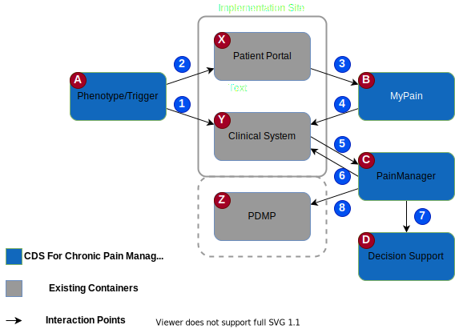
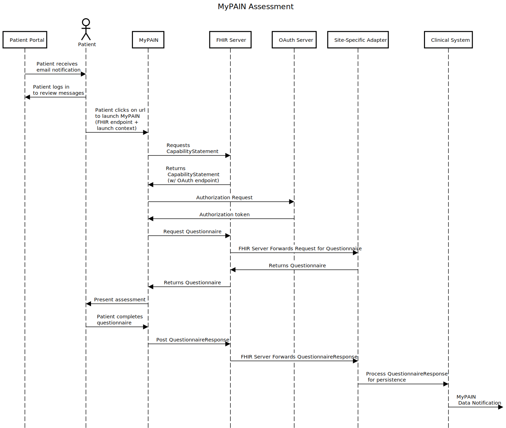
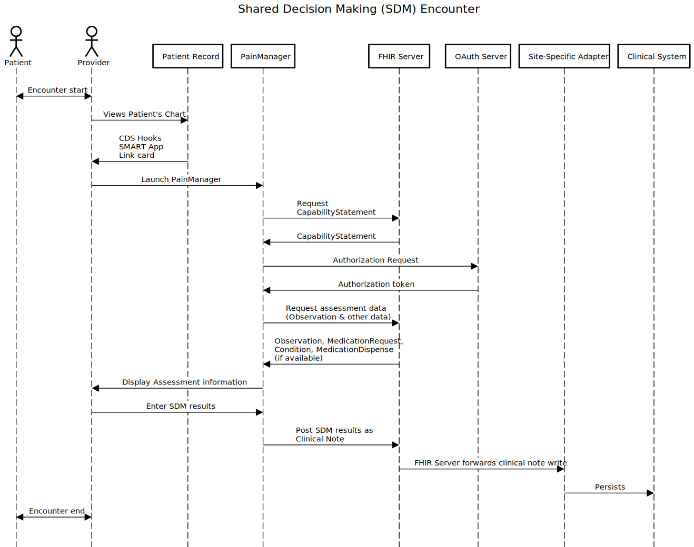
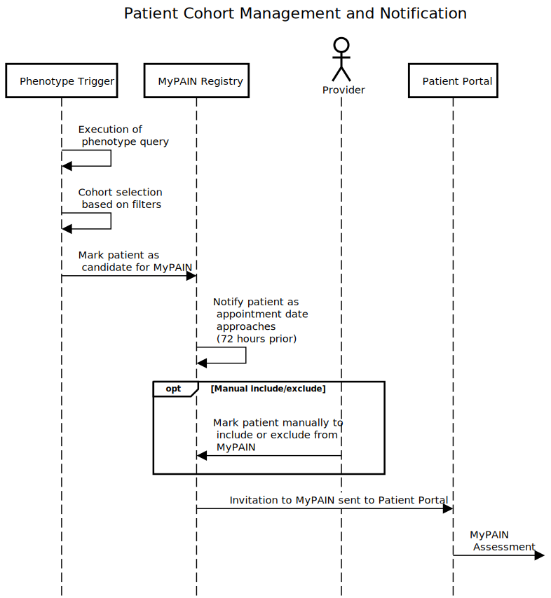
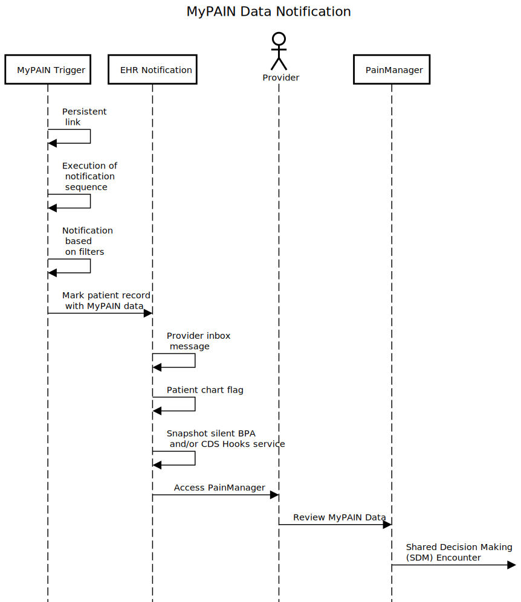
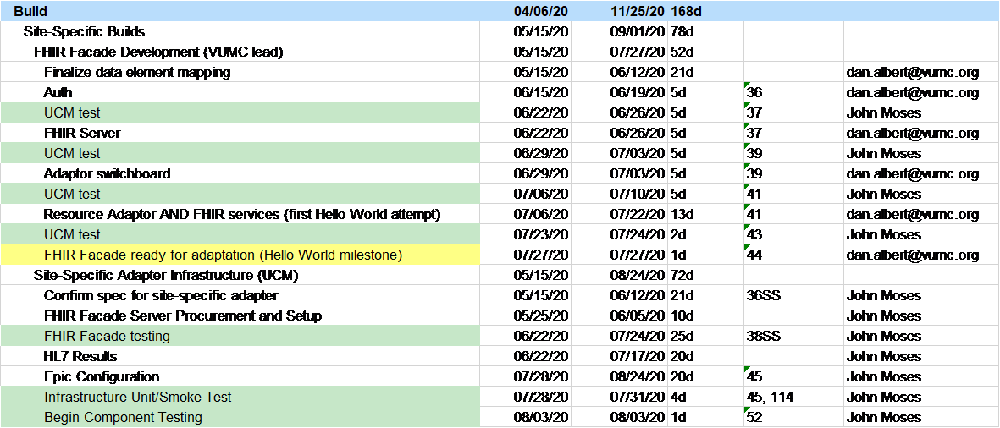
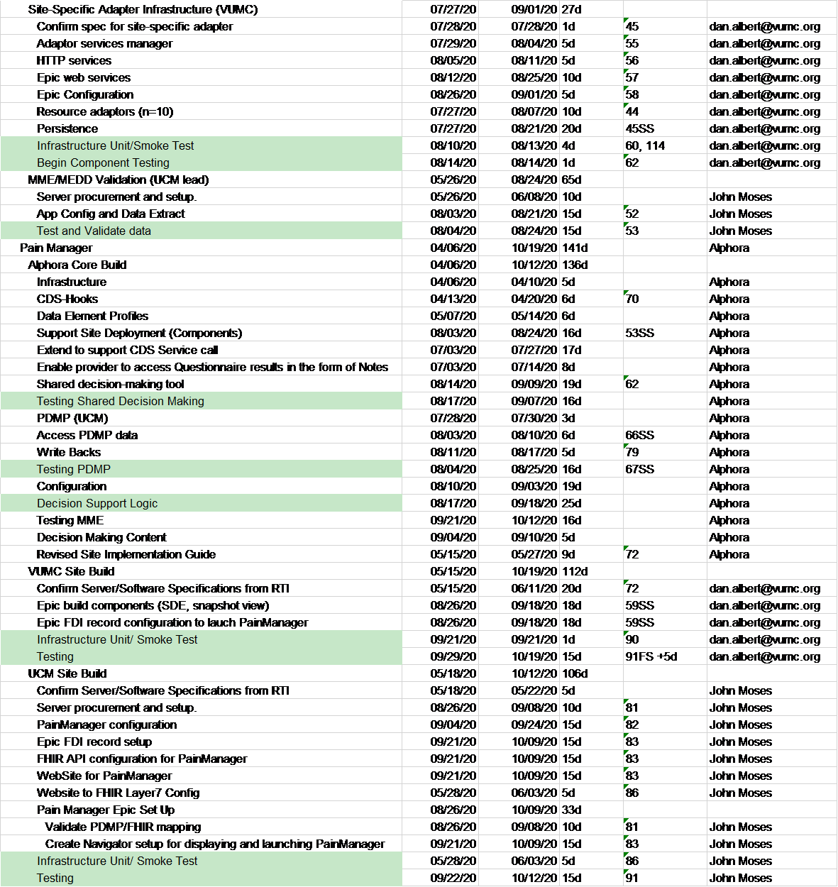
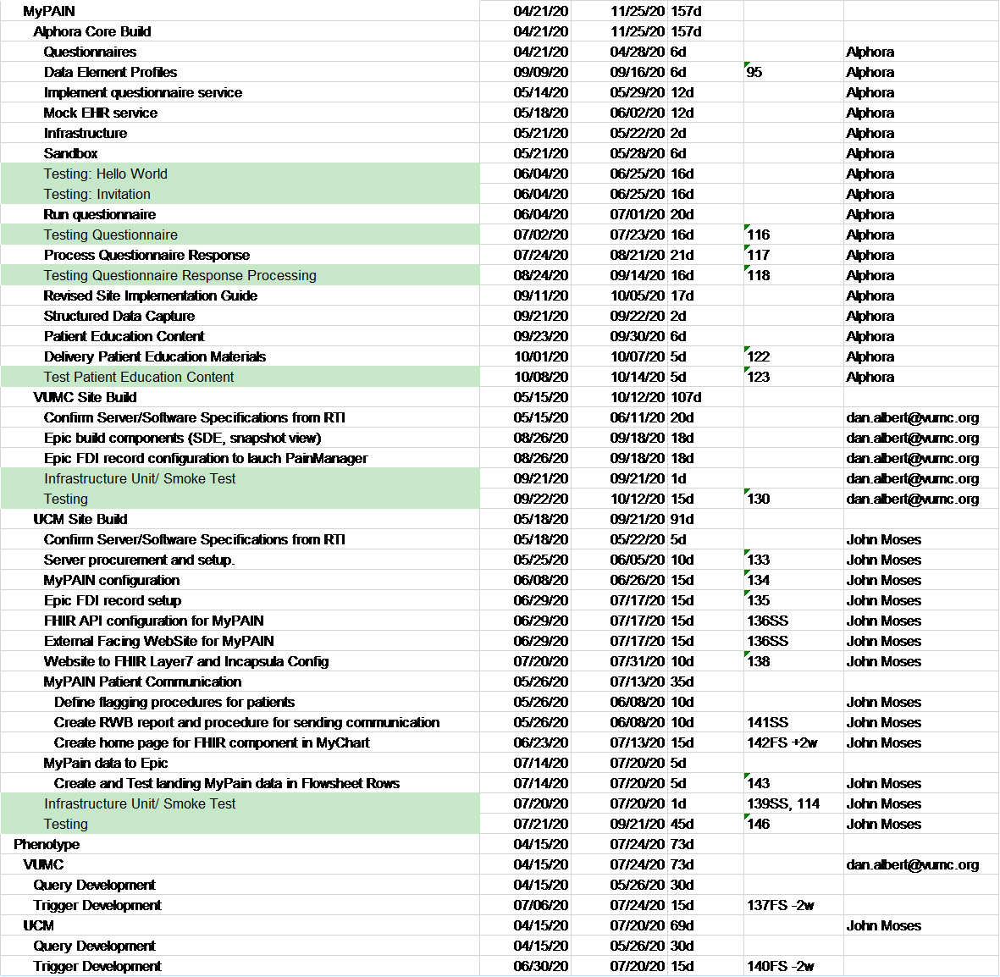
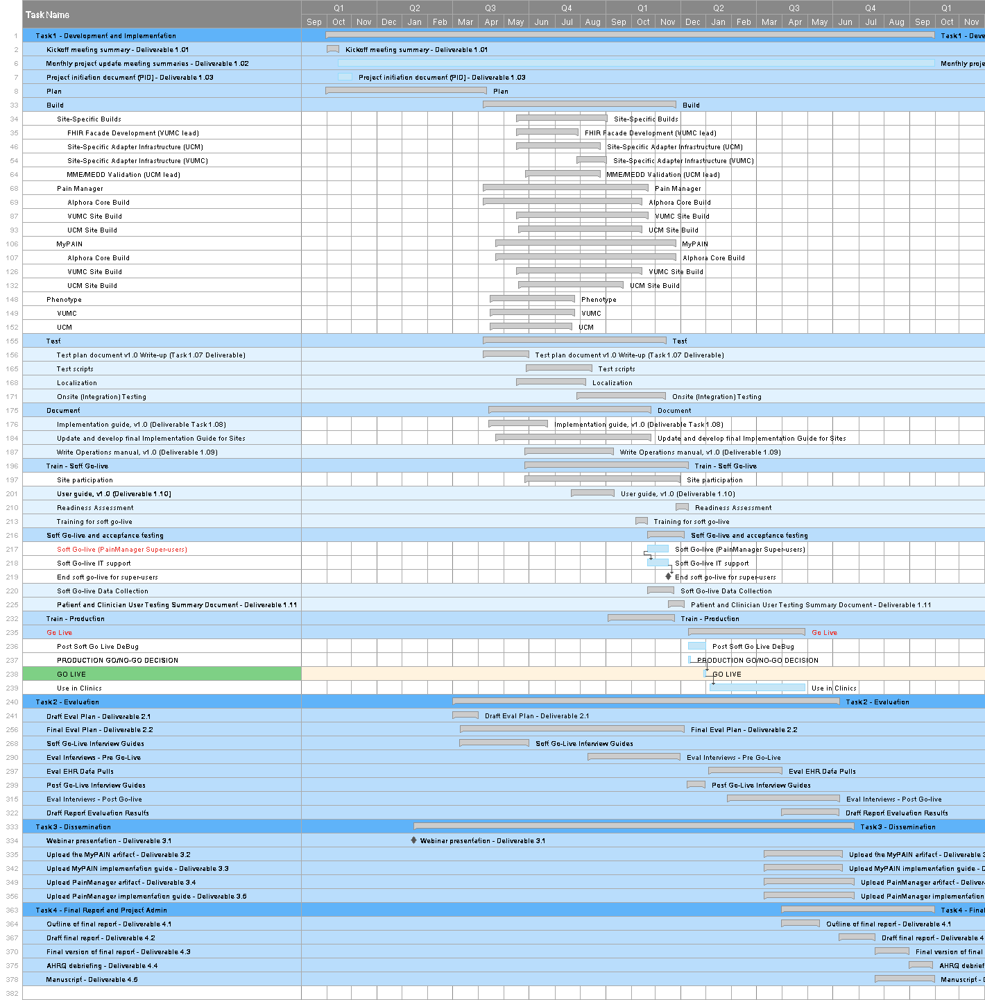

## Proposed Table of Contents (TOC):

- [1. Introduction](#1-introduction)
- [2. Approach](#2-approach)
- [3. Resources, Roles and Responsibilities](#3-resources-roles-and-responsibilities)
- [4. Testing Strategy and Procedures](#4-testing-strategy-and-procedures)
- [5. Schedule](#5-schedule)
- [6. Features to be tested](#6-features-to-be-tested)
- [7. Significant Impacts, Dependencies, Risks and Assumptions](#7-significant-impacts-dependencies-risks-and-assumptions)

## Glossary
*	Application (App)—is a program or group of programs designed for end users; typically, software that a user downloads, installs, and manages
*	Batch testing—synonymous with unit testing (see below)
*	Beta testing—the release of a preliminary version of a software system to a limited set of users to obtain feedback
*	Code—items that comprise a component
*	Component—elements of an individual container
*	Context—software system in scope
*	Container—high-level building blocks of the software system in scope
* 	Edge case - a rare use case scenario that would typically only occur under extreme conditions, intended to test the limits of a system
*	Feature—set of related requirements that allows the user to satisfy a business objective or need
*	FHIR façade—an architectural pattern for implementing capability in a standards-compliant way, in the absence of that support from existing/installed vendor systems
*	Function—specification of behavior between outputs and inputs
*	HAPI FHIR - a complete implementation of the HL7 FHIR standard for healthcare interoperability in Java intended to provide a flexible way of adding FHIR capability to applications
*	“Hello world” – a test confirming that the basic, established framework of an application or system are sufficient for continued development
*	Interface requirement—system requirement that involves an interaction with another system
*	Logic testing—process by which the CDS logic is evaluated systematically
*	Minimum viable product (MVP)—those features or functions of a system which, when built out, represent a core version of a functioning system
*	Patient population testing—a method of testing a software system using a synthetic set of patient population data to verify the system behaves as expected
*	Requirement—a condition or capability needed by a user to solve a problem or achieve an objective
*	Section 508 compliance testing—testing of a document, application, or system to verify compliance with the standards within Section 508 of the Rehabilitation Act of 1973 Section 508 of the Rehabilitation Act of 1973
*	Service—centrally managed software that provides some logic or functionality to end users, which a user accesses (via API, website, etc.)
*	Shareability - the extent to which the resulting CDS4CPM artifacts and implementation guides for each artifact are postable to a publicly accessible repository so that those artifacts can be implemented by a variety of care providers or clinics in different geographic settings
*	Site-specific adapter—an instance of a FHIR façade at a site, implemented with proprietary mechanisms, but exposed using standard FHIR APIs
*	Smoke testing—preliminary testing of important system functions to reveal simple failures which would prevent a prospective software release
*	Software as a service (SaaS)—method of software delivery and licensing in which software is accessed online via a subscription rather than bought and installed on individual computers
*	[Software] System—a series of components working together to deliver services
*	Sprint – In agile development, a designated period of time during which a selected set of tasks is expected to be completed
*	Synthea—an open-source, synthetic patient generator that models the medical history of synthetic patients
*	Unit testing—the testing of individual components or containers to confirm that they are fit for use in a larger system
*	User acceptance testing—a testing process designed to confirm that a software system functions as expected for its intended user base
*	User interface (UI)—the rules of engagement for a user interacting with a specific page on a website or screen within an application
*	Version—a unique state of computer software

## Acronyms
|     Acronym      |     Literal Translation                                                             |
|------------------|-------------------------------------------------------------------------------------|
|     ACPA         |     American Chronic Pain Association                                               |
|     AHRQ         |     Agency for Healthcare Research & Quality                                        |
|     API          |     Application Programming Interface                                               |
|     CAT          |     Computer Adaptive Testing                                                       |
|     CDC          |     Centers for Disease Control and Prevention                                      |
|     CDS          |     Clinical Decision Support                                                       |
|     CNCP         |     Chronic Non-Cancer Pain                                                         |
|     CQL          |     Clinical Quality Language                                                       |
|     EHR          |     Electronic Health Record                                                        |
|     FHIR         |     Fast Healthcare Interoperability Resources                                      |
|     HL7	   |	 Health Level Seven
|     IRB          |     Institutional Review Board                                                      |
|     IT           |     Information Technology                                                          |
|     MEDD         |     Maximum Equivalent Daily Dose (see details on the Epic-specific calculation)    |
|     MME/day      |     Morphine Milligram Equivalent per day (see CDC guideline)                       |
|     NLM VSAC     |     National Library of Medicine Value Set Authority Center                         |
|     MVP          |     Minimum Viable Product                                                          |
|     MyPAIN       |     My Pain Assessment and Information Needs                                        |
|     PCCDS-LN     |     Patient Centered Clinical Decision Support Learning   Network                   |
|     PDMP         |     Prescription Drug Monitoring Program                                            |
|     PEG scale    |     Pain, Enjoyment, General Activity scale for pain                                |
|     PMD          |     Pain Management Dashboard                                                       |
|     PRO          |     Patient-Reported Outcome                                                        |
|     PROMIS       |     Patient-Reported Outcomes Measurement Information System                        |
|     SDD          |     System Design Document                                                          |
|     SDM          |     Shared Decision Making                                                          |
|     SDOH         |     Social Determinants of Health                                                   |
|     SHARE        |     Seek, Help, Assess, Reach, and Evaluate                                         |
|     SMART        |     Substitutable Medical Applications, Reusable Technologies                       |
|     UCM          |     University of Chicago Medicine                                                  |
|     UI           |     User Interface                                                                  |
|     VUMC         |     Vanderbilt University Medical Center                                            |

## 1. Introduction

Through its Accelerating Change and Transformation in Organizations and Networks III (ACTION III) initiative, the Agency for Healthcare Research & Quality (AHRQ) has elected to sponsor a project that investigates how shareable and interoperable clinical decision support (CDS) can be made actionable for patients and clinicians at scale. Embodied in prior work such as that of the Patient-Centered Clinical Decision Support Learning Network (PCCDS-LN) and CDS Connect, AHRQ has invested in patient-centered and shareable CDS, but these efforts face development and implementation challenges to wider adoption and use. The system and services for which a testing plan is outlined in this document seek to connect patients and providers, clinical best practices, novel delivery models, and evidence generators to demonstrate how to provide CDS in a standardized, publicly shareable form at scale for improving chronic pain management.

This system, to which this testing plan applies, includes two central services. First, a patient-facing CDS artifact termed My Pain Assessment and Information Needs (MyPAIN), which will handle the collection and transmission of chronic non-cancer pain (CNCP) assessment information (patient-reported outcomes; PROs), provide relevant educational content, and support a workflow designed to handle the collection and delivery of this information to support a shared decision-making (SDM) encounter for a patient and their provider. Partnering with MyPAIN is a provider-facing artifact termed PainManager. PainManager, a read-only resource, is based on the MITRE-developed Pain Management Summary/Dashboard (PMD) (Agency for Healthcare Research and Quality, n.d.-b), a CDS Connect (Agency for Healthcare Research and Quality, n.d.-a) artifact, and handles the presentation of information collected via MyPAIN along with some demographic, social determinants of health (SDOH), and prescription drug monitoring program (PDMP) data, and other clinically relevant information retrieved from an electronic health record (EHR). Together, these products form a system for the delivery of both patient- and provider-facing CDS to support SDM in CNCP patients at two sites, Vanderbilt University Medical Center (VUMC) and the University of Chicago Medicine (UCM).

This system is being implemented in primary care clinics as identified by our two site partners: VUMC and UCM. We will target patients with four common conditions in the pilot: chronic low back pain, osteoarthritis of the hip, osteoarthritis of the knee, and fibromyalgia.

Targeting these patients involves the creation of automated query and triggering mechanisms at each site that send MyPAIN invitations to patients who are eligible to receive the intervention. This document is intended to define and outline a testing plan for this system, which includes a patient-facing application, MyPAIN, and a provider-facing application, PainManager. The information provided by these applications is presented in MyPAIN as a patient-facing application and in PainManager as a dashboard application, both implemented as Substitutable Medical Applications, Reusable Technologies on Fast Healthcare Interoperability Resources (SMART on FHIR) applications. These SMART on FHIR applications are expected to be integrated with or interfaced to an EHR.

This testing plan includes a six-pronged approach to testing the MyPAIN and PainManager applications and their broader system. This approach will ensure that the components or containers function as a unit and together meet the necessary requirements of the end users.

## 2. Approach

### 2.1 Objective

The objective of the testing of the MyPAIN and PainManager applications is to ensure functionality of the system and all essential system requirements, including:
*	Logic testing for the content of the system to ensure that units within the applications behave as expected.
*	Patient population testing to assess the behavior of system components in a synthetic population.
*	Batch or unit testing to assess the functionality of the system components and anticipate potential failures.
*	Smoke testing to ensure that the overall system behaves as expected through changes.
*	Integration and performance testing to determine whether the system will run in an automated way in context.
*	Final beta or user acceptance testing to run through specific test cases to ensure proper functionality and Section 508 compliance.
As the sprints progress, these tests may happen on any given slice of the system in any given environment. Smoke testing of the entire system at the most basic level is the most fundamental initial step in testing.

### 2.2 Requirements

MyPAIN and PainManager are intended to work together to provide end-to-end support for SDM around chronic pain management. for the targeted conditions Key functions of this system include allowing patients to complete self-report measures and education materials, provide contextual information from the patient’s medical record accessed via that medical record’s patient portal, notify a provider when this information is completed, and present results of this information along with PDMP information wherever available in a dashboard to support an SDM encounter for chronic pain at the time of the patient visit. MyPAIN and PainManager are intended to be implemented together rather than standalone applications.

To summarize, within this system are the following:

1.	a patient-facing application that collects patient-reported data and preferences, delivers patient-specific educational materials about CNCP and opioids, and prepares patients for SDM with providers via a SMART on FHIR integration with a patient portal; and
2.	a clinician-facing CDS application that gives primary care physicians visually satisfying patient-specific data for CNCP and opioids, access to PDMP data (optional), information supporting SDM during primary care visits, and an ability to record the results. The clinician-facing application is based-upon a modified and enhanced version of CDS Connect’s SMART on FHIR–based PMD.

The applications above are designed to comprise a standalone system that can be integrated into EHRs and into clinical workflows. MyPAIN is expected to be invoked via a patient portal (e.g., MyChart for Epic systems), and PainManager is expected to be accessed via an ambulatory EHR (e.g., Epic Ambulatory). The system will support interactions between patients and clinicians.

Use of MyPAIN is dependent on a patient accepting an invitation to access and use the application. This invitation is triggered according to a particular patient profile or “phenotype” within the EHR. This phenotype will include criteria that identify relevant diagnoses. Sites will need to determine their own best practices for configuring and implementing the phenotype and programming a triggering mechanism(s) for sending an invitation to patients. Strategies might include using an existing appointment reminder system infrastructure either within the EHR environment (UCM) or through an external appointment system (VUMC). Whatever the approach, these and future sites will determine how to identify the candidates who will receive a MyPAIN invitation.

In addition to MyPAIN and PainManager, the high-level system architecture consists of several supporting applications (called containers in the architectural approach taken for this project) that enable the functionality delivered by PainManager and MyPAIN. Exhibit 1 illustrates these main containers and their interactions:

**Exhibit 1 - Architectural Overview for CDS4CPM** 

#### 2.2.1 CDS4CPM Containers

* A: **Phenotype/Trigger** - A periodic or triggered process that identifies candidate patients for invitation to the MyPAIN application
* B: **MyPAIN** - A SMART-on-FHIR application that collects information from and provides information to patients
* C: **PainManager** - A SMART on FHIR application that displays patient-reported and EHR-provided data that enables SDM at a clinic visit
* D: **Decision Support** - A feature that provides decision support related to chronic pain

#### 2.2.2 Implementation Site Containers

* X: **Patient Portal** - A patient portal that is an existing feature of the ambulatory medical records system
* Y: **Clinical System** - An ambulatory medical records system that supports standard interfaces for securely accessing patient information
* Z: **PDMP** - Prescription Drug Monitoring Program, accessed through standard interfaces
* ZZ: **FHIR Facade** - Not drawn here but referenced in a related diagram is the FHIR facade and site-specific adapter layer

**Exhibit 2 - MyPAIN Requirements** 

|    Component    |    ID       |    Requirement                                                                                           |    Function                                          |    Priority    |    Resource                                                                                                                                                                                                                                                                                                                                                                                                                                         |
|-----------------|-------------|----------------------------------------------------------------------------------------------------------|------------------------------------------------------|----------------|-----------------------------------------------------------------------------------------------------------------------------------------------------------------------------------------------------------------------------------------------------------------------------------------------------------------------------------------------------------------------------------------------------------------------------------------------------|
|    MyPAIN       |    1.1.1    |    OAuth 2.0   specification is used to identify and authenticate the patient when accessing   MyPAIN    |    Authentication   and matching                     |    Core        |    Patient   matching by clinical identifier is conducted to validate the identity of the   patient. NOTE: Assumes a SMART on FHIR solution.                                                                                                                                                                                                                                                                                                        |
|    MyPAIN       |    1.2.1    |    MyPAIN   populated with patient data from EHR                                                         |    Data Population                                   |    Core        |    Demographic   information—Patient name, DOB, condition, visit doctor, date and time                                                                                                                                                                                                                                                                                                                                                              |
|    MyPAIN       |    1.3.1    |    Patient completes   self-report measure(s)                                                            |    Data Collection                                   |    Core        |    Use PROMIS Pain   Intensity SF-3a (75262-6 In the past 7 days - How intense was your pain at   its worst?; 75261-8 In the past 7 days - How intense was your average pain?;   75260-0 What is your level of pain right now?)                                                                                                                                                                                                                     |
|    MyPAIN       |    1.3.2    |    Patient   completes self-report measure(s)                                                            |    Data Collection                                   |    Core        |    Use PROMIS Pain   Interference SF-4a (LOINC: 61758-9 In the past 7 days - How much did pain   interfere with your day to day activities?; 61769-6 In the past 7 days - How much   did pain interfere with work around the home?; 61773-8 In the past 7 days -   How much did pain interfere with your ability to participate in social   activities?; 61775-3 In the past 7 days - How much did pain interfere with   your household chores?)    |
|    MyPAIN       |    1.3.4    |    Patient   completes self-report measure(s)                                                            |    Data Collection                                   |    Core        |    Patient records   treatment hx (see MyPAIN wireframes)                                                                                                                                                                                                                                                                                                                                                                                           |
|    MyPAIN       |    1.3.5    |    Patient   completes self-report measure(s)                                                            |    Data Collection                                   |    Core        |    Patient records   activity goals and barriers                                                                                                                                                                                                                                                                                                                                                                                                    |
|    MyPAIN       |    1.4.1    |    Patient is   presented with chronic pain education materials                                          |    Patient   Education - Living with Chronic pain    |    Core        |    US Pain   Foundation website: https://uspainfoundation.org/living-with-pain/—chronic   pain and treatment options                                                                                                                                                                                                                                                                                                                                |
|    MyPAIN       |    1.6.1    |    Patient is   presented with SDM education materials                                                   |    Patient   Education - Chronic pain                |    Desired     |    American   Chronic Pain Association ‘Car with four flat tires’ video: https://www.theacpa.org/acpa-car-with-four-flat-tires/—chronic   pain management                                                                                                                                                                                                                                                                                           |

**Exhibit 3 - PainManager Requirements**

|     Component     |     ID       |     Requirement                                                                                                                |     Function                                                                                                                                                                                               |     Priority     |     Resource                                       |
|-------------------|--------------|--------------------------------------------------------------------------------------------------------------------------------|------------------------------------------------------------------------------------------------------------------------------------------------------------------------------------------------------------|------------------|----------------------------------------------------|
|    PainManager    |    2.1.1     |    PainManager   operates under the authentication provided by the EHR’s patient portal                                        |    PainManager is   invoked within the authentication provided by the EHR patient portal                                                                                                                   |    Core          |    NA                                              |
|    PainManager    |    2.1.2     |    Provider can   verify whether PainManager displays the correct patient                                                      |    PainManager   displays patient identifiers within the application                                                                                                                                       |    Core          |    NA                                              |
|    PainManager    |    2.3.1     |    Provider can   access a patient’s responses to the treatment history assessment                                             |    PainManager   displays the results from the treatment history assessment                                                                                                                                |    Core          |    Treatment   history assessment                  |
|    PainManager    |    2.3.2     |    Provider can   access a patient’s responses to the PROMIS Pain Intensity Survey (SF-3a)                                     |    PainManager   displays the results from the PROMIS Pain Intensity Survey (SF-3a)                                                                                                                        |    Core          |    SF-3a                                           |
|    PainManager    |    2.3.3     |    Provider can   access a patient’s responses to the PROMIS Pain Interference Survey (SF-4a)                                  |    PainManager   displays the results from the PROMIS Pain Intensity Survey (SF-4a)                                                                                                                        |    Core          |    SF-4a                                           |
|    PainManager    |    2.3.4     |    Provider can   access a patient’s responses to two open-ended questions about activity goals   and barriers                 |    PainManager   graphically displays the results from the previous three timepoints for each   question in the SF-3a battery                                                                              |    Core          |    SF-3a                                           |
|    PainManager    |    2.3.5     |    Provider can   access a patient’s answers to three previous timepoints for the PROMIS Pain   Interference Survey (SF-4a)    |    PainManager   graphically displays the results from the previous three timepoints for each   question in the SF-4a battery                                                                              |    Core          |    SF-4a                                           |
|    PainManager    |    2.3.6     |    Provider can   access a patient’s answers to three previous timepoints for the PROMIS Pain   Intensity Survey (SF-3a)       |    PainManager   displays the results from the project’s three open-ended questions                                                                                                                        |    Core          |    TBD                                             |
|    PainManager    |    2.3.7     |    Provider can   access a patient’s responses to one open-ended question about the location(s)   of their pain                |    PainManager   displays the results from the pain-location open-ended question                                                                                                                           |    Core          |    TBD                                             |
|    PainManager    |    2.4.1     |    Provider can   view education materials patient viewed (or not)                                                             |    PainManager displays   whether the ACPA “Car with Four Flat Tires” video (or not)                                                                                                                       |    Core          |    Web log                                         |
|    PainManager    |    2.4.2     |    Provider can   view education materials patient viewed (or not)                                                             |    PainManager   displays whether the patient viewed the US Pain Foundation website                                                                                                                        |    Core          |    Web log                                         |
|    PainManager    |    2.4.3     |    Provider can   access the education material a patient viewed (or not)                                                      |    PainManager   displays the ACPA “Four Flat Tires” video                                                                                                                                                 |    Core          |    ACPA’s Four   Flat Tires, US Pain Foundation    |
|    PainManager    |    2.4.4     |    Provider can   access the education materials a patient viewed (or not)                                                     |    PainManager   displays the US Pain Foundation website                                                                                                                                                   |    Core          |    US Pain   Foundation website                    |
|    PainManager    |    2.5.1     |    A provider   receives an EHR notification (passive or semi-active) that a patient provided   data via MyPAIN                |    PainManager (or   the system) delivers a notification of the site’s choosing (e.g., BPA,   SnapShot)                                                                                                    |    Important     |    NA                                              |
|    PainManager    |    2.5.2     |    A provider can   open PainManager from the EHR notification (passive or semi-active)                                        |    The EHR (or the   system) provides a means to open PainManager via the site’s choosing (e.g.,   BPA, SnapShot)                                                                                          |    Important     |    NA                                              |
|    PainManager    |    2.5.3     |    A provider can   access PainManager whether a patient entered data via MyPAIN                                               |    The EHR offers   access to PainManager via a “persistent link” in the EHR (e.g., Links, BPA)                                                                                                            |    Important     |    NA                                              |
|    PainManager    |    2.7.1     |    Provider can   access PDMP data                                                                                             |    PainManager at   UCM (ONLY) displays a link to access PDMP data                                                                                                                                         |    Important     |    Illinois PDMP   via LogiCoy                     |
|    PainManager    |    2.7.2     |    Provider can   view PDMP data                                                                                               |    PainManager at   UCM (only) displays PDMP data                                                                                                                                                          |    Important     |    Illinois PDMP   via LogiCoy                     |
|    PainManager    |    2.12.2    |    Providers can   view flags, counts, tooltips, information icons, and URLs                                                   |    Show “flags” (different   icon), show counts (only if = 0), tooltips (need to be updated), information   icons (information needs updating), and URLs (need updating) from Pain   Management Summary    |    Desired       |    Pain Management   Summary                       |
|    PainManager    |    2.13.1    |    Physician   reviews pertinent medical history - Risk Factors for Opioid-related Harms                                       |    PainManager   displays data from the relevant value set via NLM VSAC                                                                                                                                    |    Core          |    NLM VSAC                                        |
|    PainManager    |    2.13.2    |    Physician   reviews pertinent medical history - Conditions Associated with Chronic Pain                                     |    PainManager   displays data from the relevant value set via NLM VSAC                                                                                                                                    |    Core          |    NLM VSAC                                        |
|    PainManager    |    2.13.3    |    Physician   reviews pertinent medical history - Risk Factors                                                                |    PainManager   displays data from the relevant value set via NLM VSAC                                                                                                                                    |    Core          |    NA                                              |
|    PainManager    |    2.14.1    |    Physician   reviews risk considerations - Most Recent MME                                                                   |    PainManager   displays data from the relevant value set via NLM VSAC                                                                                                                                    |    Core          |    NA                                              |
|    PainManager    |    2.14.1    |    Physician   notices red exclamation mark for opioid meds and rolls mouse over                                               |    PainManager   displays data from the relevant value set via NLM VSAC                                                                                                                                    |    Important     |    NA                                              |
|    PainManager    |    2.14.2    |    Physician   reviews risk considerations - Urine Drug Screens                                                                |    PainManager   displays data from the relevant value set via NLM VSAC                                                                                                                                    |    Core          |    NLM VSAC                                        |
|    PainManager    |    2.14.3    |    Physician   reviews risk considerations - Benzodiazepine Medications                                                        |    PainManager   displays data from the relevant value set via NLM VSAC                                                                                                                                    |    Core          |    NLM VSAC                                        |
|    PainManager    |    2.14.4    |    Physician   reviews risk considerations - Naloxone Medications                                                              |    PainManager   displays data from the relevant value set via NLM VSAC                                                                                                                                    |    Core          |    NLM VSAC                                        |
|    PainManager    |    2.14.5    |    Physician   reviews risk considerations - Risk Screenings Relevant to Pain Management                                       |    PainManager   displays data from the relevant value set via NLM VSAC                                                                                                                                    |    Core          |    NLM VSAC                                        |
|    PainManager    |    2.13.1    |    Physician   reviews pertinent medical history - Risk Factors for Opioid-related Harms                                       |    PainManager   displays data from the relevant value set via NLM VSAC                                                                                                                                    |    Core          |    NLM VSAC                                        |
|    PainManager    |    2.16.1    |    Physician can   view relevant SDOH data for the patient                                                                     |    PainManager   displays patient-specific SDOH data (if available)                                                                                                                                        |    Core          |    Epic                                            |
|    PainManager    |    2.17.1    |    Physician can   view why PainManager is offered for the patient                                                             |    PainManager   displays this information at the top of the summary display                                                                                                                               |                  |    Epic                                            |
|    PainManager    |    2.18.1    |    Physician   reviews Current and Historical Pain Treatments - Current Opioid Medications                                     |    PainManager   displays data from the relevant value set via NLM VSAC                                                                                                                                    |    Core          |    NA                                              |
|    PainManager    |    2.18.2    |    Physician   reviews Current and Historical Pain Treatments - Opioid Medications in the   past year                          |    PainManager   displays data from the relevant value set via NLM VSAC                                                                                                                                    |    Core          |    NA                                              |
|    PainManager    |    2.18.3    |    Physician   reviews Current and Historical Pain Treatments - Non-Opioid Medications                                         |    PainManager   displays data from the relevant value set via NLM VSAC                                                                                                                                    |    Core          |    NLM VSAC                                        |
|    PainManager    |    2.18.4    |    Physician   reviews Current and Historical Pain Treatments - Non-Pharmacologic Treatments                                   |    PainManager   displays data from the relevant value set via NLM VSAC                                                                                                                                    |    Core          |    NLM VSAC                                        |
|    PainManager    |    2.18.5    |    Physician   reviews Current and Historical Pain Treatments - Stool Softeners and   Laxatives                                |    PainManager   displays data from the relevant value set via NLM VSAC                                                                                                                                    |    Core          |    NLM VSAC                                        |

**Exhibit 4 - Phenotype Requirements**

|    Component    |   ID    |    Requirement                                                                                  |    Function                        |    Priority    |    Resource                                                                |
|-----------------|-----------------|-------------------------------------------------------------------------------------------------|------------------------------------|----------------|----------------------------------------------------------------------------|
|    Phenotype    |    3.1.1        |    A custom   phenotype (TBD) specification is used to identify the patient to access MyPAIN    |    Custom   Phenotype + trigger    |    Core        |    Services in   English only                                              |
|    Phenotype    |    3.1.2        |    A custom   phenotype (TBD) specification is used to identify the patient to access MyPAIN    |    Custom   Phenotype + trigger    |    Core        |    Four specific   conditions                                              |
|    Phenotype    |    3.1.4        |    A custom phenotype   specification for VUMC used to exclude patients for access to MyPAIN    |    Custom   Phenotype + trigger    |    Core        |    Identify   patients (VUMC only) on opioids with an MME >= 20 per day    |
|    Phenotype    |    3.1.5        |    A custom   phenotype (TBD) specification is used to identify the patient to access MyPAIN    |    Custom   Phenotype + trigger    |    Core        |    ICD-10 codes   for relevant conditions                                  |
|    Phenotype    |    3.1.6        |    A custom   phenotype (TBD) specification is used to exclude patients for access to MyPAIN    |    Custom   Phenotype + trigger    |    Core        |    Identify   patients (VUMC only) on opioids enrolled in INSPIRE trial    |
|    Phenotype    |    3.1.7        |    A custom   phenotype (TBD) specification is used to identify the patient to access MyPAIN    |    Custom   Phenotype + trigger    |    Core        |    CPT codes for   relevant procedures                                     |
|    Phenotype    |    3.1.8        |    A custom   phenotype (TBD) specification is used to identify the patient to access MyPAIN    |    Custom   Phenotype + trigger    |    Core        |    Target practice   sites                                                 |

#### 2.2.3 Interactions

1.	Phenotype/Trigger to Clinical System
2.	Phenotype/Trigger initiates patient invitation in the Patient Portal
3.	Patient securely launches MyPAIN from the invitation in the Patient Portal
4.	MyPAIN delivers patient assessment information to the Clinical System
5.	Clinician securely launches PainManager from the Clinical System
6.	PainManager accesses and displays relevant information from the Clinical System
7.	PainManager invokes appropriate Decision Support
8.	PainManager accesses Prescription Drug Monitoring Program data

#### 2.2.4 Assumptions:
*	Leverage and build on the existing CDS Connect PMD artifact to the fullest extent possible
*	Leverage the CPGonFHIR checklists and implementation guide as appropriate, in the hopes of leveraging other opioid related work in this arena (most likely to be used in implementation phase)
*	Leverage CDS standards to the fullest extent possible, and when standards fall short, employ EHR-specific solutions (e.g., Epic services)
*	Plan to first build for an Epic, Inc. implementation at the two sites (VUMC and UCM), and then refine, as possible, per available resources, standards and project experience and post the shareable artifact(s) after rollout
*	Patients will have access to, and the means for using, a site’s EHR patient portal
*	Affiliated sites with primary care providers will be invested in using CDS for chronic pain management support
*	System training for providers will contain instructions on SDM methods based on AHRQ’s Seek, Help, Assess, Reach, and Evaluate (SHARE) framework
*	The sites will employ a system architecture in which the system’s hardware, software, and data reside within each site’s own firewall
*	The assessment and educational content that we offer in MyPAIN and PainManager are allowable for use

#### 2.2.5 Constraints:
The system to be tested is built using Health Level Seven (HL7) FHIR as the framework for enabling interoperability among the systems, services, and applications involved. From the perspective of the SMART on FHIR applications, all the interactions with the clinical system will be described by and performed through FHIR Application Programming Interfaces (APIs) exposed as industry standard web services. The technical standards on which this project is based are documented in the following references:

*	HL7 FHIR STU3 (HL7FHIR, 2019)
*	SMART app launch, v1.0.0 (HL7FHIR, 2018a)
*	US Core Profiles, v2.0.0 (HL7FHIR, 2018b)
*	US Meds Home, v1.2.0 {HL7FHIR, 2019
*	 #28}
*	Structured Data Capture (SDC), v2.0.0 (HL7FHIR, 2017)
*	CDS Hooks, v1.0 (CDSHooks, 2018)
*	Pain Management Dashboard, v0.3.2 (Agency for Healthcare Research and Quality, 2020)
*	CDC Opioid Prescribing Support, v1.1.1 (GitHub, 2020)

#### 2.2.6 Data Elements

##### 2.2.6.1 MyPAIN
Within MyPAIN, data are collected as a QuestionnaireResponse FHIR resource. Specifically, the answers to assessment questions will be recorded in the appropriate elements of a QuestionnaireResponse and posted to each site’s FHIR server. Each site will be responsible for storing the answers provided as part of that QuestionnaireResponse. This storage may be in the form of an additional repository at the site for storing QuestionnaireResponses directly, or it may involve transforming the responses in the questionnaire into observational data that can be stored directly within the EHR through proprietary API calls. Sites have the flexibility to choose the approach they take so long as the interfaces exposed for use by MyPAIN support the required functionality.

Patient: Patient-specific data elements needed to support MyPAIN are already available via the standard EHR FHIR API.

Questionnaire: Questionnaire-specific data elements needed to support MyPAIN are NOT already available via the standard EHR FHIR API nor do these data elements specifically exist as standards-based shareable resources in the EHR. Many EHRs contain resources relevant to the questionnaire data element but these are not well documented or understood from a shareability standpoint.

##### 2.2.6.2 PainManager

Within PainManager, input data may consist of the results of the SDM encounter, captured as a clinical note and posted to the EHR’s FHIR Server. The sites will be responsible for storing the resulting clinical note, either as a native capability of the EHR’s existing FHIR server or as additional functionality exposed as an FHIR API through the Site-Specific Adapter.

Patient: Patient-specific data elements needed to support MyPAIN are already available via the standard EHR FHIR API.

##### 2.2.6.3 Phenotype/Trigger

Within the Phenotype/Trigger, the system must be able to capture whether a patient has been selected as a candidate for MyPAIN. In addition, the system will need to be able to determine the current status of the invitation to MyPAIN (either by sending on a preconfigured interval prior to a scheduled encounter or by specifically recording MyPAIN invitation status for selected patients). Although this aspect is managed by the sites, the data about whether a patient is enrolled in MyPAIN, and the assessment data gathered from their MyPAIN session(s), need to be available through the FHIR API used by the MyPAIN and PainManager applications.

## 3 Resources, Roles, and Responsibilities 

### 3.1 Roles
Testing roles: The two central classes of testing roles are (1) artifact developers and (2) site developers/implementers. These testing roles are further outlined below.

*	**Artifact Developers** are responsible for the core standards-based artifacts of the system; the principal focus of this role for testing is to determine the performance of the base artifacts against the reference implementation (e.g., in vitro testing).
*	**Site Developers/Implementers** are responsible for connecting the core standards-based artifacts of the system to the FHIR facade and site-specific adapters needed to make the system operational in context; these developers also provide the expertise to construct any APIs needed to extend the native data elements to the FHIR facade resource requests; the principal focus of this role for testing is to ensure the performance of the base artifacts when connected to the site-specific environment (e.g., in vivo testing).

User Roles: The system's two central classes are (1) patients and their families/caregivers and (2) clinicians. These and other potential user classes and their characteristics are outlined in more detail below.

*	**Patients and their Family Members/Caregivers** who wish to participate in the process of PCCDS data collection and preparation for SDM around CNCP management or in general
*	**Clinicians and Quality Leaders** who seek to implement, test, and execute this PCCDS system for CNCP management in their EHRs or other health information tools/systems
*	**CDS Developers, Standards Organizations, and Informaticists** seeking to use this PCCDS system for SDM around CNCP management; contribute PCCDS artifacts of their own making; or want to make use of well-developed structured logic and CQL in their own work
*	**Organizations or Individuals** interested in developing their own PCCDS artifacts may find this document helpful as a resource for the process by which clinical guidelines are translated into CQL artifacts and SMART-on-FHIR services

### 3.2 Resources

### 3.2.1 **MyPAIN**

The MyPAIN application will interact with the EHR through a FHIR API conforming to the Structured Data Capture implementation guide (HL7FHIR, 2018c) and specifically the Form Filler role defined within the implementation guide.

The CDS4CPM Implementation Guide will describe Questionnaire resources that capture the assessment questions displayed as part of the MyPAIN application, and this questionnaire will provide the terminologies to be used to record the assessment information, specifically any LOINC codes associated with the PROMIS-based questions and any site-specific codes that support the exchange of data not identifiable with existing standard terminologies.

In addition, the MyPAIN application will display basic patient demographic information for the purposes of confirming the patient interaction. The existing EHR FHIR APIs support this information through the Patient resource, and specifically the USCore Patient profile (HL7FHIR, 2018c).

For the sequence diagrams which follow, we are including both common and site level implementation details (and associated testing discussions), however, in the final implementation, the site specific details may diverge slightly.

Below is a sequence diagram for the MyPAIN assessment.

**Exhibit 5 - MyPAIN Assessment**

### 3.2.2 **PainManager**

The PainManager application will interact with the EHR through a FHIR API conforming to the US Core Profiles, as described in the system design and data design sections of this document.

The CDS4CPM Implementation Guide will nominate these profiles and provide specific guidance for implementing sites to support. This support can be met through either existing FHIR API functionality provided by the EHR’s FHIR Server, or it can be built up and exposed as part of the site-specific adapter.

PainManager can also be configured to use CDS Hooks as a mechanism to provide a recommendation to the clinician that a patient is either enrolled in MyPAIN, or has MyPAIN assessment data available, or both. While both options will be fully supported in the final artifact, this ‘configuration option’ would require some support of the CDS Hooks service within the FHIR façade. 

In addition, PainManager can be configured to use a PDMP feed to retrieve patient-specific dispensing medication information. For this capability, the PainManager application will expect to access an FHIR API conforming to the ONC US Medication Profiles (HL7FHIR, 2018c), specifically the PDMP Responder role defined within that implementation guide.

Below is a sequence diagram for the SDM encounter supported by PainManager.

**Exhibit 6 - PainManager Shared Decision Making (SDM) Encounter**

Indication of enrollment in MyPAIN, invitation of enrolled patients through the patient portal, and management of the status of invitations must be provided by implementing sites, since no standard approach exists that can support these capabilities.

There may be a need to align the delivery of messaging (e.g., to a patient from the EHR patient portal or to a provider from the portal or similar) to the best method available at each site. For example, messaging patients through the existing appointment reminder system could be beneficial; this would then point the patient to MyPAIN in their patient portal application. Details on this are to be determined by the implementing site.

Exhibits 7 and 8 show a sequence diagram for the phenotype and trigger process.

**Exhibit 7 - Patient Cohort Management and Notification**

**Exhibit 8 - MyPAIN Data Notification**

### 3.2.3 **FHIR Facade**

Throughout this Testing Plan reference has been made to relevant Site-specific Adapters and a related FHIR Façade. This container is conceptual and requires components to be built on both sides of the system—the standards-based artifact side builds standards-based requests or posts which get handed off to either FHIR servers or to appropriate site-specific adapters to fulfill these requests or posts. This means that the core artifact development work and subsequent Testing Plan go as far as the standards allow and the sites must develop solutions that can handle such requests. During the build phase we will continue to define interface details. To the greatest extent possible, the details of these site-specific adapters and any associated testing will be included in the final IG.

### 3.3 **Responsibilities**

The developer is responsible for all baseline testing and will provide guidance and support in the development of an infrastructure for sites to commence feature and function-level integration testing. This infrastructure will also support a continuous release cycle to maximize the opportunity to share updates seamlessly from developer to site and from site to site whenever possible.

The development team can develop unit tests involving edge cases and test accordingly. This verifies basic functionality as we understand it but this still needs validation from a clinical perspective. Sites will provide the clinical support needed to test effectively. This may include the development of testing scenarios and/or test data using clinical input from the project team or institutional SMEs. This includes ensuring that clinical staff are available and attendant to the intended clinical goals of the system. In support of this activity, sites will also develop relevant test data sets including the user stories and edge cases that will facilitate robust and complete testing scenarios. 

In terms of the management of test data both where it originates and who is responsible for using which test set, these determinations will be outlined in a future version of this Testing Plan. The use of stories to support development and to help prioritize the work in sprints may be repurposed to aid in the development of user stories for the development of relevant test data that addresses core functionality and edge cases where real data may not represent what is expected in the reference implementation environment. These efforts will also inform the implementation guide.

## 4. Testing Strategy and Procedures

Below, the strategies and procedures for testing the CDS4CPM system are outlined in more detail. The elements described include the overall development and testing environment, testing procedures, the sequencing of the stages of testing, and plans for the identification and/or development of testing data.

### 4.1 Development and Testing Tracking with Jira

The Atlassian software tool Jira will be used throughout the development process to manage the overall waterfall approach with agile sprints embedded in the timeline. The waterfall allows the team to project out and estimate the work ahead and aim for a target deliverable date. The agile process within this waterfall approach supports iterating through different types (from proprietary to fully standards based) of approaches. This process will be coupled with an agile approach to testing to help ensure that both site-level coordination and iterative testing are featured throughout the development process. Testing phases may typically fall in a specific order and may also be repeated or cycled through as needed to reach identified targets or benchmarks.

Below, the six testing phases are outlined in some detail. These include logic testing, patient population testing, batch and unit testing, end-to-end testing, integration and performance testing (to include any regression testing), and user acceptance testing (UAT). Plans regarding the acquisition or development of relevant test data are also described.

### 4.2 Logic Testing

The existing Pain Management Summary references key Centers for Disease Control and Prevention [CDC guidelines (3, 8, 10 and 11)](https://github.com/DBCG/cds4cpm/blob/master/input/pagecontent/pm-opioid-logic-assessment.md) for the implementation of specific logic components. The logic testing step will help ensure that the CQL developed to support this logic, which will be substantially revised to reflect updates to the [Opioid IG](https://github.com/cqframework/opioid-cds), are functioning as expected in PainManager. 

Similarly, the existing MME/Maximum Equivalent Daily Dose (MEDD) calculator based on  [CDC guideline #5](http://build.fhir.org/ig/cqframework/opioid-cds/recommendation-05.html) will be updated to be leveraged by PainManager to deliver an MEDD average based on either the currently calculated MEDD or the line level medication data supplied in the FHIR facade. To determine the best approach, clinical review of the performance of the calculator will be compared against the EHR calculated value. This custom-built logic testing process will allow the development team to make adjustments to the calculator and the project team to make a decision about the optimal implementation solution for the planned pilots.

Additional logic testing will be conducted as needed.

### 4.3 Patient Population Testing

Plans for the initial phases of patient population testing will involve the use of synthetic patient data from a service like Synthea. This use of synthetic data will facilitate testing with an approximation of real patient data, which can help with some aspects of more realistic testing but will lack the inconsistencies and site-specific preferences or limitations of more realistic data.

There are some options at the site level to use or develop more complete and realistic patient test data. Steps toward developing or accessing this data will be detailed further in the next version of the Testing Plan.
 
	
### 4.4 Batch and Unit Testing

During the sprint planning process, the development team will identify relevant ‘batches’ and ‘units’ (or aggregates of batches) for testing. Not all sprints will result in a testable batch and not all batches or units will represent components or containers to test. However, as the work progresses, some specificity regarding a ‘testable batch’ or ‘testable unit’ will be defined and the testing process for those elements will be described and executed. The goal is to both execute testing at the smallest discrete level for a batch as is reasonable so that the development process benefits from that level of transparency when testing and to provide insight for the sites on how to emulate this process when they receive items to test.

Without any discrete batches to test at the time of writing this plan, the specification of a batch and associated process of testing is still to be determined. Additionally, the specifics of site handoff for testing will need to be detailed in a future version of this Testing Plan.

### 4.5 End-to-end (Smoke) Testing

As the waterfall model provides all three development teams with some insight into how items are expected to be released and when, each team is working to develop an infrastructure that can support testing, development to manage the integration, and ultimately the hosting environment needed to implement the system. This infrastructure will benefit from smoke testing at the “hello world” level, which will confirm that the necessary services are in place and that they can perform a rudimentary “handshake” to establish communication. The basic concept is that by “standing up” the HAPI FHIR environment and testing connections between the EHR, the FHIR server, and some limited implementation of the artifacts (the system), the three development teams can ensure that the infrastructure is in place to begin development and testing in earnest with some confidence that things should work.

This phase of testing will be repeated once the final FHIR façade is in place and the artifacts have met the MVP stage. More details on the MVP product and its related data elements and functionality will be provided in a forthcoming version of this Testing Plan.

### 4.6 Integration and Performance Testing 

Combining smoke testing with multiple batches or units represents the movement to integration testing. At this stage, development components and then containers will be tested in their intended integration environments. There may still be significant parts of the overall system missing but multiple pieces will be ready to incorporate and connections to the intended environment for the final deployment of the system are required for this phase of testing. At this stage, we will put in place specific performance benchmarks.  The use case or user story guiding overall development will be used to establish those benchmarks, and detailed data on testing success will be captured and evaluated to determine next steps.

### 4.7 Final Beta or User Acceptance Testing (UAT) 

Some initial UAT testing from the perspective of the patient or provider user is important to incorporate early. While we may not formally engage an expected end user, there will be a need to assume some level of engagement on UAT early and then throughout the process. The project will leverage members at the sites to successfully plan this out and engage relevant stakeholders. More details surrounding the final phases of testing to include UAT will be outlined in a future version of this Testing Plan.

### 4.8 Testing Data

As mentioned in Section 4.3, some effort will need to be dedicated to the identification or development of testing data that can support the full range of testing required to fully execute this Testing Plan. Between synthetic patient data, site-level test data, and developed testing data (e.g., from de-identified real patient data), plans are being developed to ensure that the full range of testing can be supported with relevant patient data. The details of creation and use of test data will be provided in a forthcoming version of this Testing Plan.

## 5 Schedule
Key members of the development team have worked intensively to develop a detailed timeline of the steps and activities that are required to support the core and site builds. Appendix A provides a working version of the full project timeline, including a GANTT chart timeline. Using Smartsheet, RTI is working to align the schedule of activities submitted by the teams at Alphora, VUMC, and UCM to identify points of handoff and when various items will be available for testing. Below is a detailed breakout of the overall timeline which highlights (in green) areas in which we expect testing to take place. 

At a high level, VUMC will begin developing the FHIR façade and will make components available to UCM in an agile fashion to test (this work has already begun). Meanwhile, both sites will be working to develop the environments needed for the site-specific adapter development work. Both sites aim to achieve an initial “smoke test” to verify basic connectivity with stub versions of PainManager and MyPAIN by mid-August, when the MVP versions of these applications will become available through Alphora. Through August, September, and October, sites will continue to test components and containers. Full testing of the PainManager application is expected in September, and of the MyPAIN application in October. By late October and into November, sites will be expected to support end-to-end integrated testing of these two applications. Exhibit 9 provides the detailed activities and initial date expectations provided to RTI, which will be refined, aligned, and developed into sprints during the build and testing process.

**Exhibit 9.	Schedule**

## 6 Features To Be Tested

The focus of this version of the Testing Plan is the core standards-based artifacts (the CDS4CPM system). Although some aspects of the site-specific integration are described in this document, the bulk of the testing details for that phase of development and implementation will be presented in a future version of the Testing Plan.

## 7 Significant Impacts, Dependencies, Risks and Assumptions 

### 7.1 Impacts
*	The potential impacts of COVID-19 are still to be determined. Some short-term furloughs at the site have already been accounted for in this Testing Plan.

### 7.2 Dependencies
*	Each site’s governance dictates the approval processes for integrating MyPAIN and PainManager into its EHR environments.
*	VUMC will not be using PDMP data access and integration in PainManager because of issues with IT development and scheduling and external issues with implementing the PDMP at the state level. At the time a decision needed to be made about PDMP integration, VUMC and the state were still finalizing the terms of API use and had not moved beyond a memorandum of understanding for participation in RxCheck, a nationwide PDMP option.
*	This work will leverage existing and ongoing work that MITRE is conducting on the PMD.
*	To the extent possible, this work will leverage existing and ongoing work that OCHIN has conducted on the PMD.

### 7.3 Risks
*	The primary risks have been related to decision-making and weighing the tradeoffs between standards-based solutions and hat is practicable in the real-world institutional settings at VUMC and UCM.
*	Each site comes with independent dependencies related to approval processes for integration into the Epic MyChart environments for MyPAIN and into the Epic ambulatory environments for PainManager.
*	Similarly, each site has different challenges and dependencies regarding PDMP data access and integration.

## 8 References

* Agency for Healthcare Research and Quality. (2020). Pain management summary 0.3.2. Retrieved from https://github.com/AHRQ-CDS/AHRQ-CDS-Connect-PAIN-MANAGEMENT-SUMMARY/releases/tag/v0.3.2
* Agency for Healthcare Research and Quality. (n.d.-a). Explore CDS connect artifacts. Retrieved from https://cds.ahrq.gov/cdsconnect/artifact_discovery
* Agency for Healthcare Research and Quality. (n.d.-b). Factors to consider in managing chronic pain: a pain management summary. Retrieved from https://cds.ahrq.gov/cdsconnect/artifact/factors-consider-managing-chronic-pain-pain-management-summary
* CDSHooks. (2018). Homepage. Retrieved from https://cds-hooks.org
* GitHub, Inc. (2020). 1.1.1 Maintenance release. Retrieved from https://github.com/cqframework/opioid-cds/releases/tag/v1.1.1
* HL7FHIR. (2017). SDC form filler. Retrieved from http://hl7.org/fhir/us/sdc/STU2/sdc-form-filler.html
* HL7FHIR. (2018a). SMART App Launch Framework. Retrieved from http://hl7.org/fhir/smart-app-launch/1.0.0/
* HL7FHIR. (2018b). US Core Implementation Guide. Retrieved from http://hl7.org/fhir/us/core/STU2/
* HL7FHIR. (2018c). US meds prescription drug monitoring program (PDMP) FHIR implementation guide. Retrieved from http://hl7.org/fhir/us/sdc/STU2/sdc-form-filler.html
* HL7FHIR. (2019). Welcome to FHIR(R). Retrieved from http://hl7.org/fhir/STU3/

**Appendix A.	
: Full Project Timeline and GANTT Chart**

